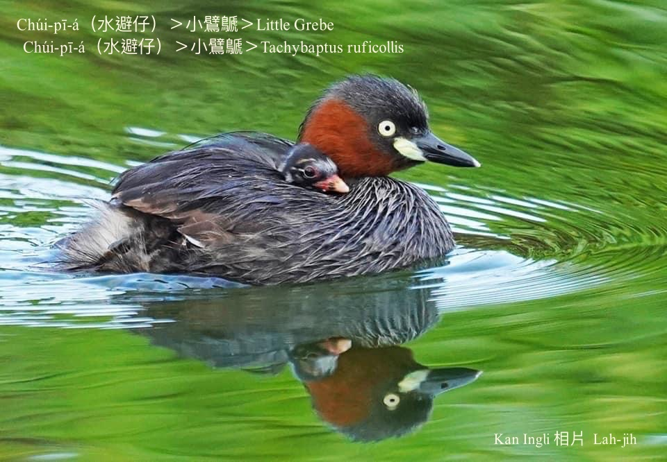
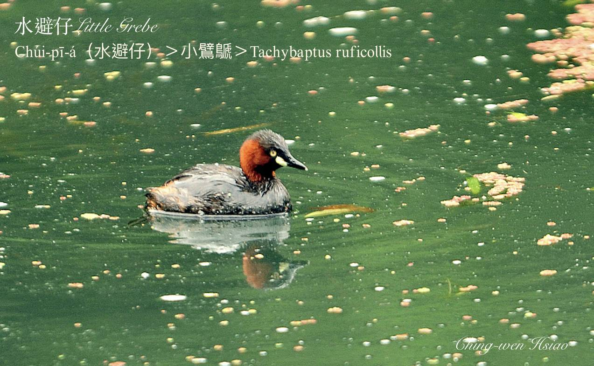
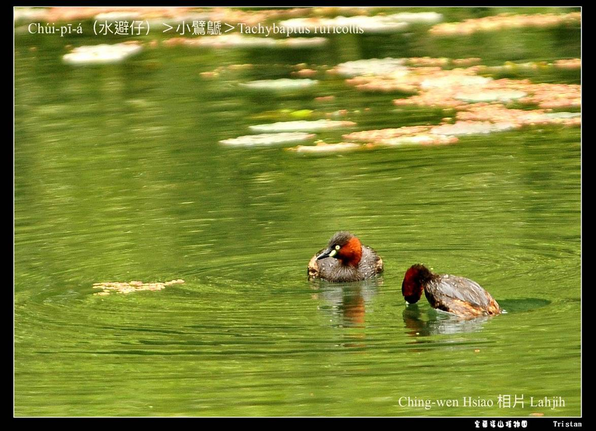
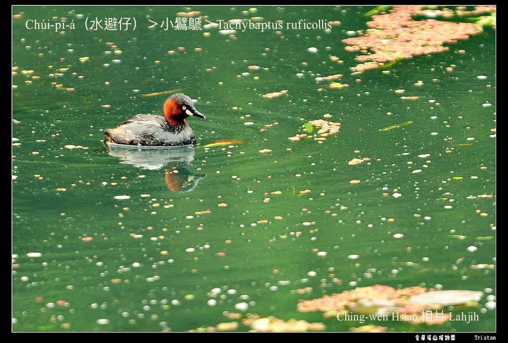
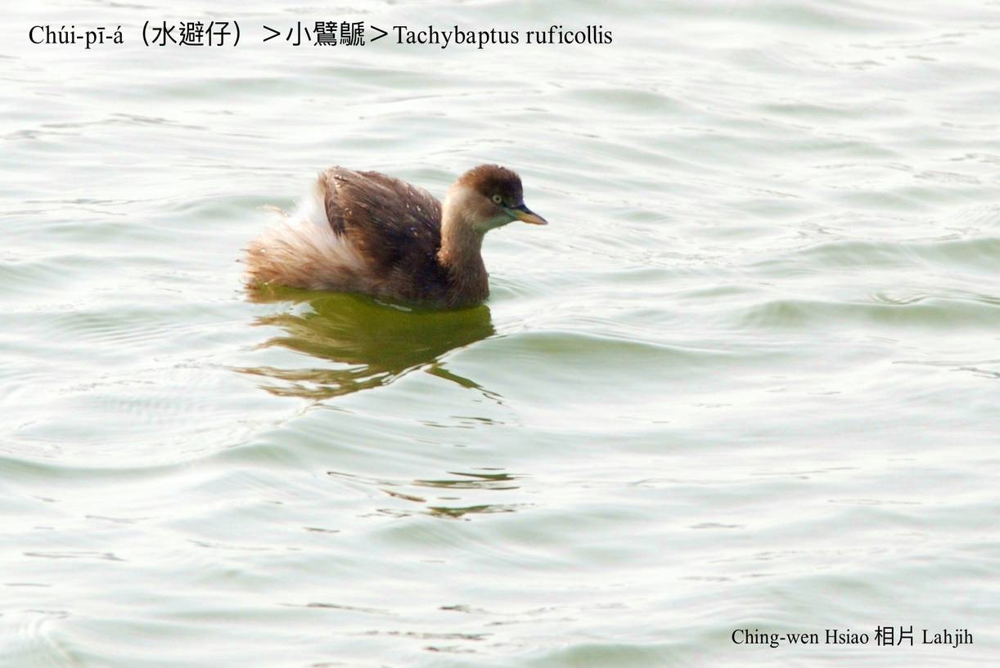
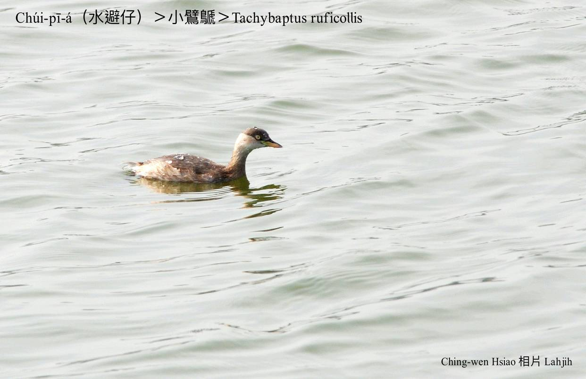
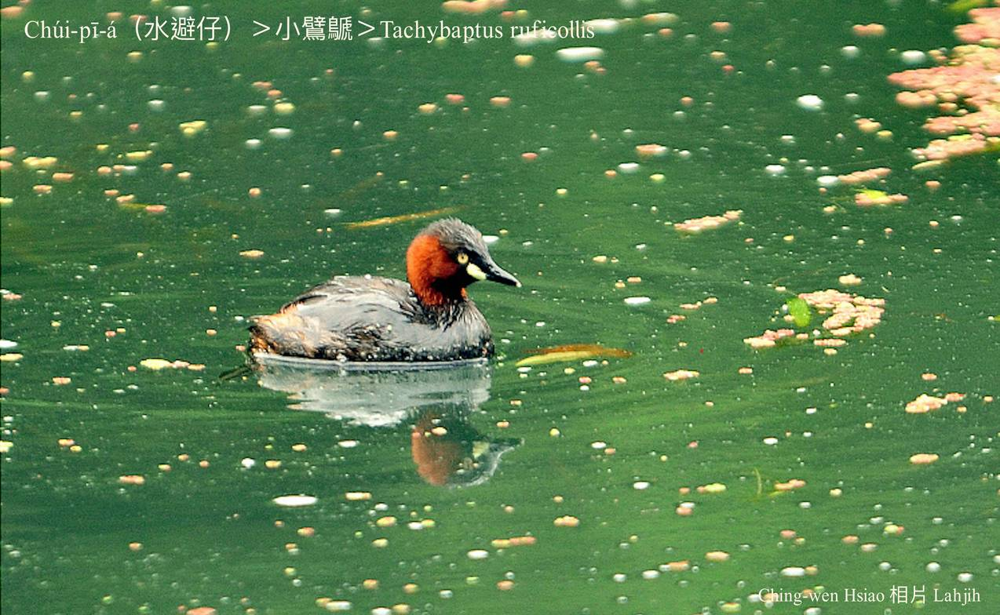

#### 1. Pek-the Kho『鷿鷈科-Podicipedidae』

|台灣名|中譯名|學名|
|Chúi-pī-á（水避á）|小鷿鷈|Tachybaptus ruficollis|

# 1-1. Chúi-pī-á（水避á）

大部分ê水鳥，tú-tio̍h危險to̍h飛出水面避險，獨獨chúi-pī-á ē-hiáu chhàng-chúi-bī bih tiàm草phō蘆竹phō內閃避危險，tiām-tiām伸出嘴pe喘氣，等待天敵離開。

Chúi-pī-á chiok gâu泅水chhàng-chúi-bī，chhōa chúi-pī-á kiáⁿ thit-thô時，chúi-pī-á母時常kā chúi-pī-á-kiáⁿ āiⁿ tī kha-chiah-phiaⁿ，chiok古錐。

# 【Tâi-oân Chiáu-á Liām Koa-si】

### **Chúi-pī-á Chhàng-chúi-bī**

Chúi-pī-á gâu siû-chúi, siau-iâu jû-ì

Phû-tiàm chúi-bīn thit-thô, 
hoaⁿ-hoaⁿ-hí-hí

Khó-sioh seⁿ-chò sè-lia̍p-chí

Ūi-tio̍h oa̍h-miā, koan-chêng kò͘-āu, siám-pī gûi-hiám

M̄-sī bih-tiàm àm-sàm chháu-phō

To̍h-sī chhàng-chúi-bī, hām te̍k-jîn bih-sio-chhōe

### 【註解】

|詞|解說|
|chhàng-chúi|『潛水』。|

