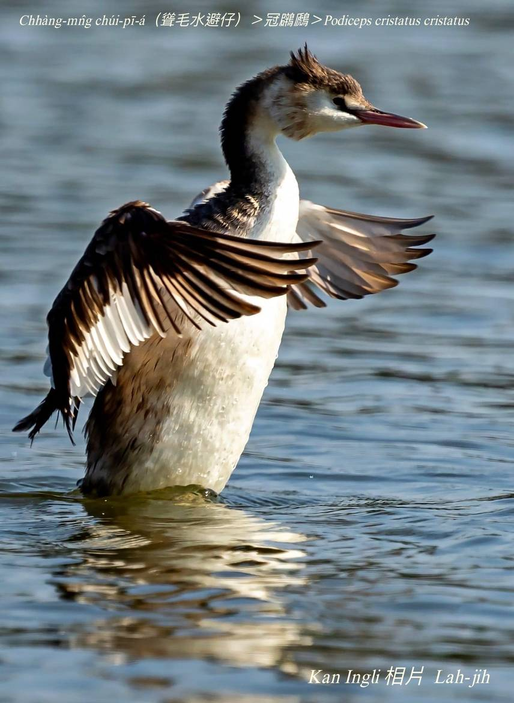
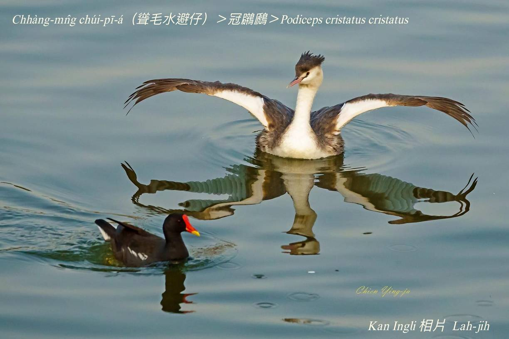
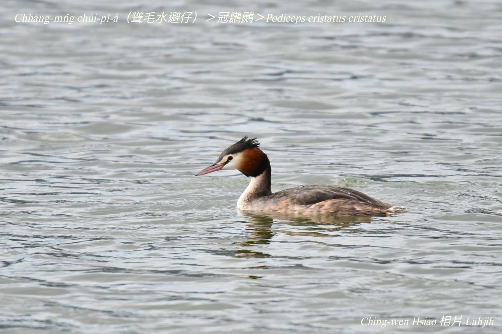
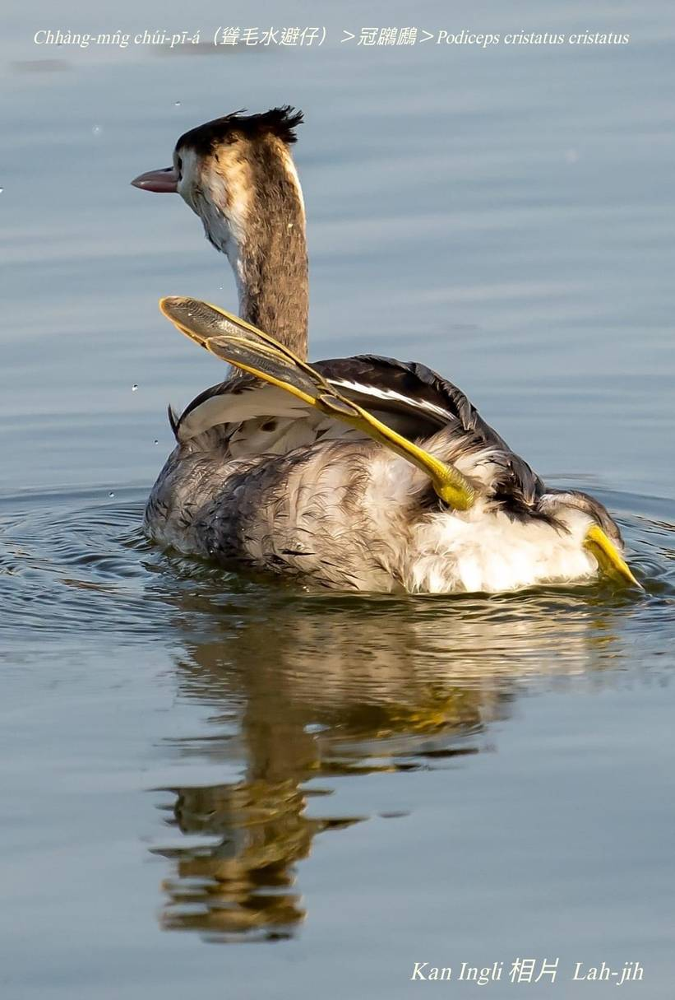
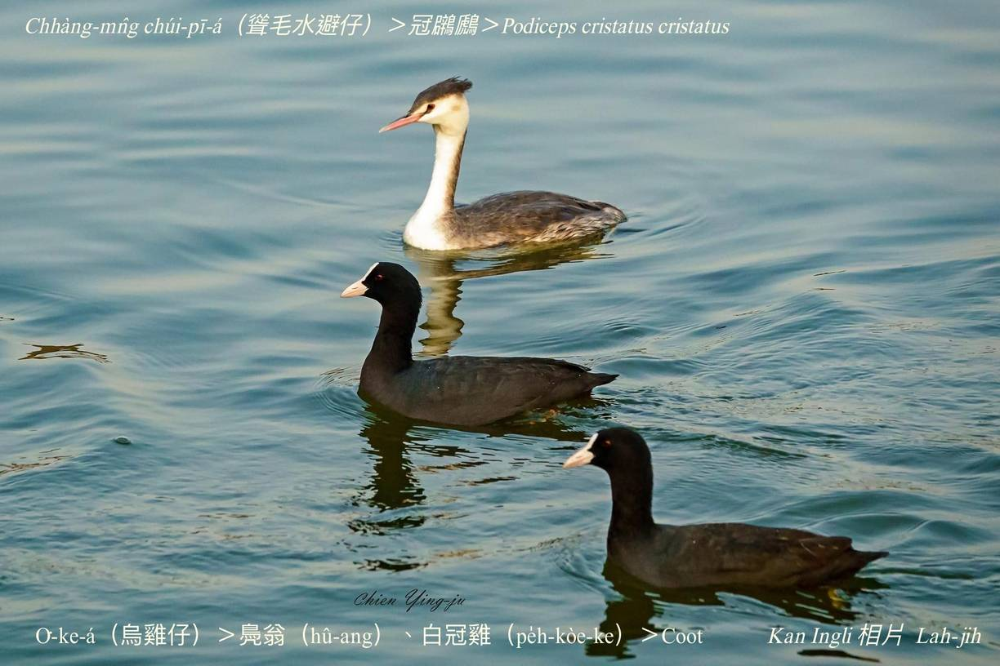

#### 1. Pek-the Kho『鷿鷈科-Podicipedidae』

|台灣名|中譯名|學名|
|Chhàng-mn̂g Chúi-pī-á（聳毛水避á）|冠鸊鷉|Podiceps cristatus|

## 1-2. Chhàng-mn̂g Chúi-pī-á（聳毛水避á）

Chhàng-mn̂g chúi-pī-á tī台灣是罕有tang-hāu-niáu／過冬鳥，時常單獨tī水潭、魚池、海邊活動，gâu泅水chhàng-chúi-bī，hèng食魚蝦thâng-thōa。生湠期間ē跳舞相交纏，姿勢優美心適，pí水避á khah大隻，因為伊ê頭殼頂chi̍t-chhop毛chhàng-chhàng ná戴帽á，m̄-chiah號做『冠鸊鷉』，iáu-bô台語名，só͘-pái ka號做聳毛水避á。

# 【Tâi-oân Chiáu-á Liām Koa-si】

### **Chhàng-mn̂g Chúi-pī-á Ū-kàu Phāⁿ**

Chhàng-mn̂g chúi-pī-á gâu siû-chúi

Koh-ē chhàng-chúi-bī

Ang-bó͘ sio-chio thiàu oa-lú-chuh

Thn̂g kam bi̍t tiⁿ

Thâu-mn̂g chhàng-chhàng ū-kàu phāⁿ

Siâⁿ lâng lâi him-siúⁿ

### 【註解】

|詞|解說|
|chhàng-mn̂g|聳毛。|
|oa-lú-chuh|Waltz，oân-bú-khek。|

