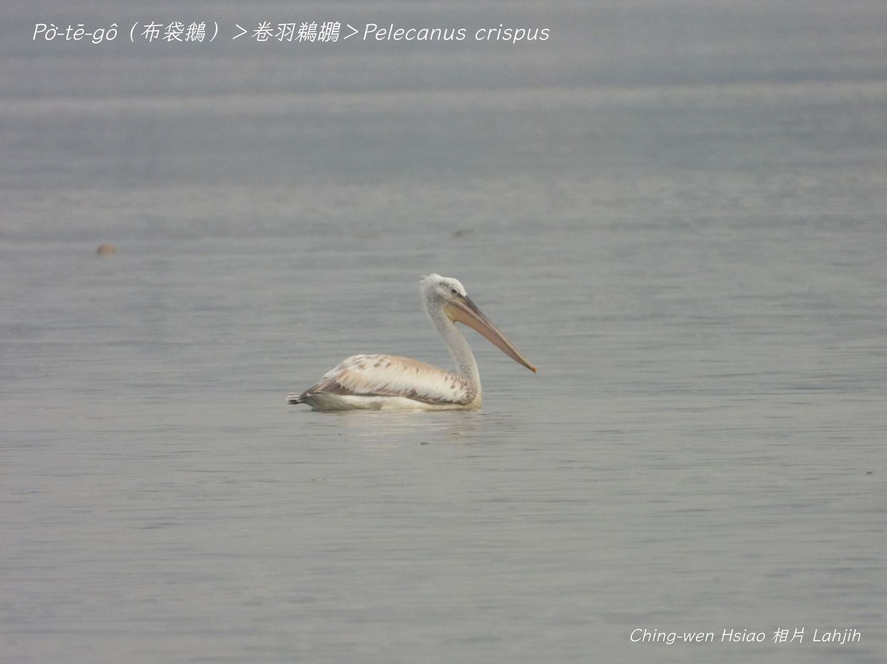
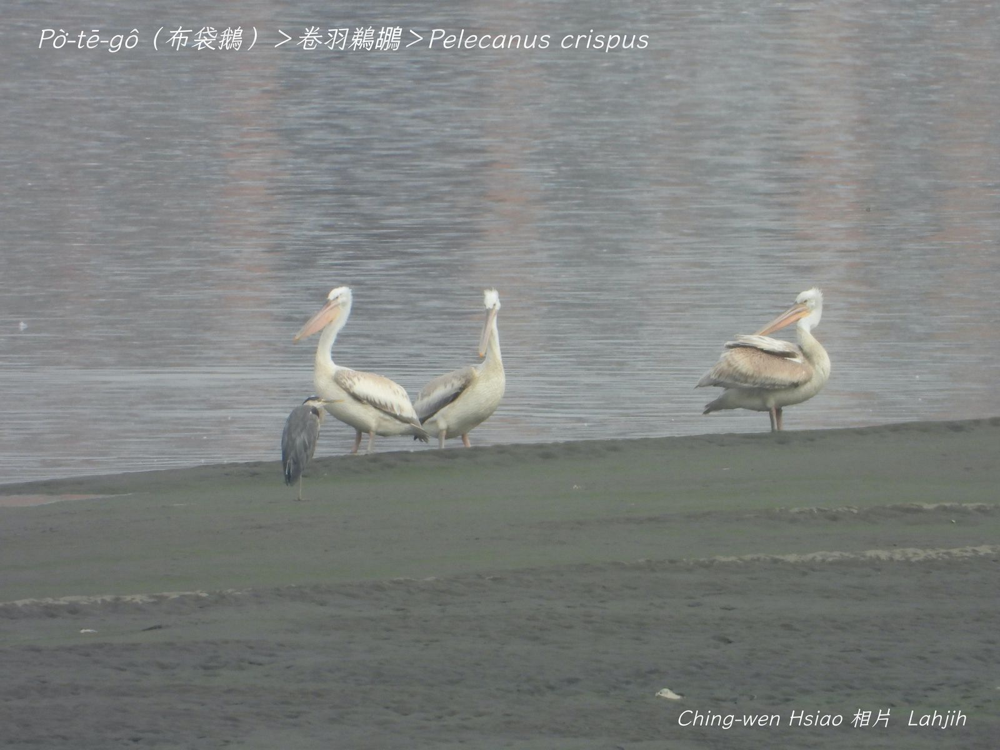
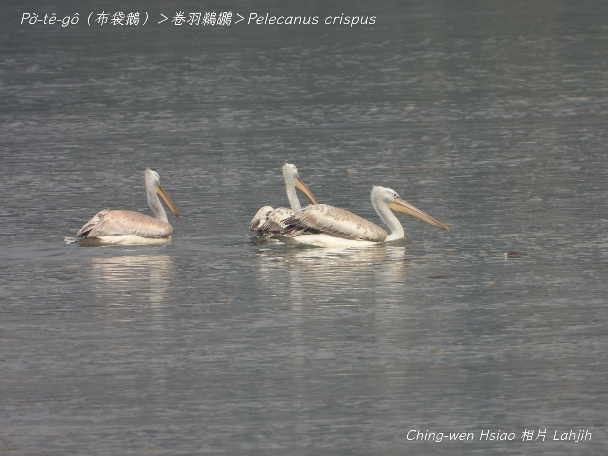
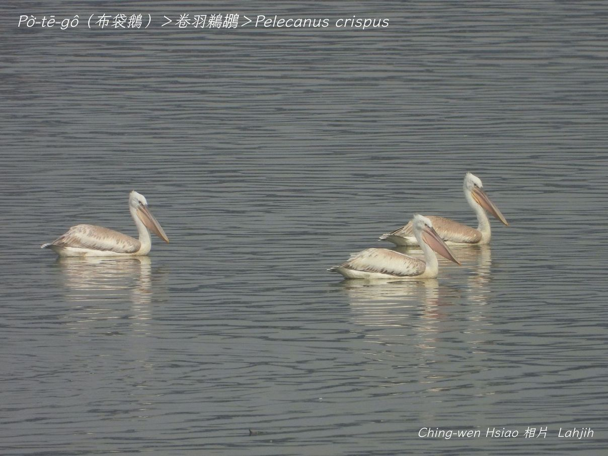

#### 2. Thê-hô͘ Kho『鵜鶘科-Pelecanidae』

|台灣名|中譯名|學名|
| Pò͘-tē-gô（布袋鵝）|卷羽鵜鶘|Pelecanus crispus（Pelecanus）|

# 2-1. Pò͘-tē-gô（布袋鵝）

Pò͘-tē-gô嘴pe特別大，長koh尖，嘴ām下有一ê真大kâi ê袋á，peh開ná布袋嘴，boeh大boeh細隨在伊ê需要，所以號做pò͘-tē-gô，海口人講pò͘-tē-giâ。Tī台灣是真罕有ê迷失路途海鳥。卷羽鵜鶘展翼3米大，10外kong-kin重，是siāng大隻ê布袋鵝，ām-kún羽毛khiû-khiû，真gâu飛。

# 【Tâi-oân Chiáu-á Liām Koa-si】

### **Pò͘-tē-gô Pò͘-tē Chhùi**

Pò͘-tē-gô chhùi tōa-tōa

Peh khui ná-chhiūⁿ pò͘-tē chhùi

Chin gâu poe

Bô-tiuⁿ-tî soah poe lâi lán pó-tē

Chiok tin-kùi

M̄-thang ka lia̍h

### 【註解】

|詞|解說|
|迷失路途海鳥|『迷鳥』。|
|鵜鶘|Thê-ô͘。|
