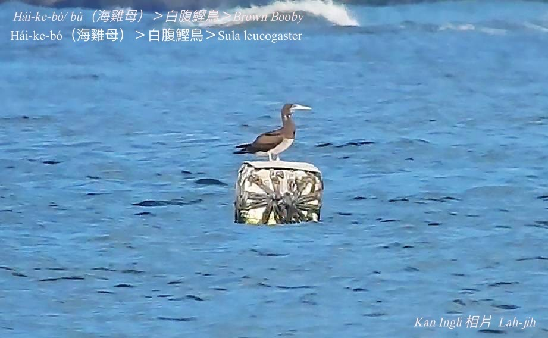

#### 3. Kian-chiáu Kho『鰹鳥科-Sulidae』

|台灣名|中譯名|學名|
|Hái-ke-bó（海雞母）|白腹鰹鳥|Sula leucogaster|

# 3-1. Hái-ke-bó（海雞母）

Hái-ke-bó是海鳥，腳有蹼，ē泅水，嘴pe pak-tó͘白色，嘴pe長長尖尖像雞嘴pe，所以號做海雞母。Kah意tòa海邊岩石téng-koân，kap海雞母魚kāng名。咱nā講海雞母，大部份人lóng是講海雞母魚。

### 【註解】

|詞|解說|
|蹼|Pok。|
