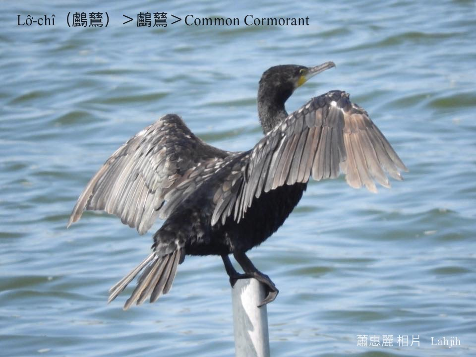

#### 4. Lô͘-chî Kho『鸕鶿科-Phalacrocoracidae』

|台灣名|中譯名|學名|
|Lô͘-chî（鸕鶿）|鸕鶿|Common Cormorant|

# 4-1. Lô͘-chî（鸕鶿）

Lô͘-chî，tī台灣是普遍ê hāu-niáu／tō͘-chiáu，是過冬鳥。真合群，時常做夥歇tī樹á頂，腳有蹼，gâu泅水ē-hiáu chhàng-chúi-bī lia̍h魚，中國人訓練lô͘-chî kā in tàu lia̍h魚。

# 【Tâi-oân Chiáu-á Liām Koa-si】

### **Lô͘-chî Gâu Lia̍h-hî**

Lô͘-chî lô͘-chî m̄-sī môa-chî

Lô͘-chî lô͘-chî chin-gâu chhàng-chúi-bī

Lô͘-chî lô͘-chî chin-gâu lia̍h-hî

Lô͘-chî lô͘-chî chin chhù-bī

### 【註解】

|詞|解說|
|hāu-niáu|『候鳥』。|
|tō͘-chiáu|渡鳥。|
|蹼|Pok。|
