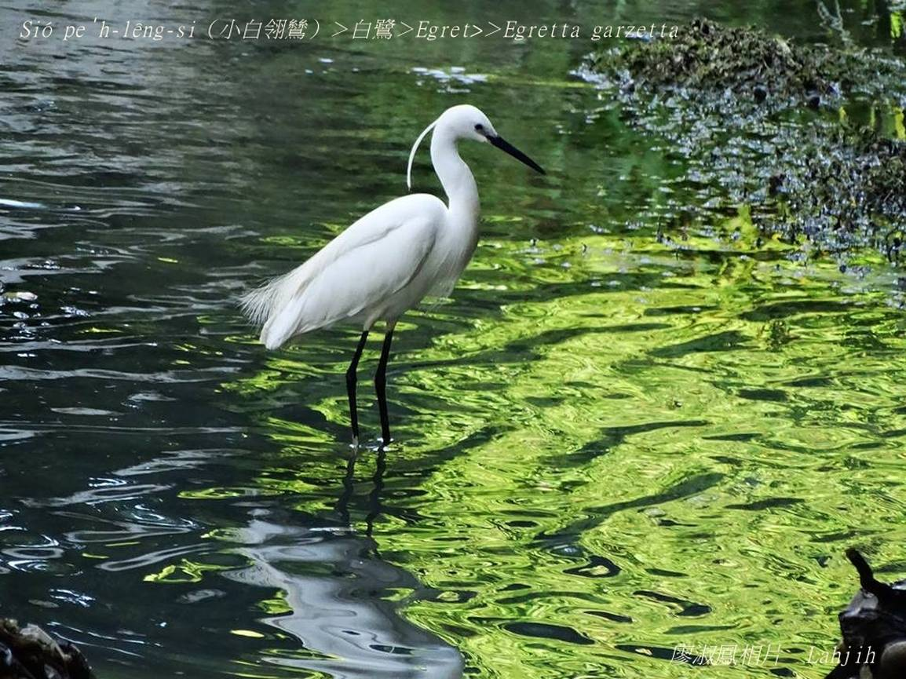

#### 5. Lō͘ Kho『鷺科』

|台灣名|中譯名|學名|
|Sió-pe̍h-lêng-si（小白翎鷥）|白鷺|Egret （Egretta garzetta）|

# 5-1. Sió-pe̍h-lêng-si（小白翎鷥）

Sió-pe̍h-lêng-si華語號做『小白鷺』，是『鷺科，白鷺屬的一個種』。

Sió-pe̍h-lêng-si kui身白色羽毛，烏嘴pe、烏腳骨、黃腳爪，生湠期間，āu-khok ām-kún有白色絲á形ê羽毛chng-thāⁿ。Kah意tī埤塘、lòm地、溪邊、水田討食，hèng食魚蝦、水族、蟲thōa，chhōe食時ē用一ki腳lā水擾亂水族生驚。Sió-pe̍h-lêng-si是在地鳥，khah早ê傳統唸謠kap俗語，lóng是講sió-pe̍h-lêng-si。

### 傳統唸謠

「西北雨一直落，白翎鷥來趕路，盤山嶺過溪河，chhōe無siū poa̍h一倒，日頭暗，boeh chóaⁿ好，土地公，土地婆，做好心，來chhōa路。」

「白翎鷥taⁿ畚箕，taⁿ到溪á墘，poa̍h一倒，khioh一圓，買光餅送大姨，大姨嫌無chē，lia̍h雞á來咒誓。」

「白鷺鷥，chhia畚箕，chhia到溪á墘，poa̍h一倒，khioh tio̍h nn̄g-sián錢。Chi̍t-sián儉起來好過年，chi̍t-sián買餅送大姨。」							

### 俗語

「白翎鷥，飛入去胭脂巷，a̍h是白。」

「白翎鷥piàⁿ死食，a̍h無腳後肚仁。」 

# 【Tâi-oân Chiáu-á Liām Koa-si】

### **Pe̍h-lēng-si Chhēng Pe̍h-saⁿ**

Pe̍h-lēng-si, ài chheng-khì, kha-kut tn̂g-tn̂g sè-sè-ki

Chhēng pe̍h-saⁿ, chiú-tī chúi-khut-á piⁿ

Chhòng siáⁿ-mih 

Boeh chia̍h hî hê kap chúi-pih

Ū-sî mā ē toè tī gû āu-piah

Thóng he poe--khí-lâi ê báng-thâng

Chia̍h kah chiok hoaⁿ-hí

### 【補充說明】

Pe̍h-lêng-si（白鴒鷥）m̄是鳥類學名，台灣人kā『小白鷺、中白鷺、大白鷺、黃白鷺』lóng號做白鴒鷥，àn chit個理路，咱kā號做

|台灣名|中譯名|學名|
|Sió-pe̍h-lêng-si（小白翎鷥）|白鷺|Egret（Egretta garzetta）|
|Tiong-pe̍h-lêng-si（中白翎鷥）|白鷺|Egret（Egretta intermedia）|
|Tōa-pe̍h-lêng-si（大白翎鷥）|白鷺|Egret（Ardea alba, Great egret）|
|N̂g-pe̍h-lêng-si（黃白翎鷥）|牛背鷺、黃頭鷺|Cattle Egret|
|N̂g-chhùi Pe̍h-lêng-si（黃嘴白翎鷥）|唐白鷺|Egret（Egretta eulophotes）|
