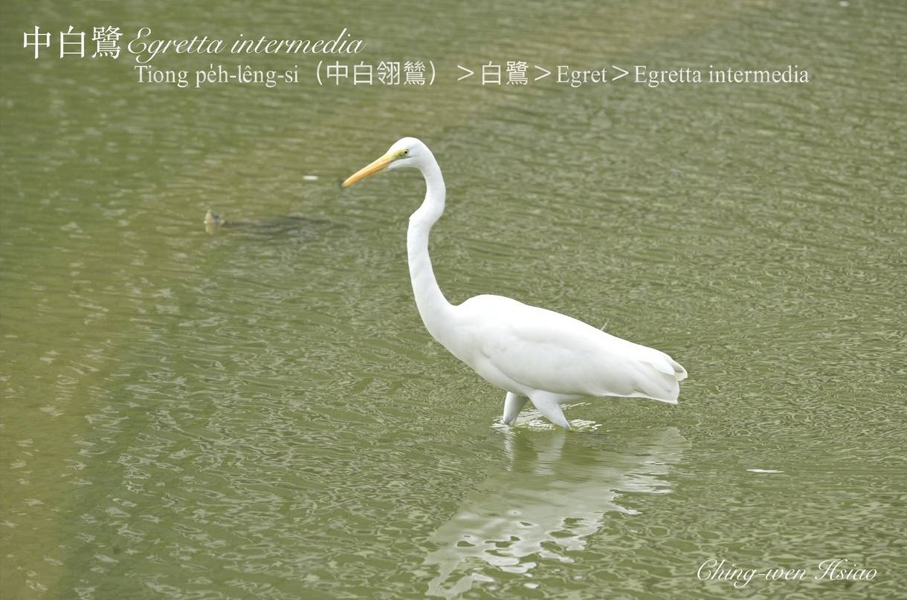
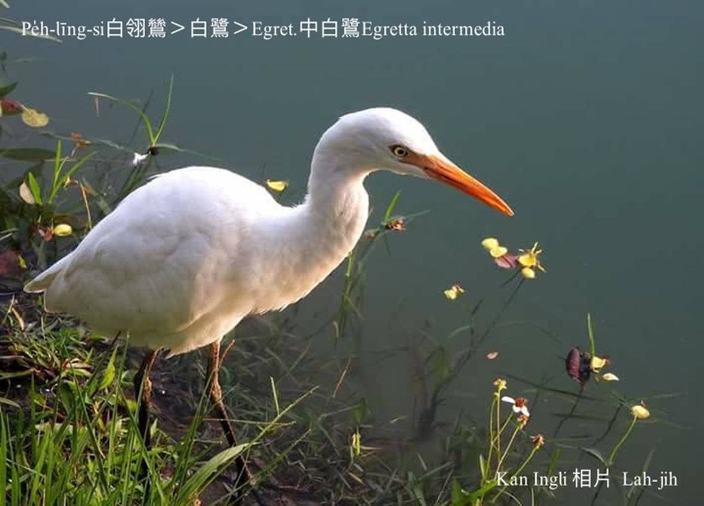

#### 5. Lō͘ Kho『鷺科』

|台灣名|中譯名|學名|
|Tiong-pe̍h-lêng-si（中白翎鷥）|白鷺|Egret（Egretta intermedia）|

# 5-2. Tiong-pe̍h-lêng-si（中白翎鷥）

中白翎鷥嘴pe黃色，腳骨、腳爪烏色，體形比小白鴒鷥khah大，比大白鴒鷥khah細，習性kap小白鴒鷥kāng款，mā ē kap小白鴒鷥tàu-tīn chhōe食、tàu-tīn tòa。中白翎鷥是hāu-niáu／渡鳥，是過冬鳥。

### 【註解】

|詞|解說|
|hāu-niáu|『候鳥』。|
