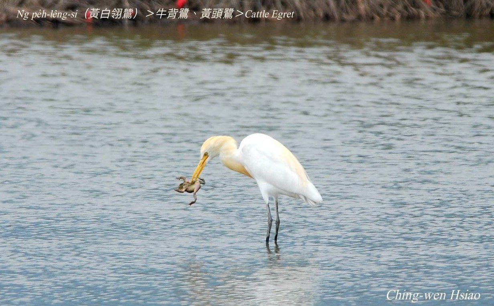
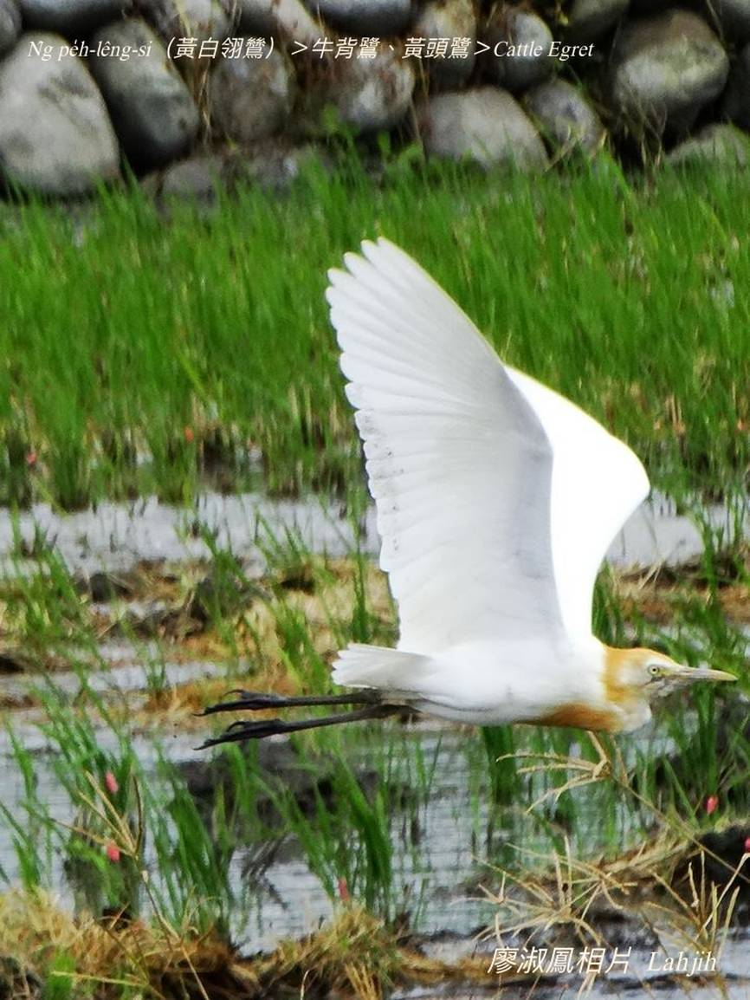
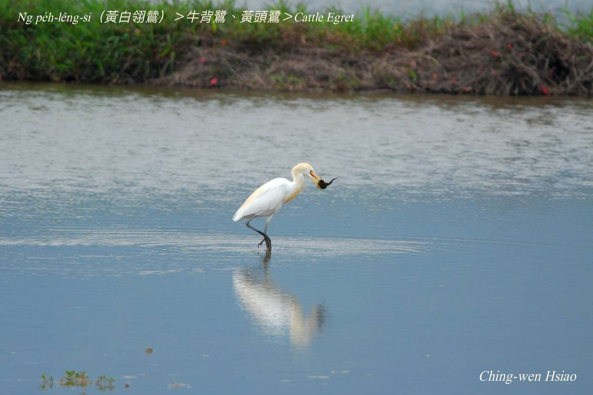

#### 5. Lō͘ Kho『鷺科』

|台灣名|中譯名|學名|
|N̂g-pe̍h-lêng-si（黃白翎鷥）|牛背鷺、黃頭鷺|Cattle Egret|

# 5-4. N̂g-pe̍h-lêng-si（黃白翎鷥）

黃白翎鷥，華語號做『黃頭鷺、牛背鷺』，分類上kap小白鷺是無kāng款--ê，時常歇tī牛kha-chiah-phiaⁿ。習性kap小白鴒鷥bô-siáⁿ-kāng，hèng食蚊蟲，kap水牛是互助關係，作穡人leh犁田時，黃白翎鷥ē tòe tiàm後壁thóng蚊蟲。白色羽毛，金黃嘴pe、烏色腳骨，生湠期間，頭殼、ām-kún ē pìⁿ-chiâⁿ金黃色。黃白翎鷥sui-bóng是夏hāu-niáu，tī台灣四季lóng看ē tio̍h，秋天時ē kui大陣ùi北ǹg南飛徙位，chiâⁿ做kúi-nā百隻kúi-nā千隻ê白鴒鷥陣。

### 【註解】

|詞|解說|
|hāu-niáu|『候鳥』。|
