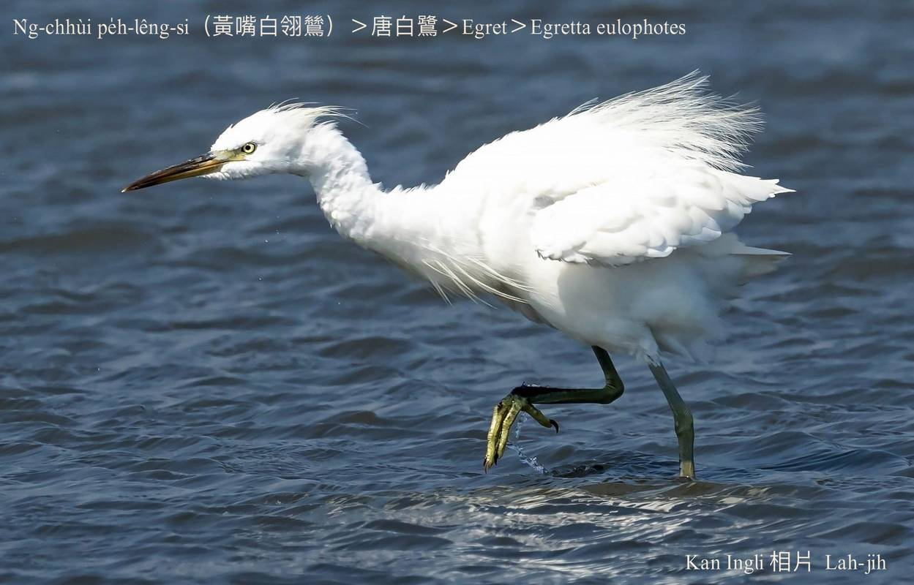
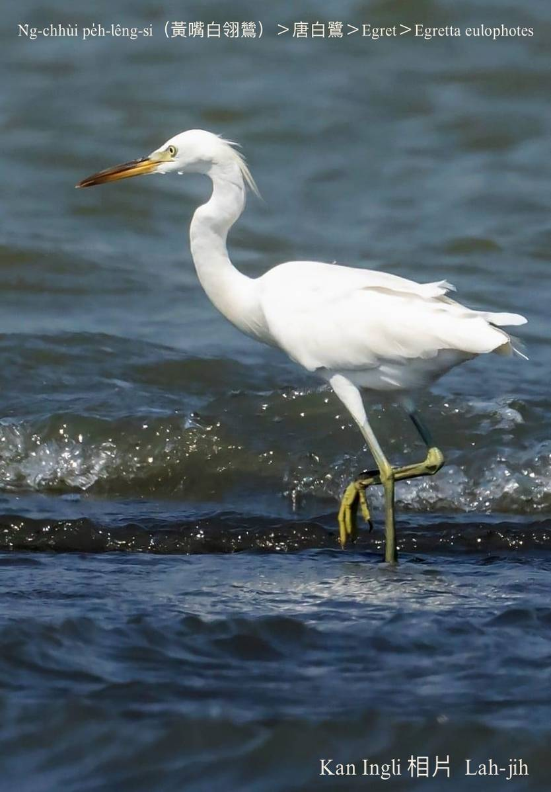
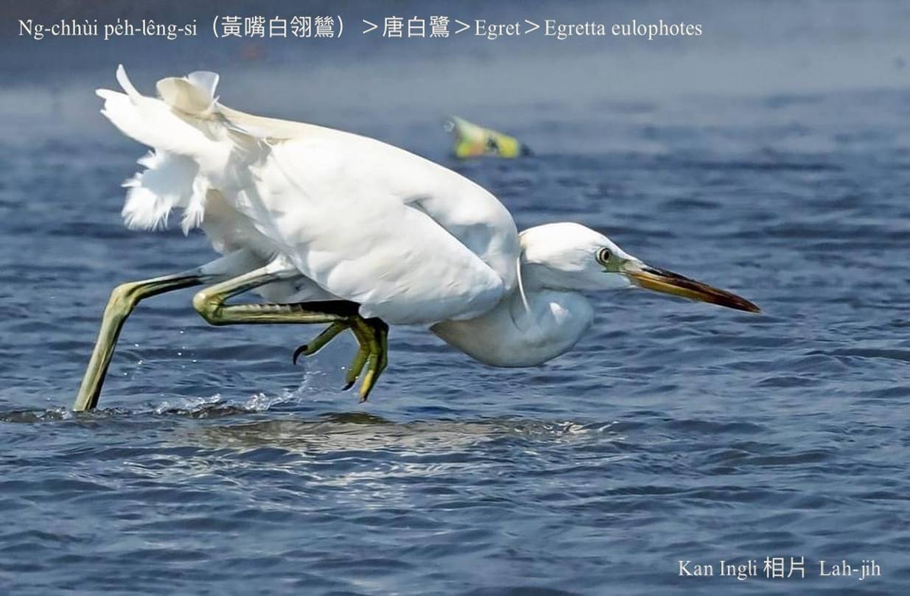
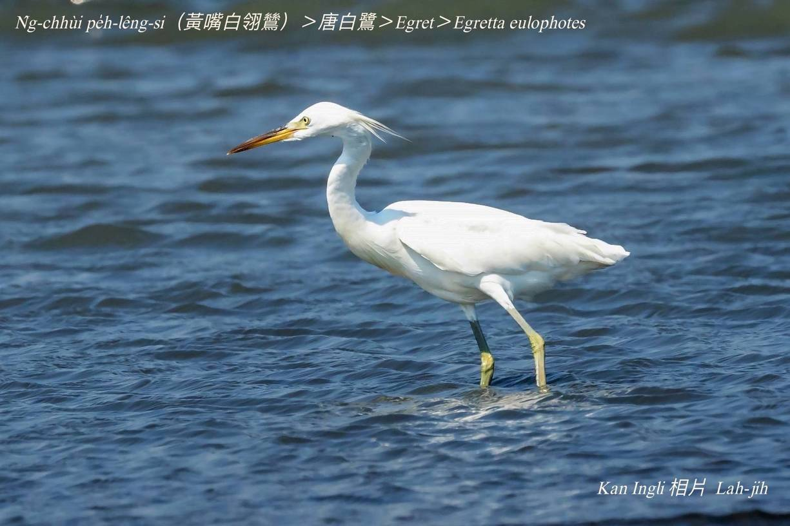
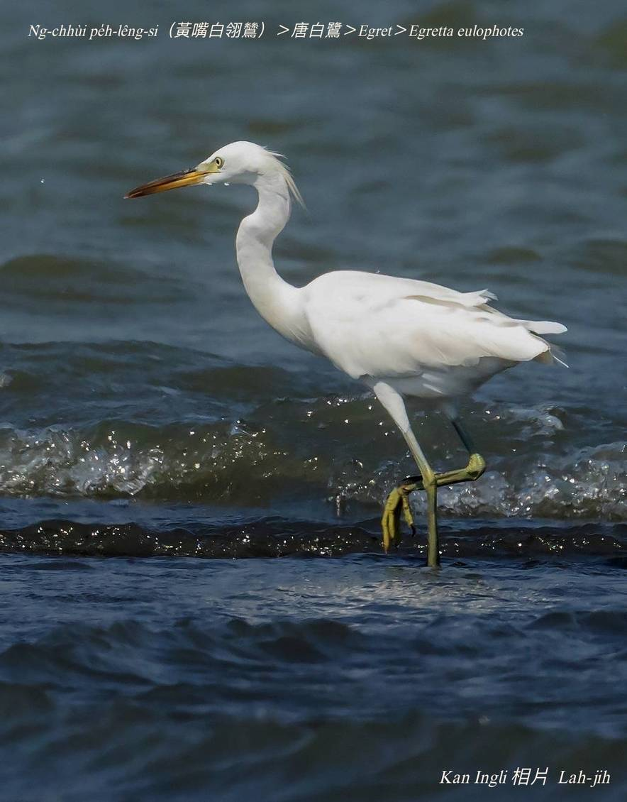
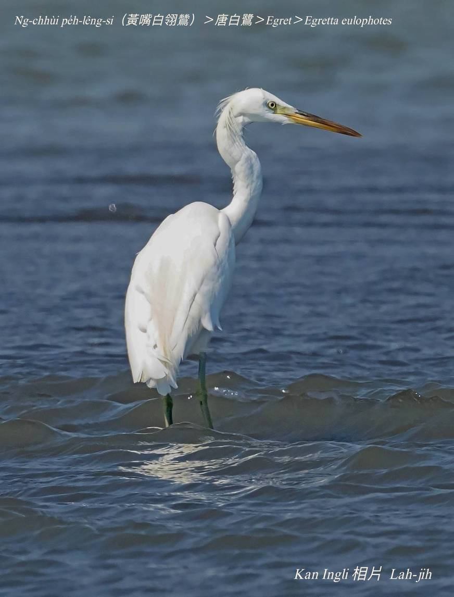
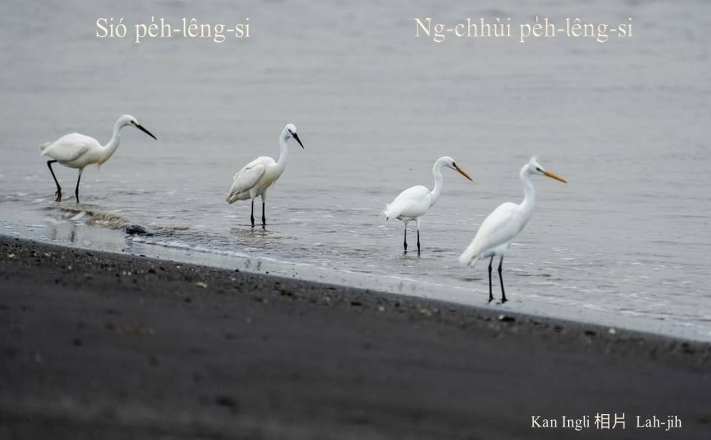

#### 5. Lō͘ Kho『鷺科』

|台灣名|中譯名|學名|
|N̂g-chhùi Pe̍h-lêng-si（黃嘴白翎鷥）|唐白鷺|Egretta eulophotes|

## 5-5. N̂g-chhùi Pe̍h-lêng-si（黃嘴白翎鷥）

黃嘴白翎鷥，華語號做『唐白鷺』，俄羅斯、朝鮮、南韓和中國生湠，然後向南遷徙，tī台灣是過冬鳥，數量真少。

黃嘴白翎鷥kap小白鴒鷥無kāng，chhù-pe柑á色，出現tī海邊、溪口、lòm地。

黃嘴白翎鷥kap烏面lā-poe kāng款是giōng-boeh斷種ê保育鳥類。

