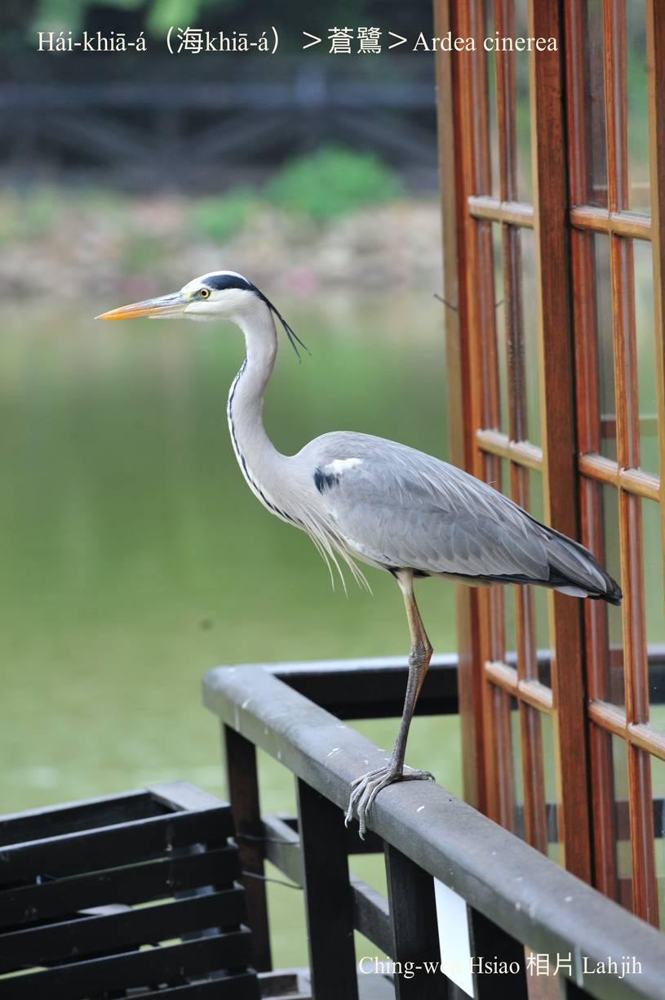
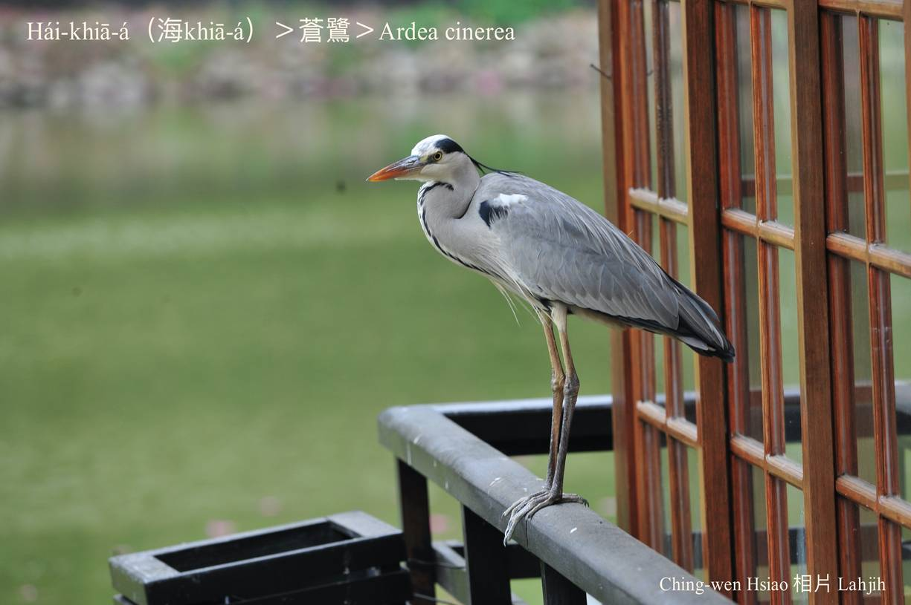
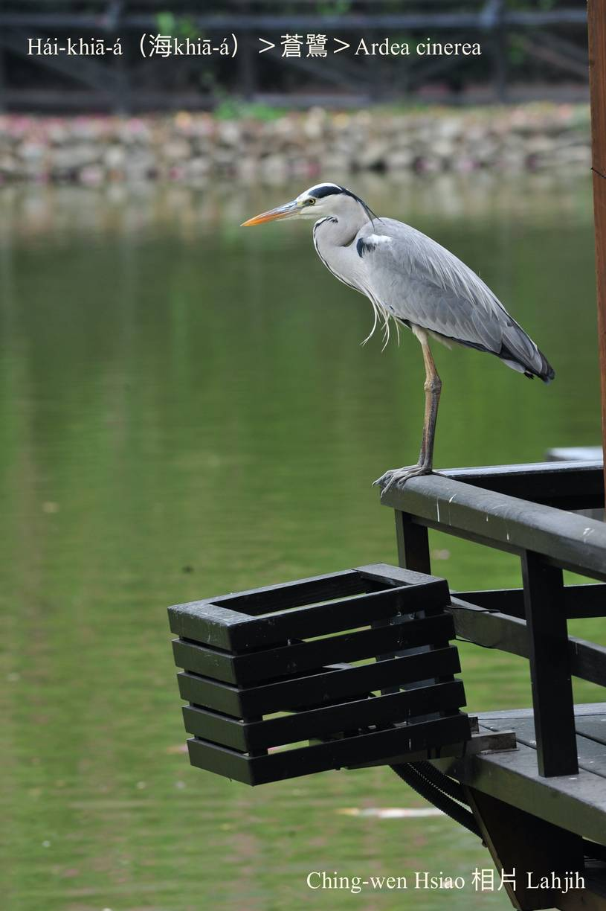
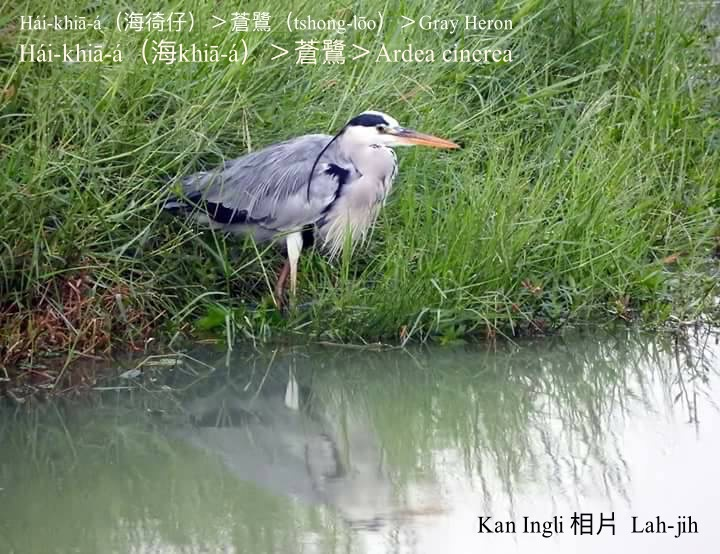
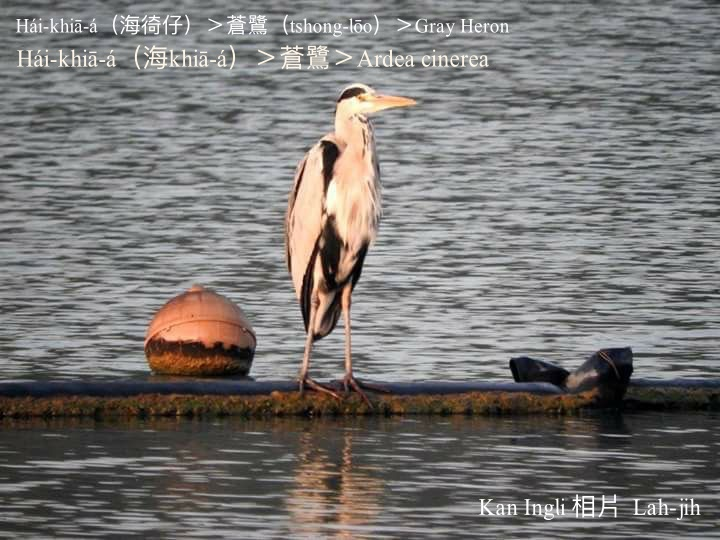

#### 5. Lō͘ Kho『鷺科』

|台灣名|中譯名|學名|
|Hái-khiā-á（海徛á）|蒼鷺|Ardea cinerea|

# 5-6. Hái-khiā-á（海徛á）

Hái-khiā-á是hāu-niáu過冬鳥，白色頭殼chhap淺niáu鼠色羽毛lām一寡烏色，嘴pe腳骨黃gâm色，kah意tī鹽埕、làm地、溪口、phû-lūn、沙洲liâu水chhōe食。

將ām-kún kiu成Z字形到肩胛頭，而且用靈敏ê眼力，等待獵物。

時常用一ki腳khiā--leh，另外一ki kiu tī腹肚下，khiā tiām-tiām等候魚蝦倚近，ē-tàng連續khiā 2-3點鐘，所以叫hái-khiā-á。

# 【Tâi-oân Chiáu-á Liām Koa-si】

### **Hái-khiā-á Hông Ho̍at-khiā**

Hái-khiā-á, lí teh hō͘ lâng ho̍at-khiā--hio͘h

Ná-ē siang-kha khiā chê-chê, lóng m̄-káⁿ kóng-ōe 

M̄-sī--lah, m̄-sī--lah

Goán a-bú ū kau-tài, ài khiā-tiàm-chia tán-thāi

Thèng-hāu hî hê nā chhut-hiān

Chi̍t-tǹg chheⁿ-chhau to̍h piān-piān

### 【註解】

|詞|解說|
|蒼鷺|Chhong-lō͘。|
|hāu-niáu|『候鳥』。|
|phû-lūn|浮崙。|
|沙洲|Soa-chiu。|
