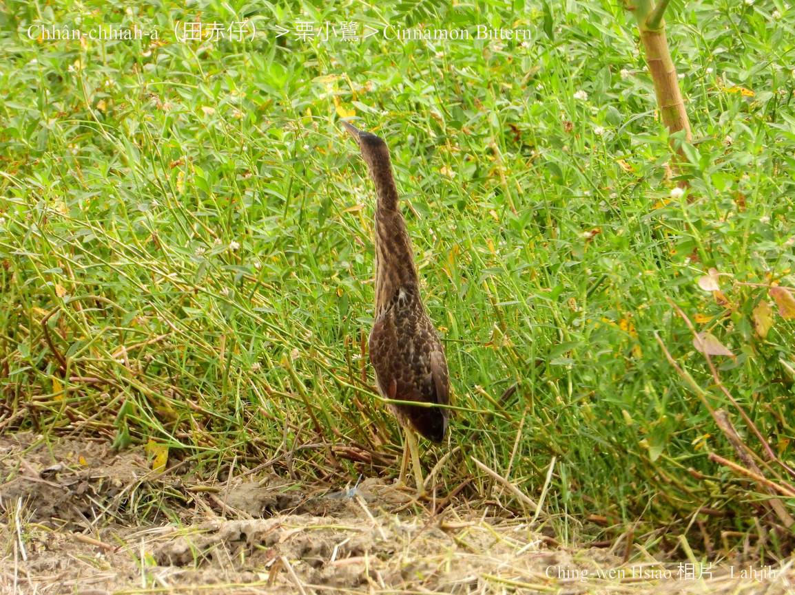
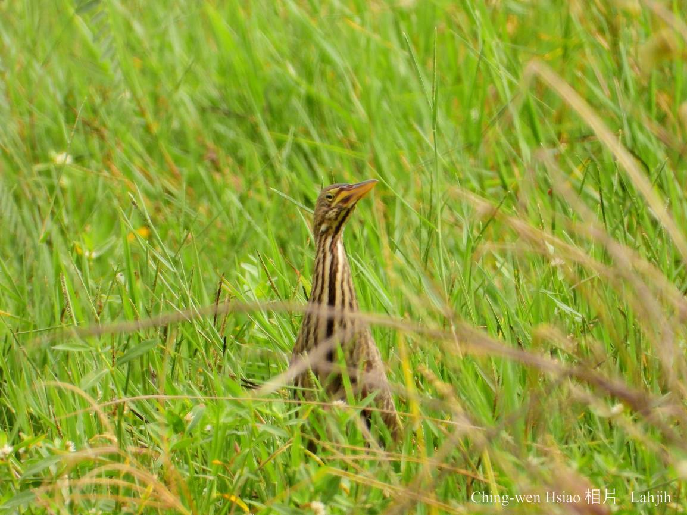
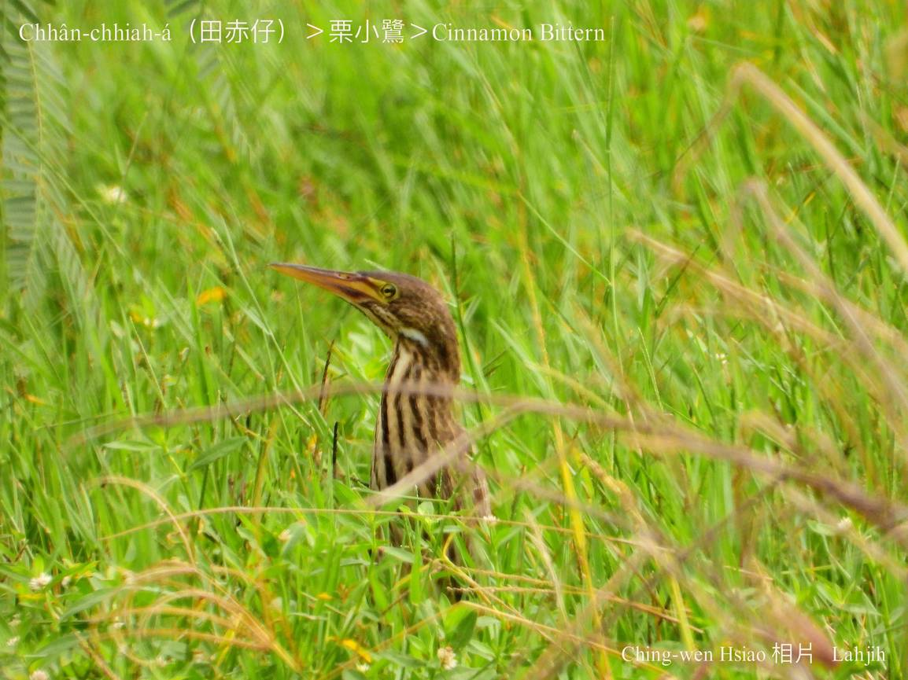
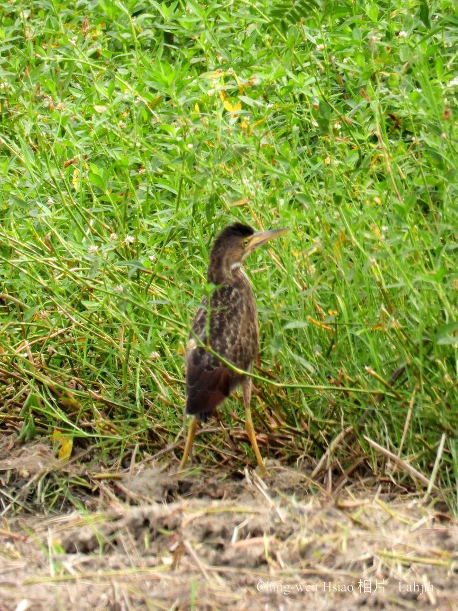
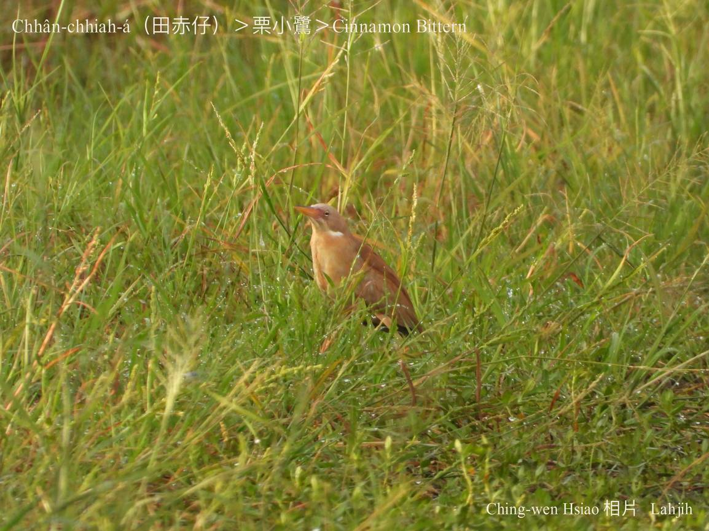

#### 5. Lō͘ Kho『鷺科』

|台灣名|中譯名|學名|
|Chhân-chhiah-á（田赤á）|栗小鷺|Cinnamon Bittern|

# 5-8. Chhân-chhiah-á（田赤á）

Chhân-chhiah-á kah意tiàm濕地草埔、魚池á邊、溪á邊草phō，a̍h是茭白筍田單獨出入chhōe食，hèng食細尾魚、水蛙、田螺、蝦á水族蟲thōa。

公鳥kha-chiah-phiaⁿ深紅色，bih-tiàm草phō內ām-kún chhun長長，koh有真好ê保護色，真oh得hō͘敵人發現。

