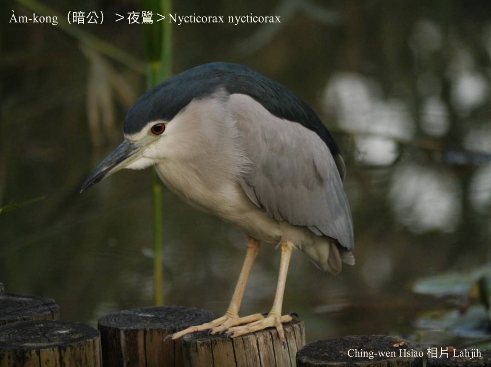
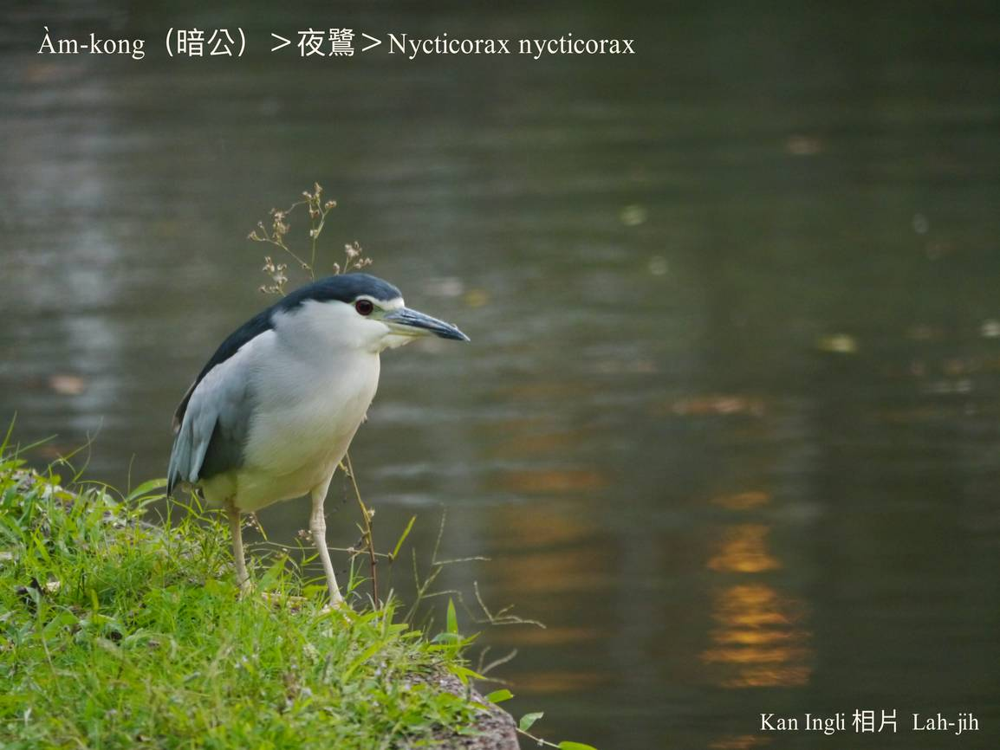
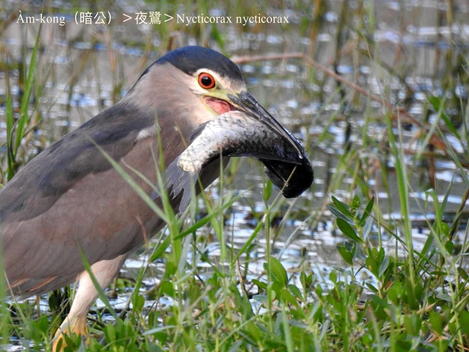
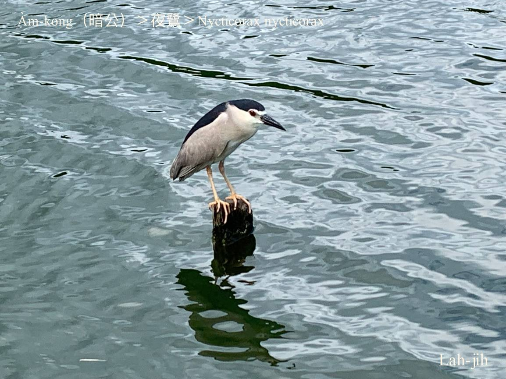
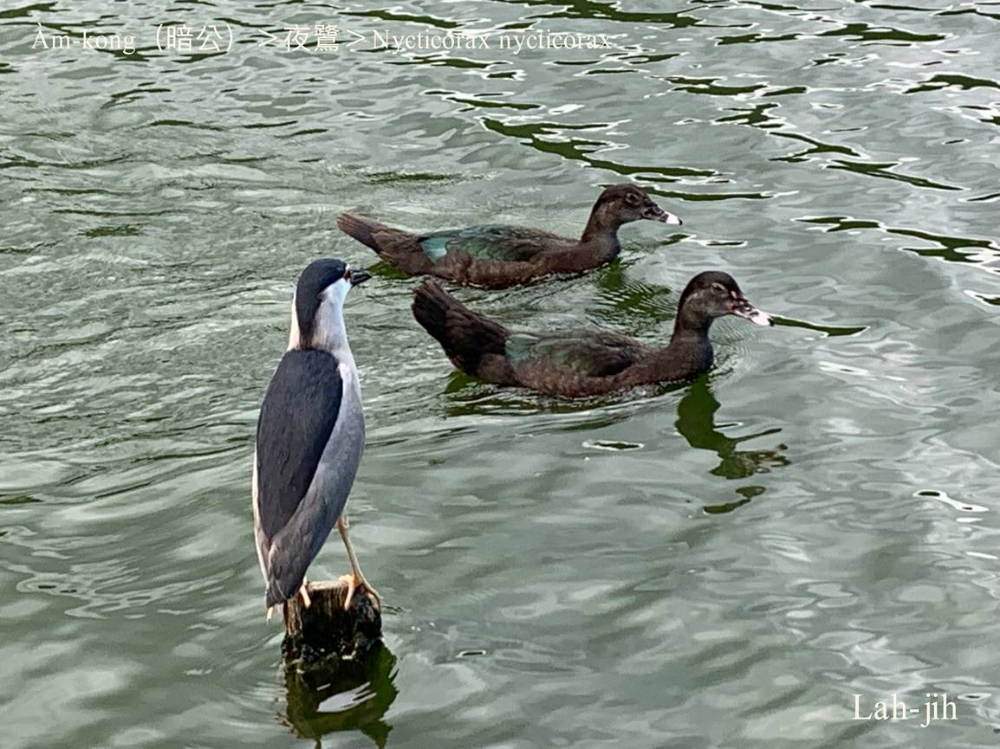

#### 5. Lō͘ Kho『鷺科』

|台灣名|中譯名|學名|
|Àm-kong（暗公）|夜鷺|Nycticorax nycticorax|

# 5-9. Àm-kong（暗公）

Àm-kong是日--時歇睏，暗時討食ê夜行性鳥類，時常kap白鴒鷥tòa做夥，伊ê叫聲ŏa ŏa ŏa，goán叫伊暗oah。

Àm-kong是在地鳥，烏嘴pe、烏頭殼、肉色腳骨、腳爪，chhíⁿ-sek翼股毛，hèng食魚á，是飼魚人認定ê pháiⁿ鳥。

暗公kap小白翎鷥、黃白翎鷥共同做白翎鷥siū。

暗公bē-sái講暗光鳥。
暗光鳥m̄是單一鳥á名。
貓頭鳥kap暗公lóng是夜行性鳥類， 傳統叫in暗光鳥，暗光鳥mā是形容三更半暝iáu m̄睏ê人。

### 俗語

暗公háu chiūⁿ山，笠á棕簑提來moa；暗公háu落海，笠á棕簑to̍h來解。

# 【Tâi-oân Chiáu-á Liām Koa-si】

### **Àm-kong Àm-kong Ū-kàu Khong**

Àm-kong àm-kong ū-kàu khong

Àm-sî m̄ khùn sì-kè chông

Choan-bûn lia̍h-hî chò saⁿ-tǹg

Kui-bóe thun-lo̍h pak-tó͘ lāi

Bián pō͘ bián chhńg m̄-kiaⁿ chhì

### **Àm-kong-chiáu Se̍h Iā-chhī**

Àm-kong-chiáu, se̍h iā-chhī 

Se̍h kah chi̍t-pòaⁿ-mê

Ji̍t--sî bih-tiàm chhiū-nâ lāi, kan-nā it-ti̍t khùn 

Tán kàu ji̍t-thâu boeh lo̍h-hái

I chiah chún-pī boeh khì chia̍h-pn̄g

Pa̍t-hāng i bô-ài, siāng kah-ì tiò-hî kui-bóe thun

### 【註解】

|詞|解說|
|chhíⁿ-sek|Indigo blue，『靛藍』。|
|暗光鳥|Àm-kong-chiáu。|
|貓頭鳥|Niau-thâu-chiáu。|
