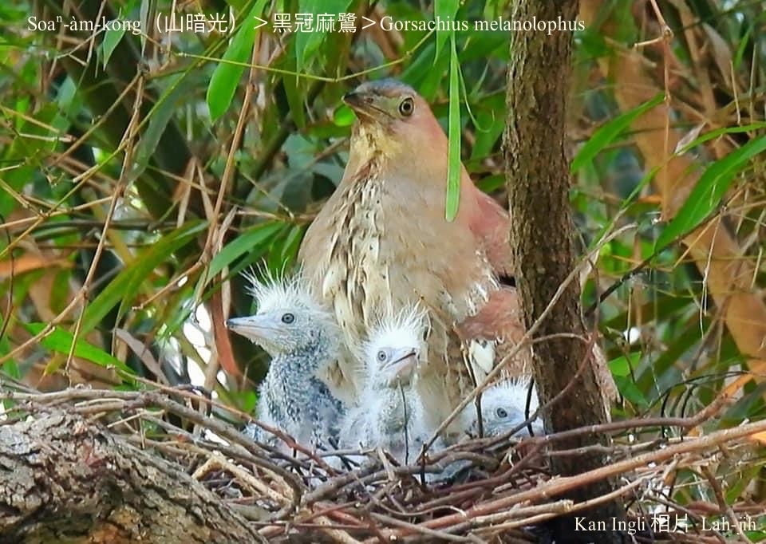

#### 5. Lō͘ Kho『鷺科』

|台灣名|中譯名|學名|
|Soaⁿ-àm-kong（山暗公）|黑冠麻鷺|Gorsachius melanolophus|

# 5-10. Soaⁿ-àm-kong（山暗公）

Soaⁿ-àm-kong是夜行性鳥類，時常boeh-àm-á時出現tī陰暗樹á腳chhōe食，hèng食tō͘-ún，sèng-sò͘慢鈍m̄驚人，有人ka號做大戇鳥。Tī台灣是低海拔山區khah罕有ê在地鳥。

# 【Tâi-oân Chiáu-á Liām Koa-si】

### **Tōa-gōng-chiáu**

Tōa-gōng-chiáu soaⁿ-àm-kong

M̄-kiaⁿ lâng ka lia̍h

Kiâⁿ-lō͘ bān-tūn kek khong-khong

Ū-sî tiām-tiām siòng

Siòng chiok-kú siòng chiong-chiong

Hiông-hiông thóng chi̍t-ē

Chi̍t-bóe tō͘-ún í-keng ji̍p-chhùi

### 【註解】

|詞|解說|
|tō͘-ún|『蚯蚓』。|
