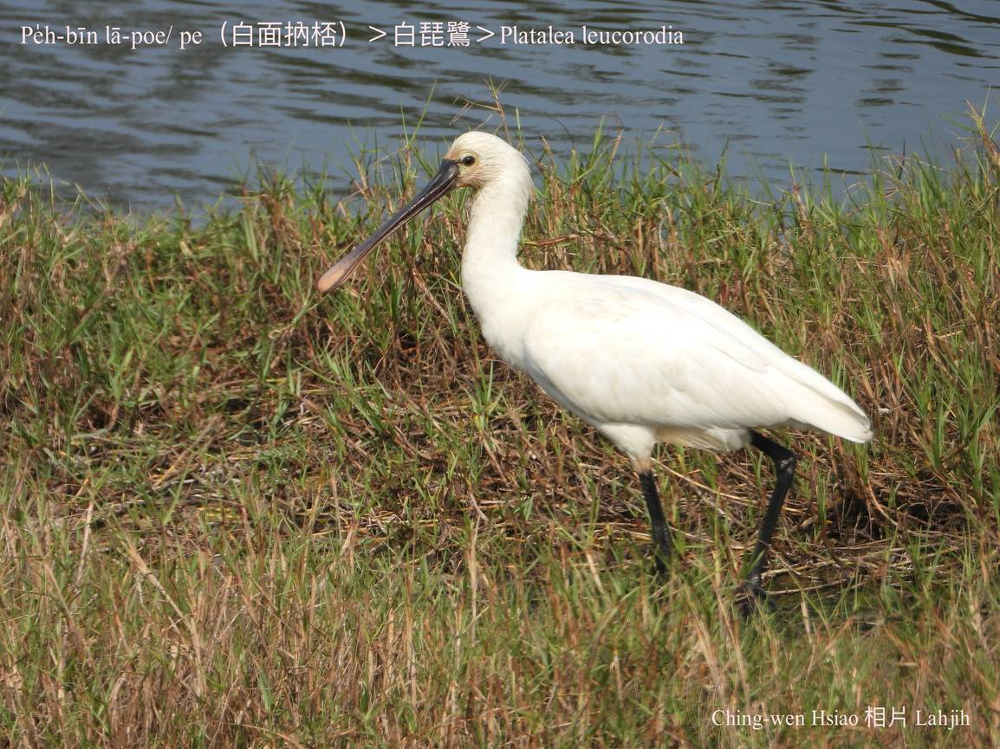
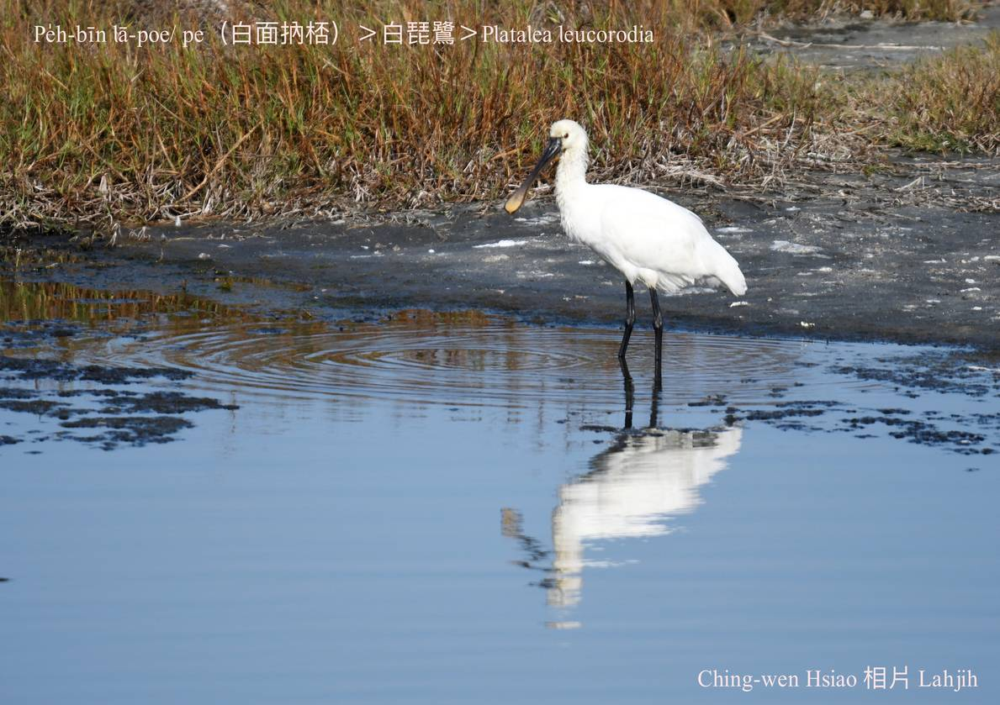
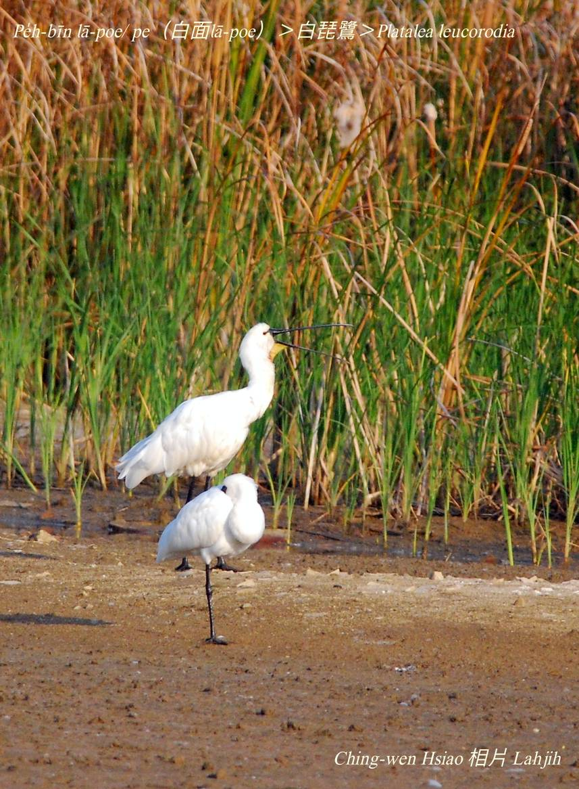
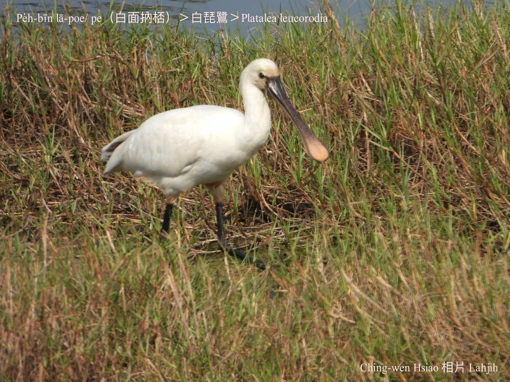
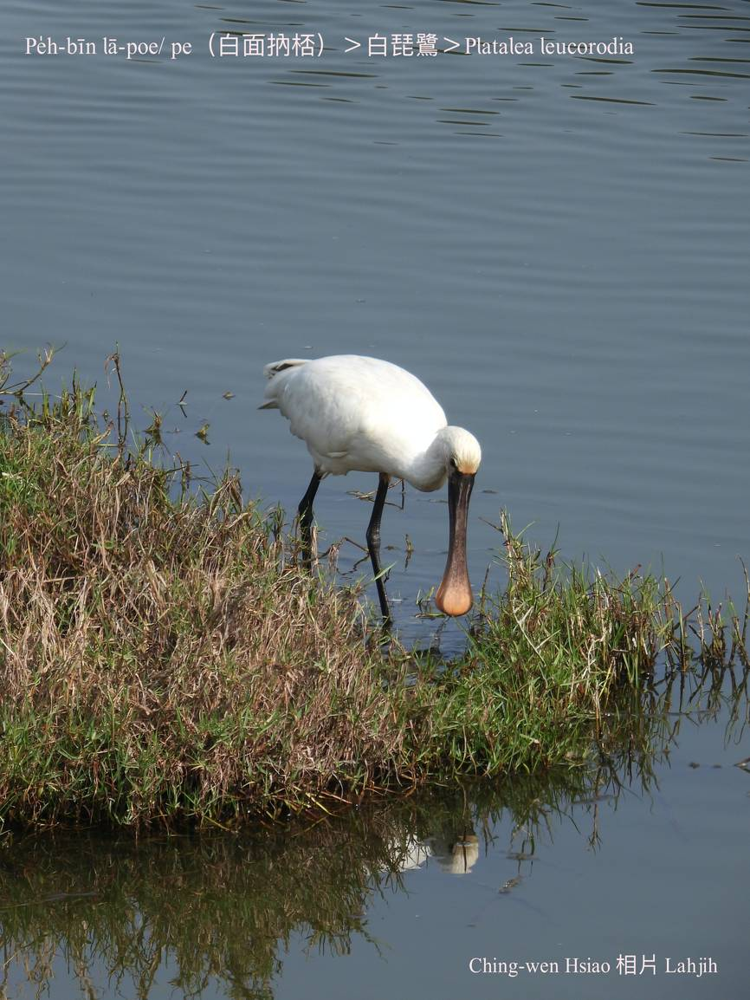

#### 6. Chu-lō͘ Kho『朱鷺科』

|台灣名|中譯名|學名|
|Pe̍h-bīn-lā-poe／pe（白面Lā-poe）|白琵鷺|Platalea leucorodia|

# 6-2. Pe̍h-bīn-lā-poe（白面Lā-poe）

O͘-bīn-lā-poe，pe̍h-bīn-lā-poe lóng是『琵鷺』，因為o͘-bīn-lā-poe是固定飛來台灣ê過冬鳥，是giōng-boeh  che̍h-chéng ê保育鳥類，數量koh chē，所以ta̍k-ê khah注目關心。

Pe̍h-bīn-lā-poe iáu m̄是giōng-boeh che̍h-chéng ê保育鳥類，而且每年飛來台灣ê數量無chē。Pe̍h-bīn-lā-poe ē lām tī o͘-bīn-lā-poe做夥討食。

Pe̍h-bīn-lā-poe體型sió-khóa khah大，面模烏色khah少。O͘-bīn-lā-poe ê ba̍k-chiu周圍是烏色，pe̍h-bīn-lā-poe是白色，無hām chhùi-phóe連做夥。

### 【註解】

|詞|解說|
|che̍h-chéng|絕種。|

