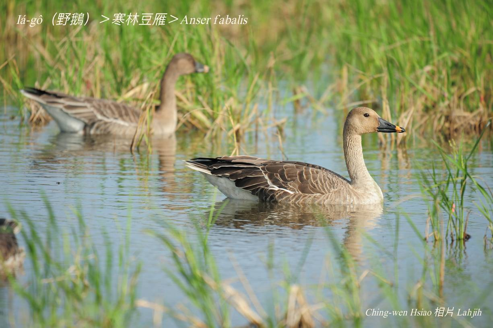
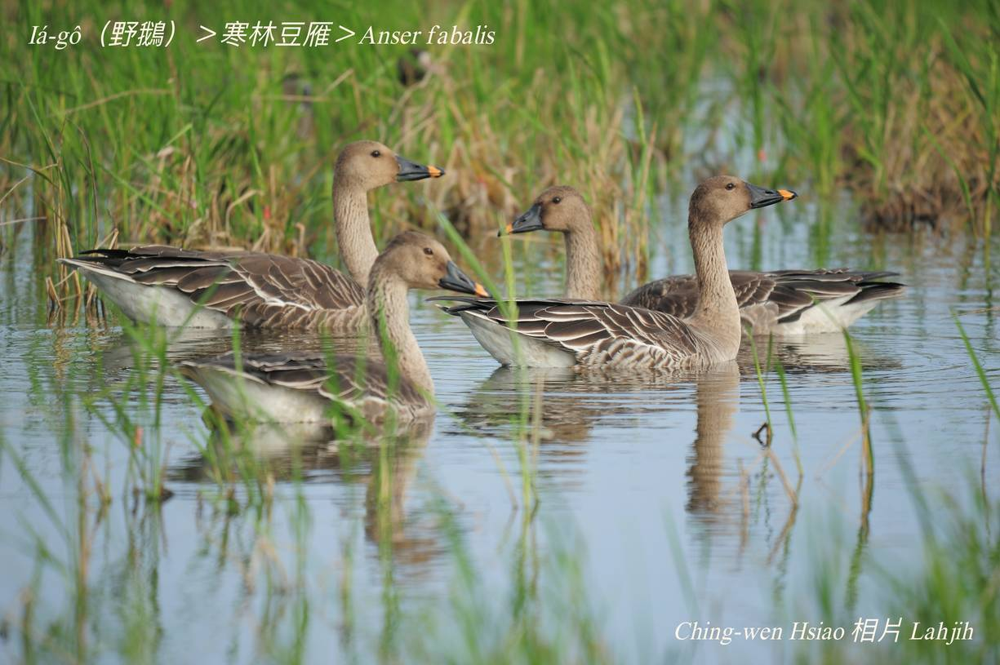

#### 7. Gān-ah Kho『雁鴨科』

|台灣名|中譯名|學名|
|Iá-gô（野鵝）|寒林豆雁|Anser fabalis|

# 7-2. Iá-gô（野鵝）

『寒林豆雁』mā是iá-gô ê一種，伊ê特色to̍h是烏色chhùi-pe尾溜有chi̍t-ê黃色色斑，遠遠看，chiok sêng chhùi-pe咬一粒黃豆，『寒林豆雁』to̍h是講chit粒豆á。

『寒林豆雁』tī台灣算是寒天ê過冬迷鳥，數量無chē。

