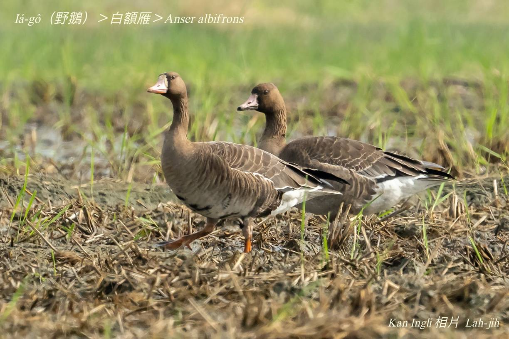
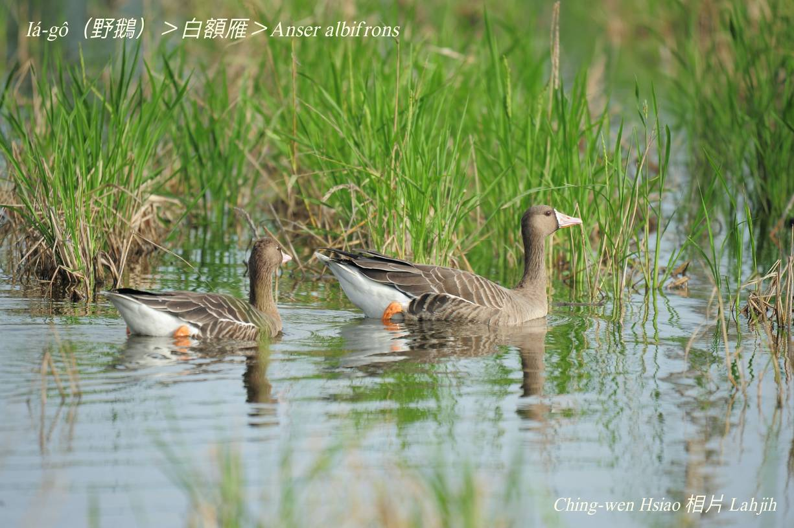
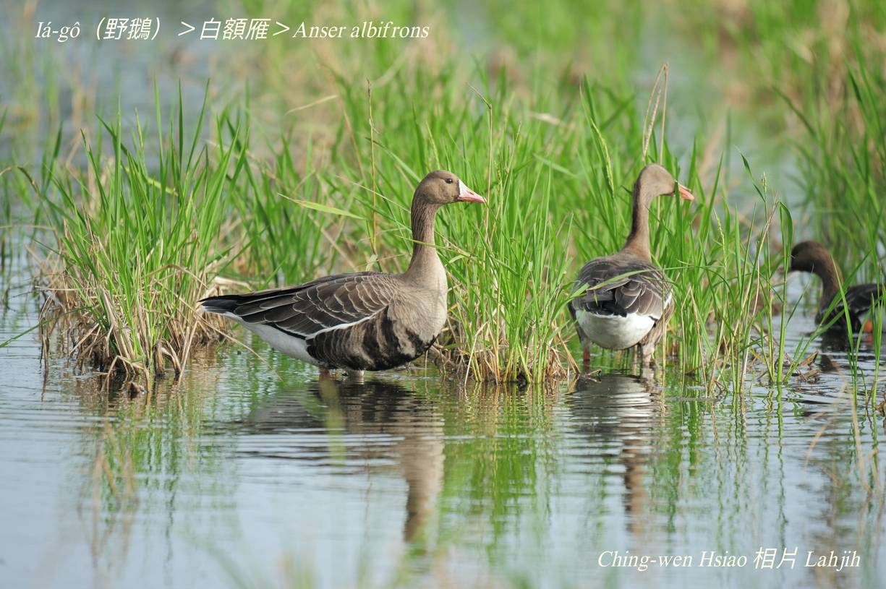
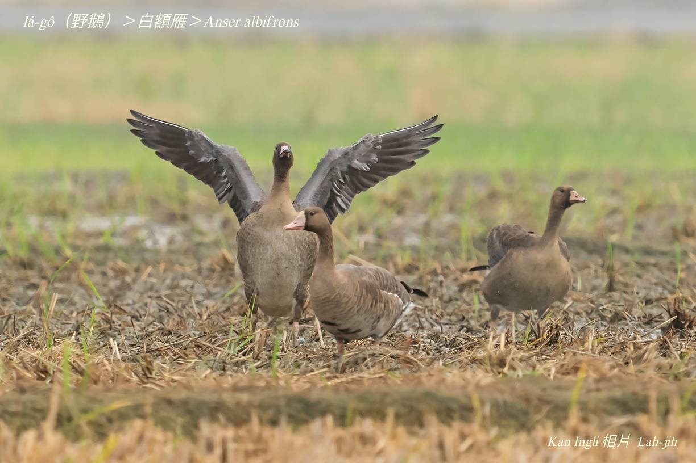
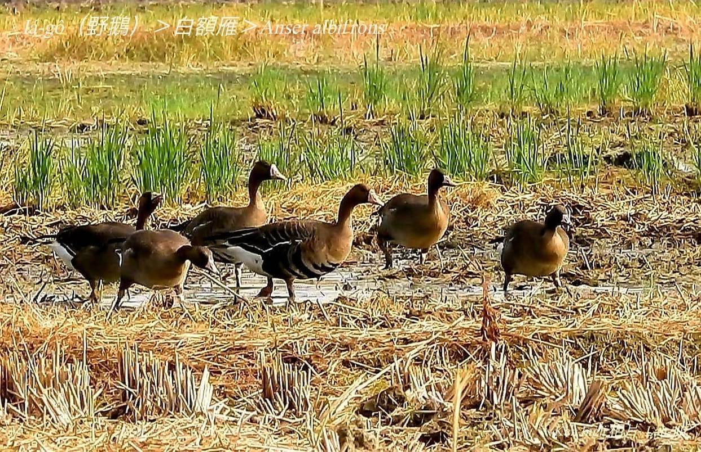
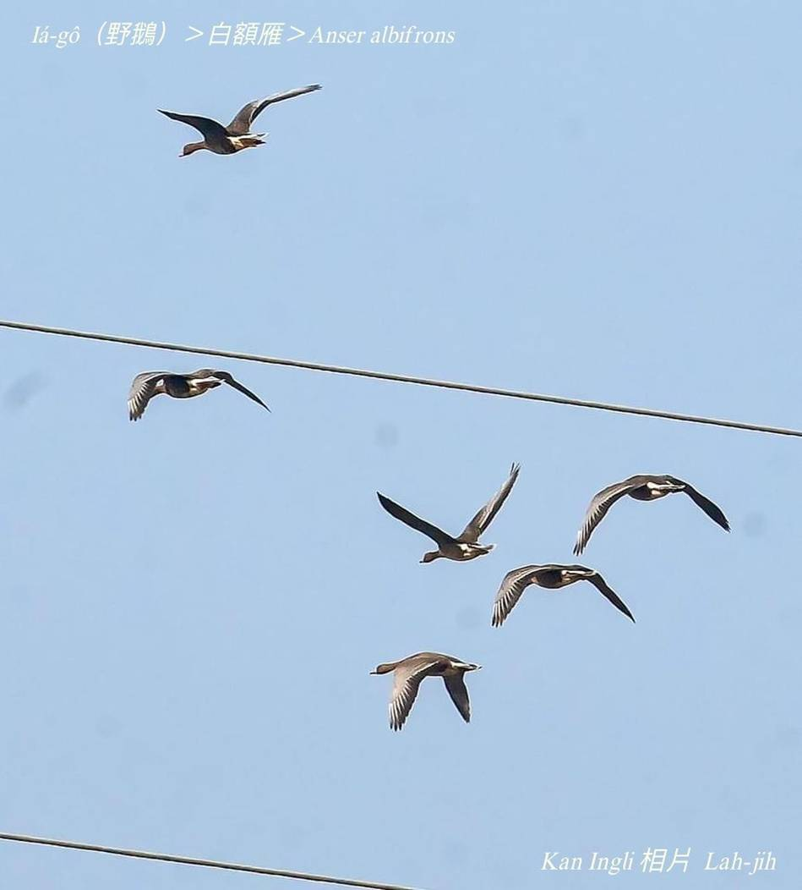
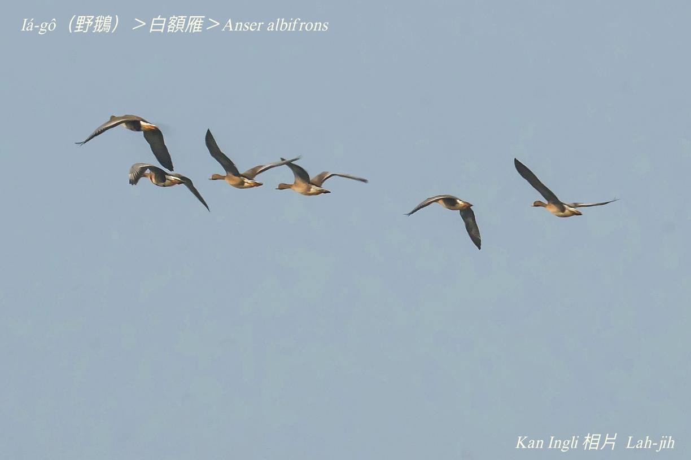

#### 7. Gān-ah Kho『雁鴨科』

|台灣名|中譯名|學名|
|Iá-gô（野鵝）|白額雁|Anser albifrons|

# 7-3. Iá-gô（野鵝）

『白額雁』mā是一種iá-gô，額頭前chhùi-pe白色是特徵。Tī台灣是冬hāu-niáu，因為每年來台灣無chē，有可能是迷鳥。Hèng食綠色植物枝葉種子，sèng-sò͘ hām家鵝sio-kāng m̄驚人，討食時，通常由長者擔任警戒，飛行àn大細排列做一列a̍h-sī人--字形。
	

### 【註解】

|詞|解說|
|hāu-niáu|『候鳥』。|

