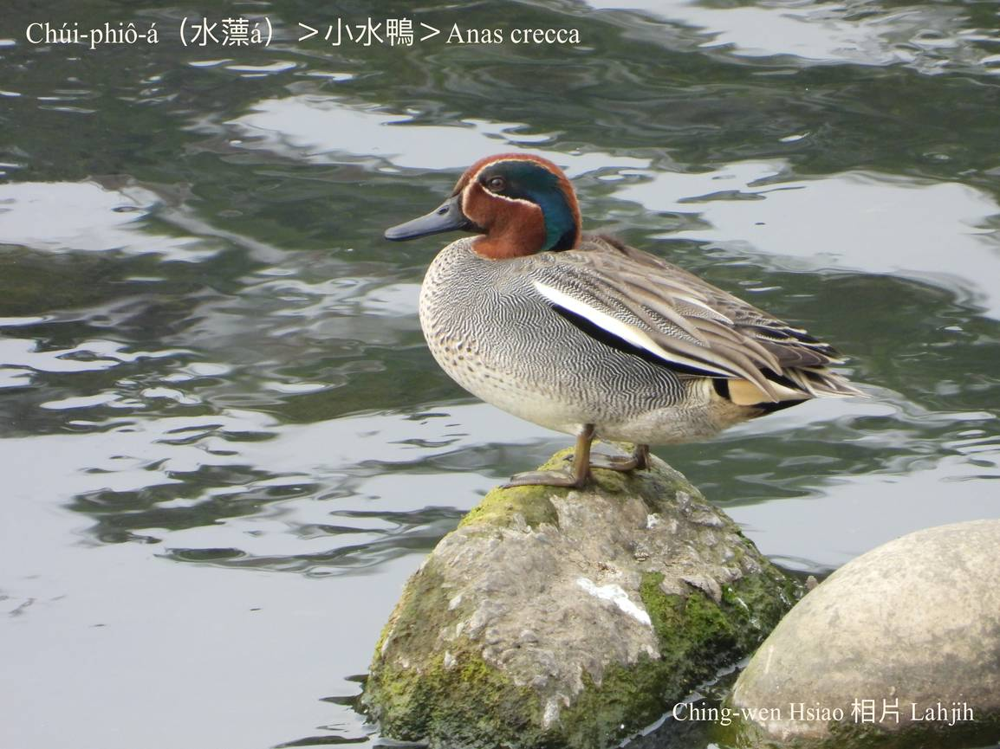
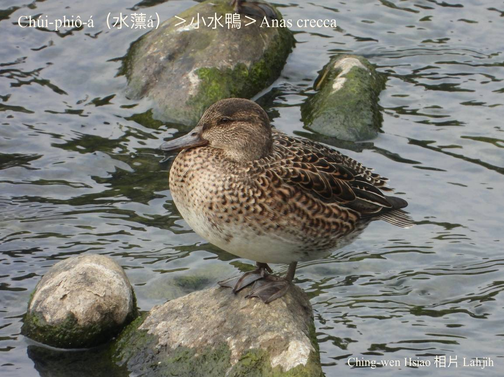
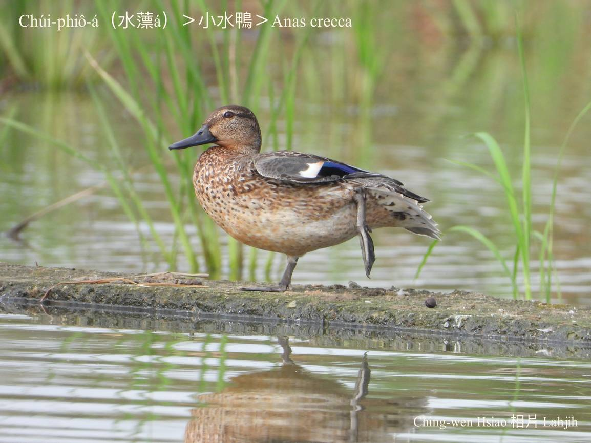
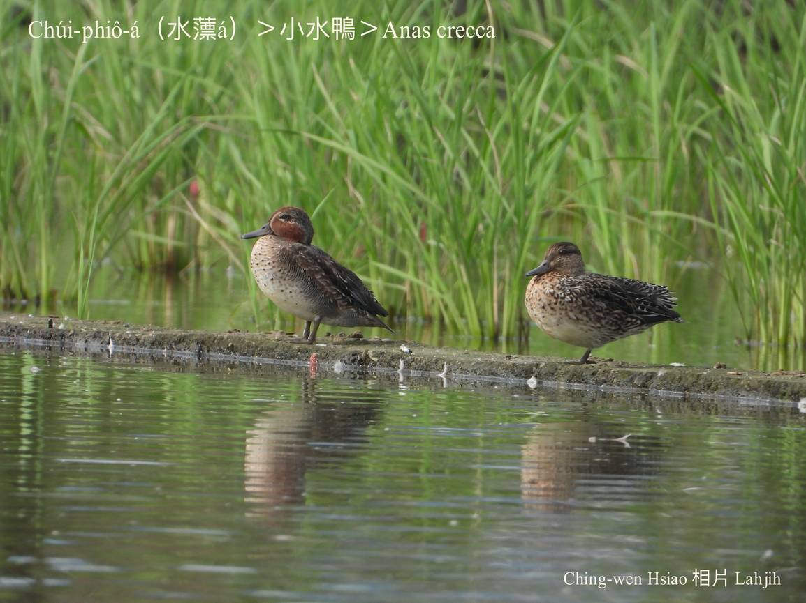
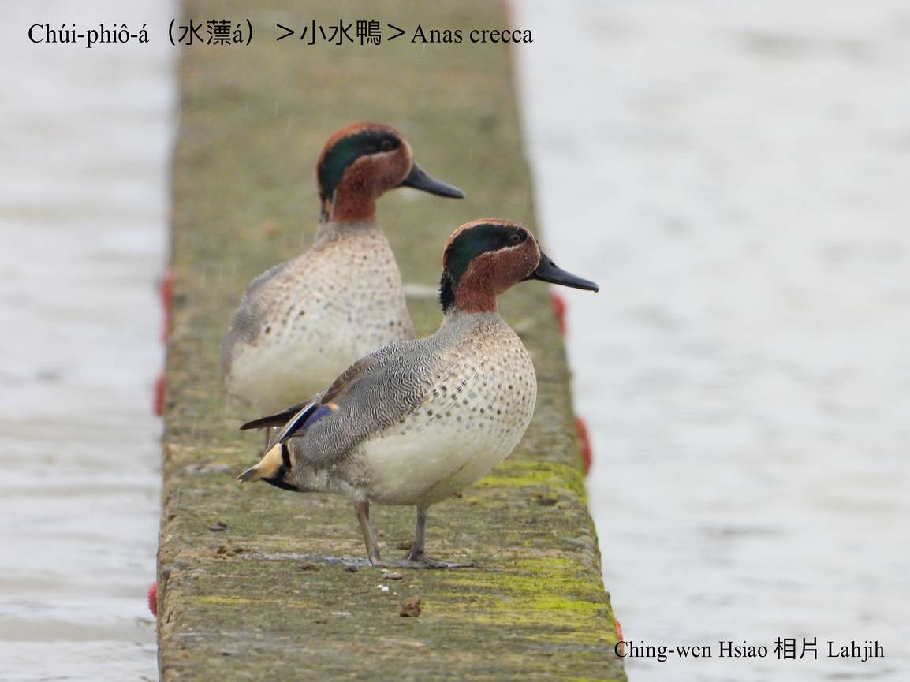
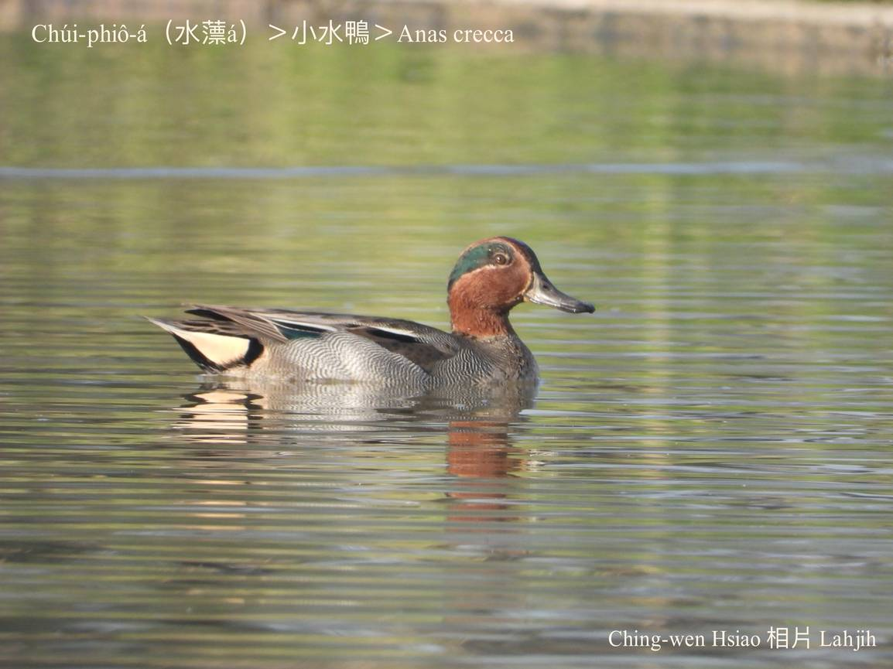

#### 7. Gān-ah Kho『雁鴨科』

|台灣名|中譯名|學名|
|Chúi-phiô-á（水薸á）|小水鴨|Anas crecca|

# 7-5. Chúi-phiô-á（水薸á）

Chúi-phiô-á是過冬鳥，寒天飛來台灣歇寒，是雁鴨類siāng普遍ê一種，日--時kui千萬隻浮tiàm水面歇睏，kài-sêng水薸。Kah意tī溪口、濕地、lòm地、水潭歇睏chhōe食。早暗時陣時常絞群tī水面chhōe食，有時ē排成人--字-型飛來飛去，非常優美。

# 【Tâi-oân Chiáu-á Liām Koa-si】

### **Chúi-phîo-á Ài Sńg-chúi**

Hn̄g-hn̄g khòaⁿ

Ná-chhiūⁿ chi̍t-phiàn chúi-phiô-á phû chúi-bīn

Kīn-kīn khòaⁿ

Chiah-chai sī chi̍t-tīn chúi-phiô-á teh sńg-chúi

Kui-pah kui-chheng ê chúi-phiô-á

Tī pêⁿ-pho-pho ê chúi-bī, éng--leh éng--leh

Kóng ū gōa kó͘-chui tō ū gōa kó͘-chui

### 【註解】

|詞|解說|
|水薸|Chúi-phiô，浮萍。|
