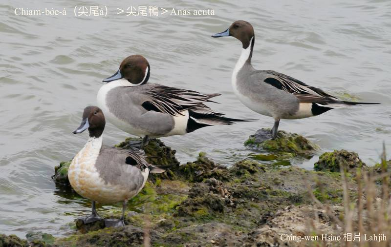
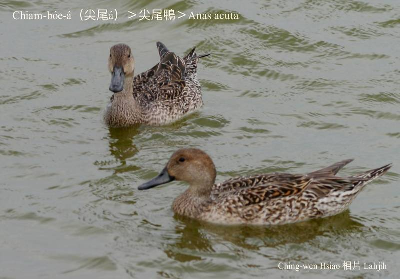
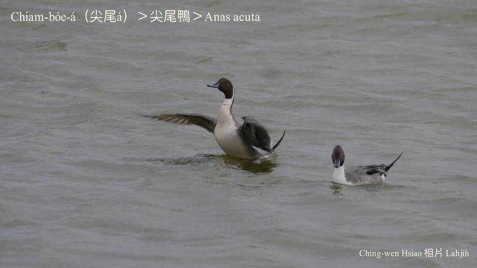
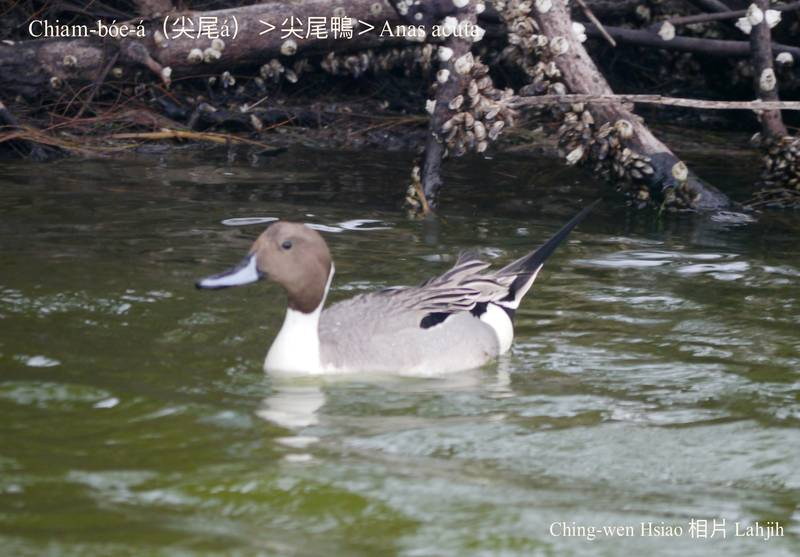
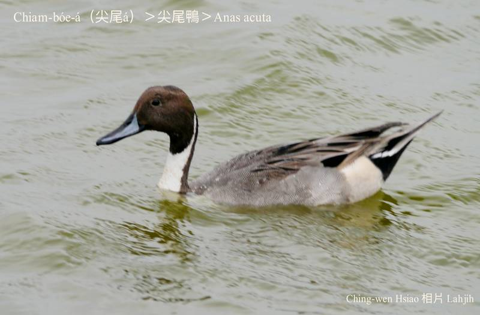

#### 7. Gān-ah Kho『雁鴨科』

|台灣名|中譯名|學名|
|Chiam-bóe-á（尖尾á）|尖尾鴨|Anas acuta|

# 7-6. Chiam-bóe-á（尖尾á）

Chiam-bóe-á，公母鴨色水chiâⁿ無kāng-khoán，公鴨ê尾，中央有二ki尖尖長長翹翹ê羽毛，sêng尖尾形，所以號做尖尾á。公鴨有phú色hām烏chhap白ê羽毛，khah影目；母鴨是花花珈琲phú色，尾khah無hiah尖。

Chiam-bóe-á是中大型雁鴨科水鳥，飛真緊koh飛真遠，kah意溪流、埤圳、濕地活動討食，tī台灣是冬hāu-niáu。

### 【註解】

|詞|解說|
|hāu-niáu|『候鳥』。|
