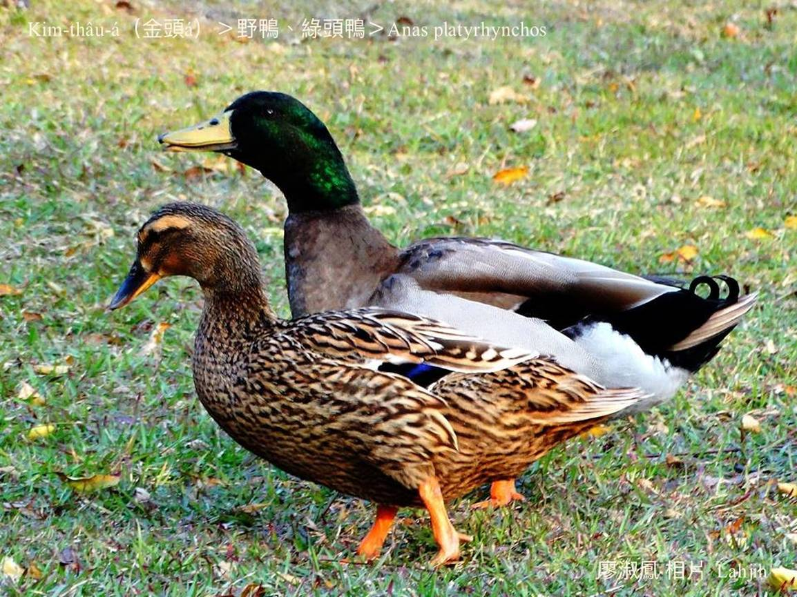
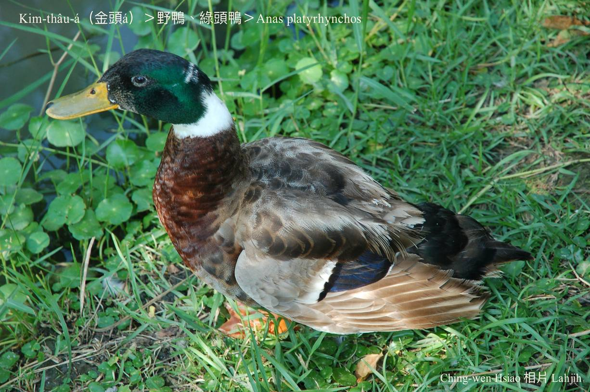
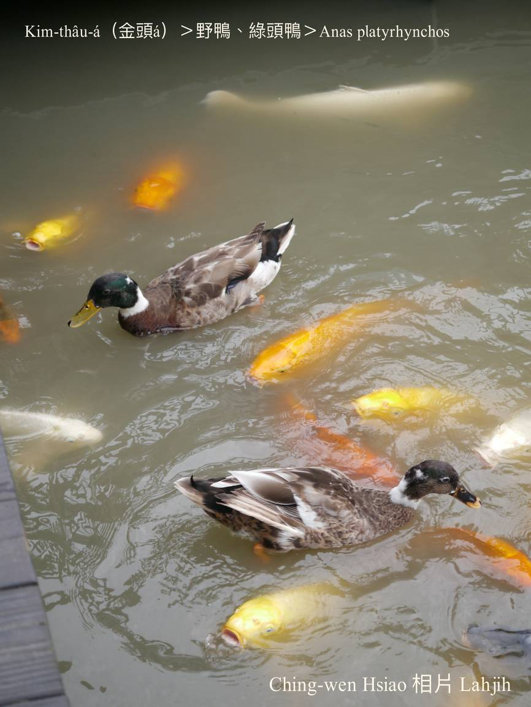
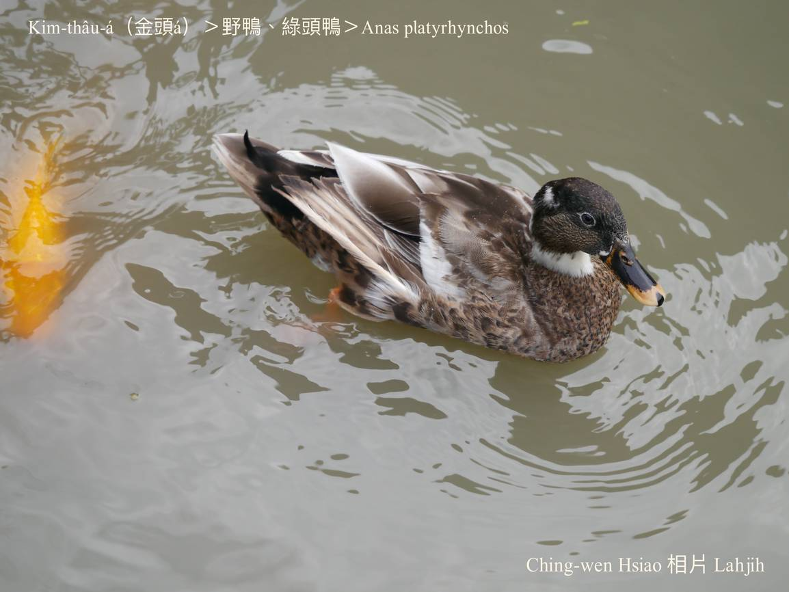
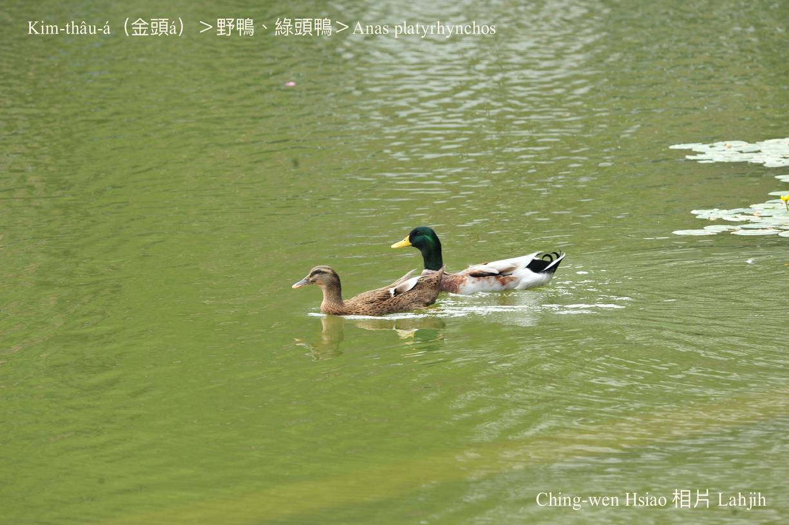
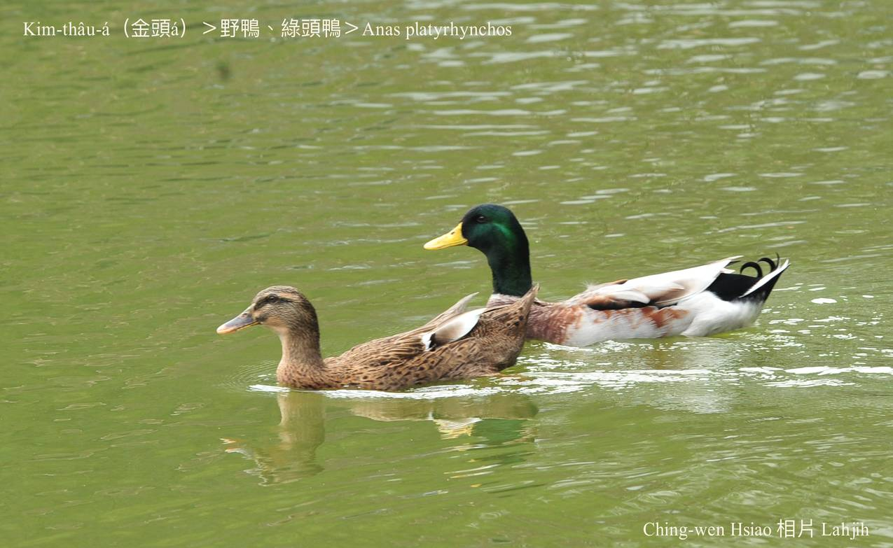

#### 7. Gān-ah Kho『雁鴨科』

|台灣名|中譯名|學名|
|Kim-thâu-á（金頭á）|野鴨、綠頭鴨|Anas platyrhynchos|

# 7-7. Kim-thâu-á（金頭á）

Kim-thâu-á主要分佈tī北半球，tī台灣是chin-chia̍p看ê雁鴨水鳥，sui-bóng是過冬鳥，mā有bē少是在地鳥，而且有人ka飼tiàm觀光所在ê魚池水潭，hō͘人看súi。

公鴨ê頭kap ām-kún，有金金深綠色ê羽毛，所以叫做金頭á，phah獵ê人慣習用水鴨ê名。真gâu飛。

# 【Tâi-oân Chiáu-á Liām Koa-si】

### **Kim-thâu-á Chhōa Bó͘ Sì-kè Siû**

Kim-thâu-á, thâu-khak kim-kim

Kim-kong chhiāng-chhiāng-kún

Ta̍k-ji̍t chhōa súi-bó͘ chúi-khut-á sì-kè siû

Kám-sī súi-chiáu bô súi-miā

A̍h-sī lín siuⁿ-kòe chhiaⁿ-iāⁿ

Soah jiá lâng gia̍h-chhèng kā lín tōaⁿ

Khiap-sì miā-ūn, hoah-hiu, kiù-miā

### 【註解】

|詞|解說|
|khiap-sì miā-ūn|薄命，苦命，命運很差。|
|khiap-sì|面bái，面pháiⁿ看。|
