#### 7. Gān-ah Kho『雁鴨科』

|台灣名|中譯名|學名|
|Pe̍h-ba̍k-bâi-á（白目眉á）|白眉鴨|Spatula querquedula|

# 7-8. Pe̍h-ba̍k-bâi-á（白目眉á）

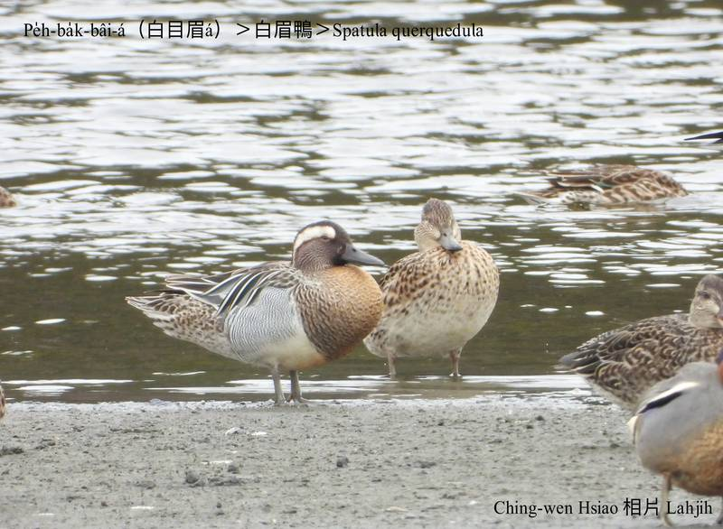

Pe̍h-ba̍k-bâi-á公鴨頭殼有chi̍t-sûn真大chōa ê白sûn，ná像目眉，ùi目chiu téng-koân liân-sòa到ām-kún，非常影目，m̄-chiah hō͘人hō-chò白目眉á。屬小型水鴨，暗時討食，日--時歇睏，食水內植物枝骨、葉á、種子。

Pe̍h-ba̍k-bâi-á tī台灣是過境水鳥，過境期間出現tī曠闊ê溪口、埤潭、lòm地，tī台灣算是普遍ê過境鳥，ta̍k年春天3-4月á到秋天10--月lóng看ē tio̍h，kan-nā有少數ē tiàm台灣過冬。

# 【Tâi-oân Chiáu-á Liām Koa-si】

### **Pe̍h-ba̍k-bâi-á Ba̍k-bâi Tōa**

Pe̍h-ba̍k-bâi-á hàm-kōa-kōa

Ba̍k-bâi ōe kah hiah-nī tōa

Lâng súi sī súi tī ba̍k-chiu tōa-tōa lúi

Lí soah kā ba̍k-bâi ōe kah pe̍h-sih-siak

Soah hō͘ goán khòaⁿ kah bô nih-ba̍k

O-ló chi̍t-siaⁿ "Ná-ē chiah-nī súi"

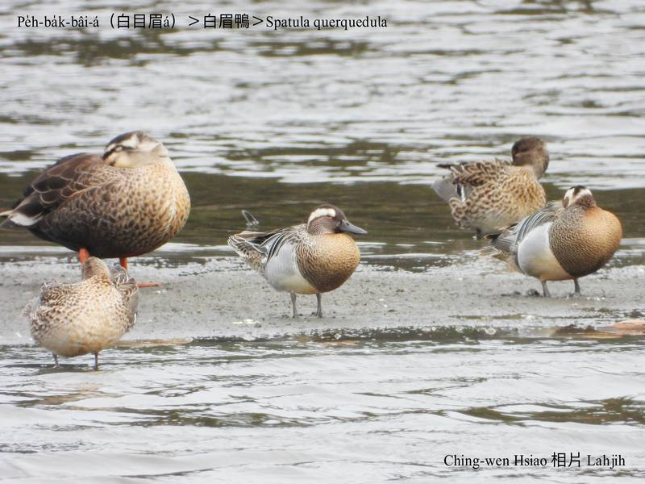
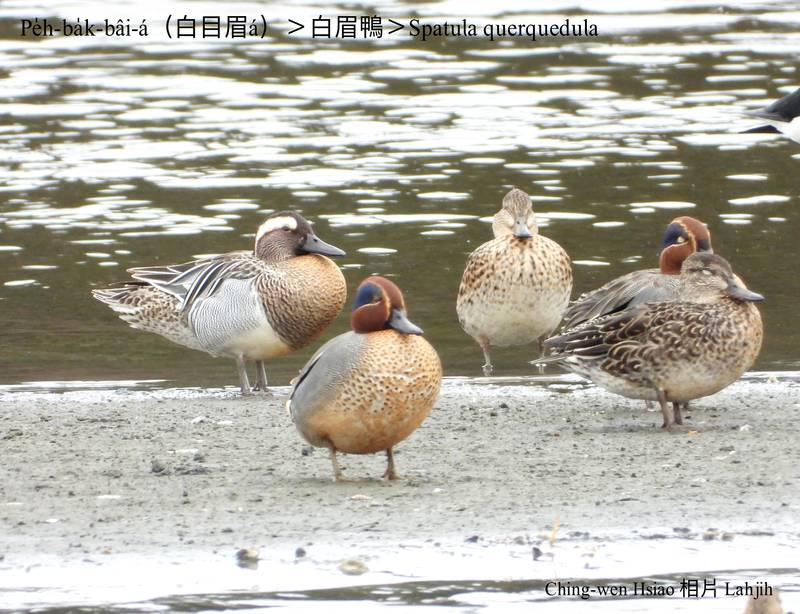
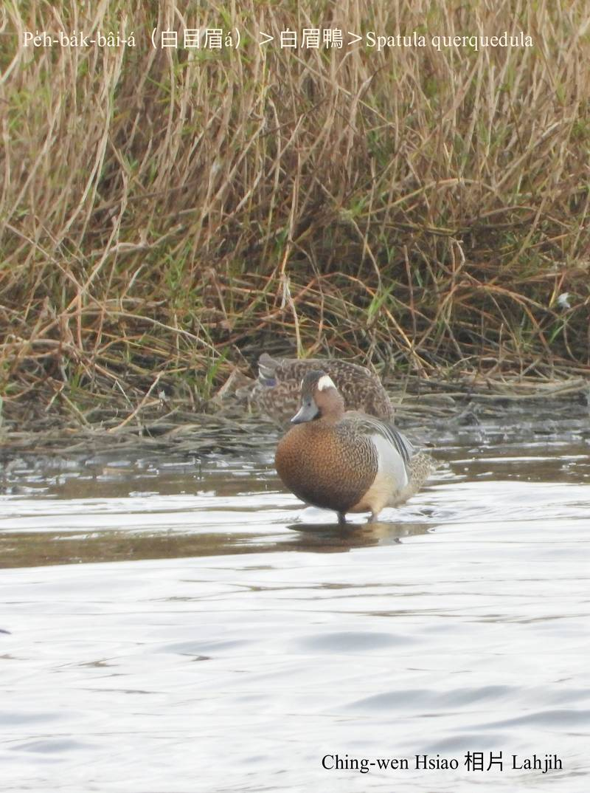
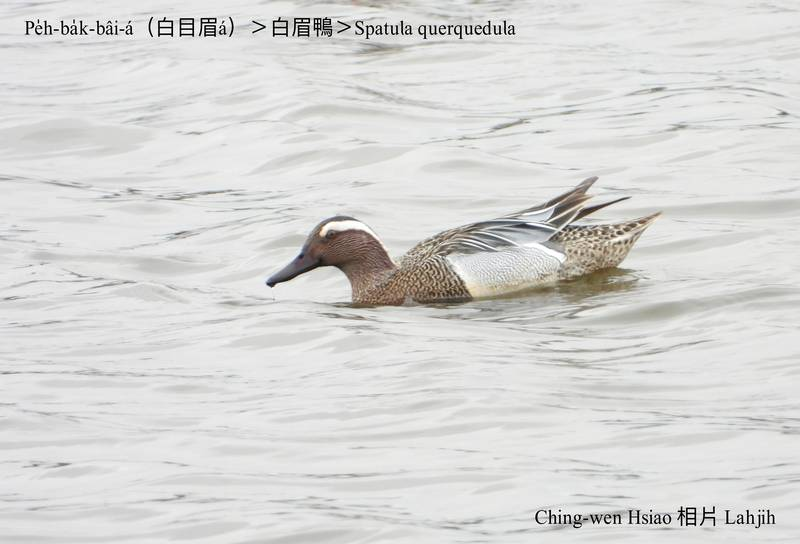
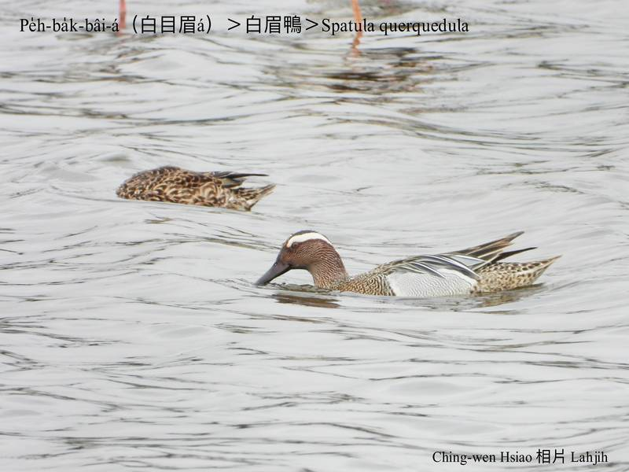
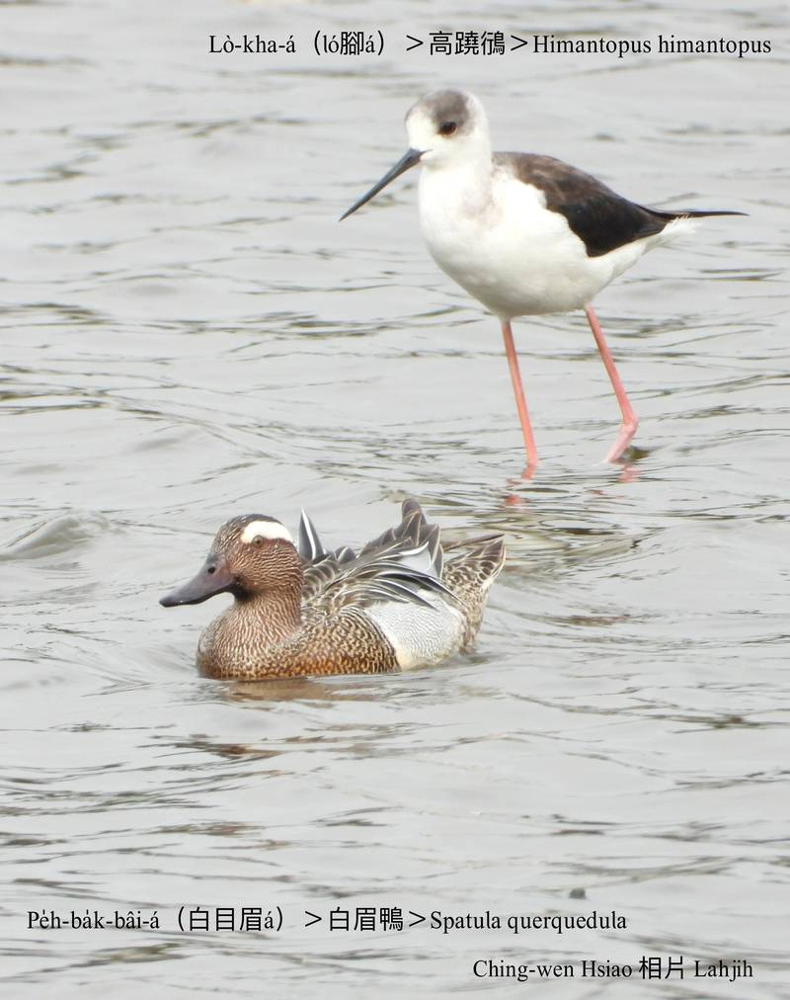
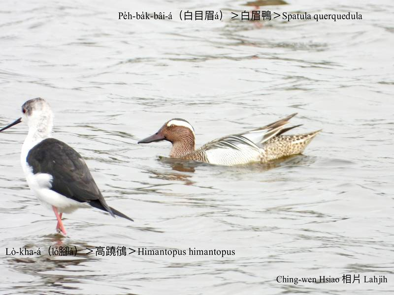
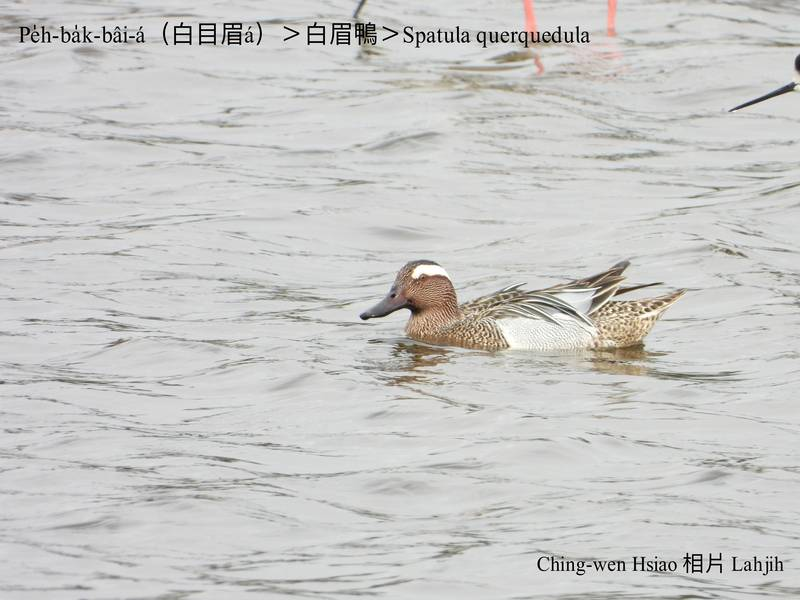
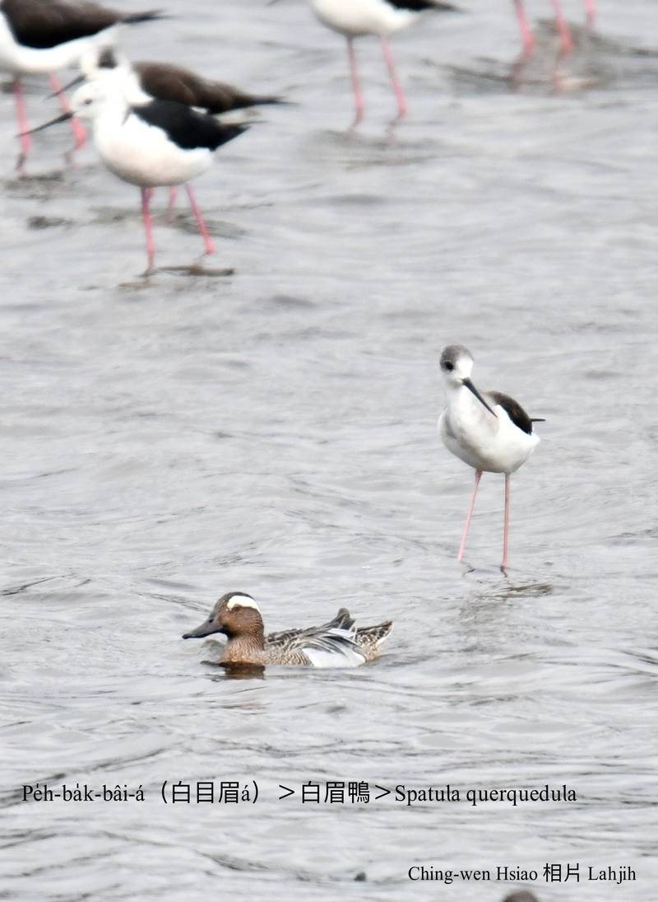
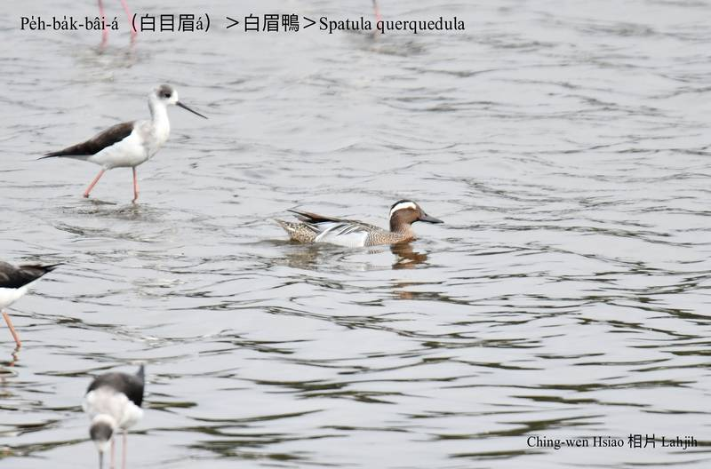
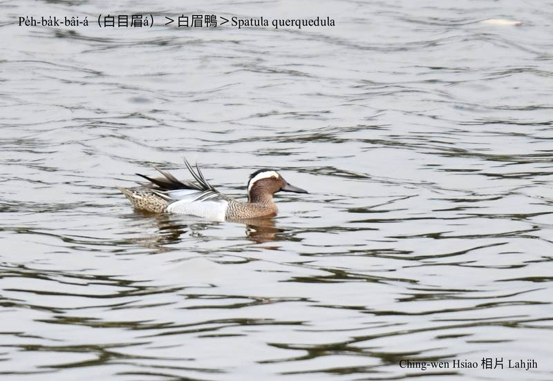
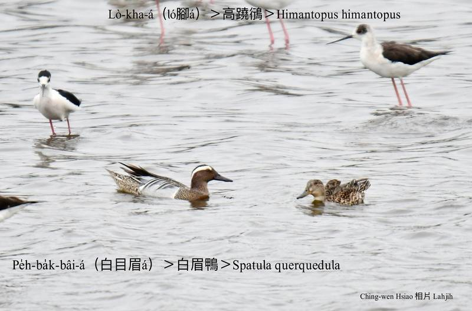
