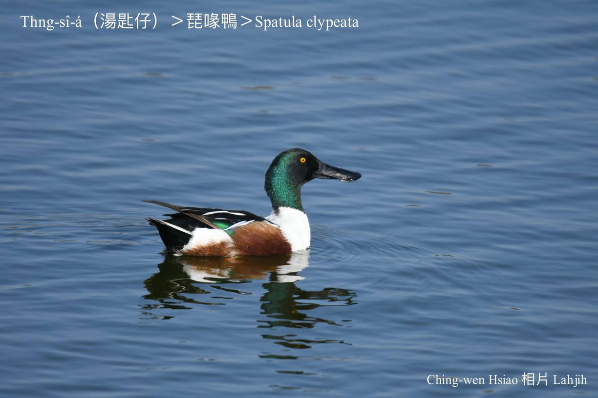
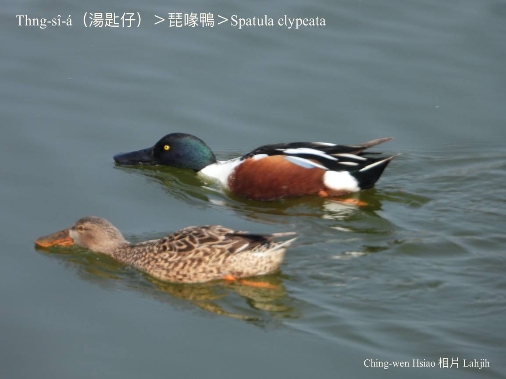
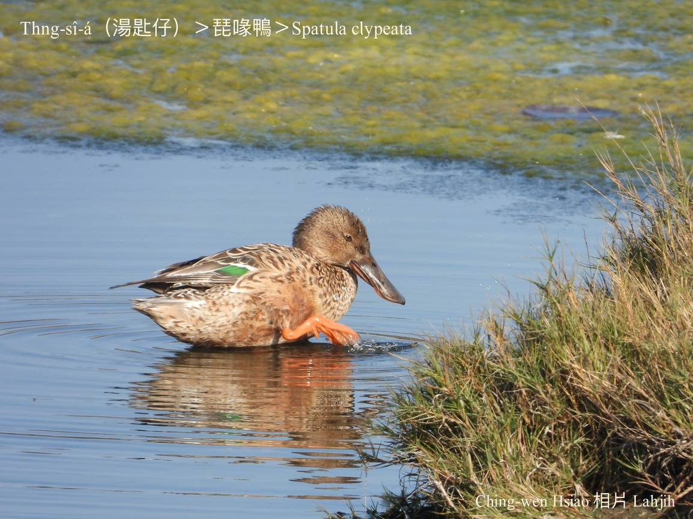
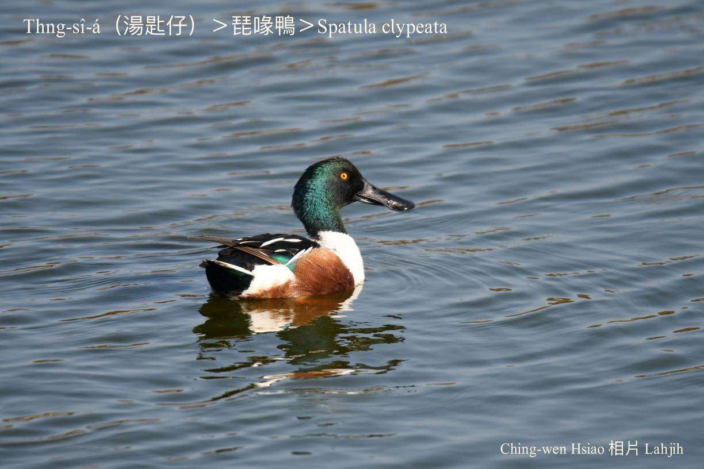
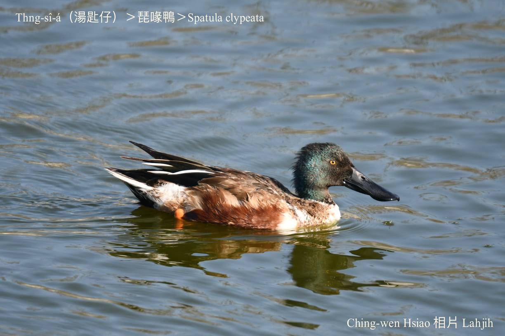
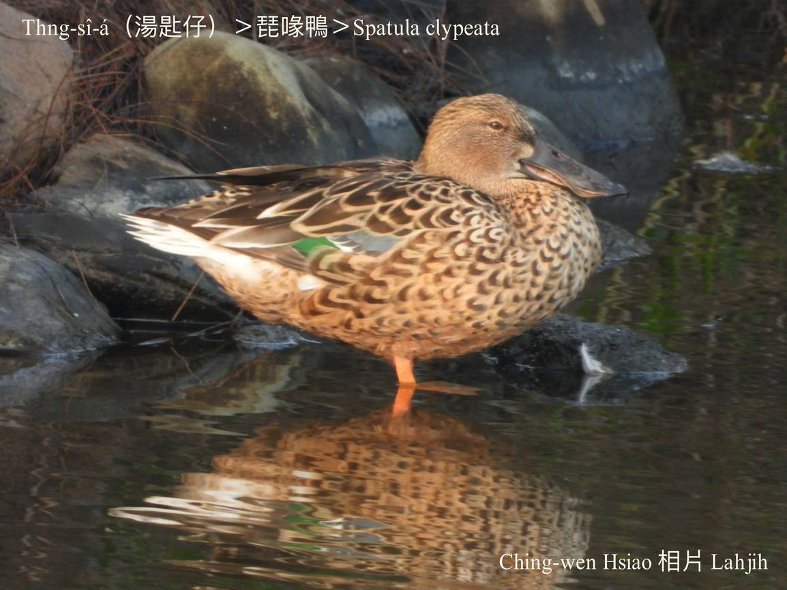

#### 7. Gān-ah Kho『雁鴨科』

|台灣名|中譯名|學名|
|Thng-sî-á（湯匙á）|琵琶鴨、琵嘴鴨|Spatula clypeata|

# 7-9. Thng-sî-á（湯匙á）

Thng-sî-á ê公母鴨嘴形，lóng像湯匙á形。因為in ê嘴pe闊koh扁，所以koh叫做大嘴pe-á。

Thng-sî-á kah意開闊ê埤潭溪流，山頂高地有水ê水窟mā看ē tio̍h，是過冬鳥。

Thng-sî-á sèng-sò͘敏感，sió-khóa動靜隨時飛leh走。

Ham-bān chhàng-chúi-bī，hèng食水面蟲thōa、魚蝦，mā ē食植物。

Thng-sî-á sui-bóng iáu未列入絕種名單，因為phah獵kap環境ê破壞，目前數量khah少。

# 【Tâi-oân Chiáu-á Liām Koa-si】

### **Thng-sî-á  Tōa-chhùi-pe**

Khòaⁿ gún ê hêng-thé, kap kim-thâu-á chiâⁿ sêng

Lín nā boeh hun ē chheng, chhiáⁿ khòaⁿ gún ê chhùi-hêng

Chhùi-pe tōa-tōa, ū-lâng kiò gún tōa-chhùi-pe

Chhùi-pe chhiūⁿ thng-sî, mā hō͘ lâng hō-chò thng-sî-á

Khòaⁿ--khí-lâi gōng-tai gōng-tai

Khòaⁿ gún siû-chúi koh kó͘-chui kó͘-chui

