#### 7. Gān-ah Kho『雁鴨科』

|台灣名|中譯名|學名|
|Oan-iuⁿ（鴛鴦）|鴛鴦|Aix galericulata|

# 7-10. Oan-iuⁿ（鴛鴦）

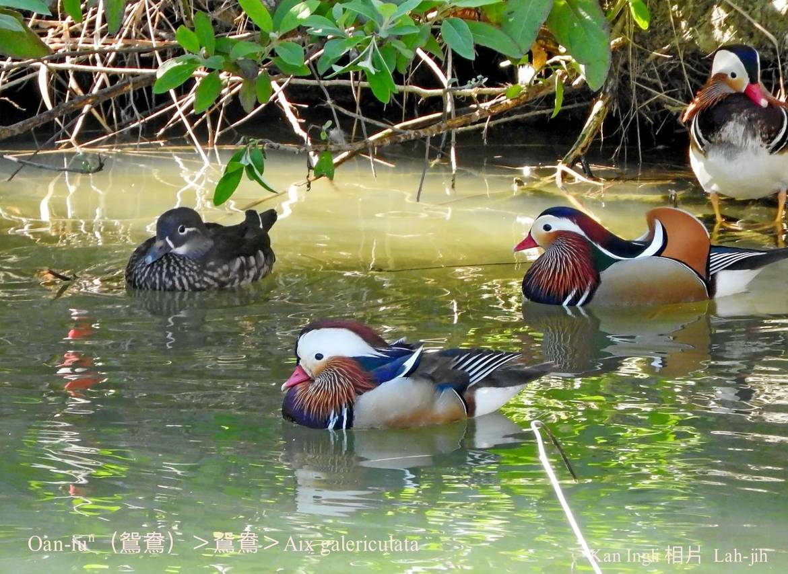

Oan-iuⁿ tī台灣是罕有ê在地鳥a̍h-sī hāu-niáu。Kah意坑溝á樹椏做siū，生湠期間1公1母做夥生湠，隔冬chiah koh重新配對。Hèng食魚栽、水底蟲thōa、幼íⁿ。

公鳥色水艷麗chiok súi，hō͘人飼leh看súi。

自古鴛鴦lóng hō͘人比論做ang某恩愛ê模範，其實包含鴛鴦在內ê雁鴨類水鳥á，一般雖然是一夫一妻制，不過chit-ê ang某關係只限tī當年ê生湠期間。所以比論非正式ang某是野鴛鴦ē-thong，講恩愛夫妻是鴛鴦to̍h無通--lò͘。

# 【Tâi-oân Chiáu-á Liām Koa-si】

### **Oan-iuⁿ Oan-iuⁿ Súi-tang-tang**

Oan-iuⁿ oan-iuⁿ súi-tang-tang

Ú-mn̂g sek-chúi chiâⁿ bê-lâng

Un un ài ài chò bí-bāng

Ū-iân saⁿ-ài kòe chi̍t-tang

Môa-nî tàu-tīn--ê bô-sio-kāng

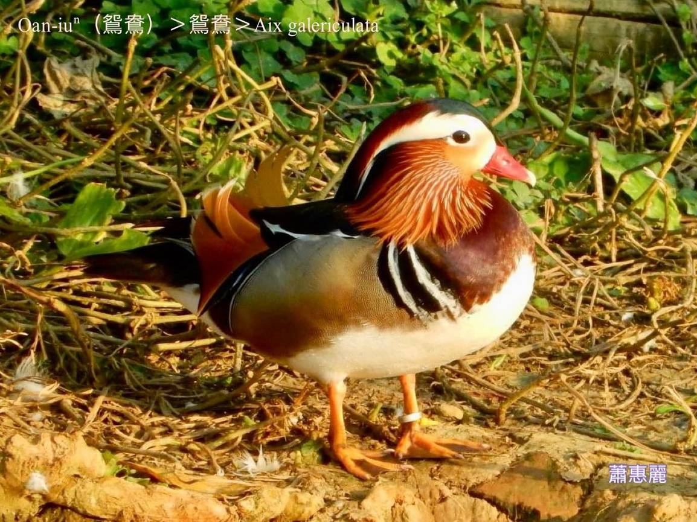
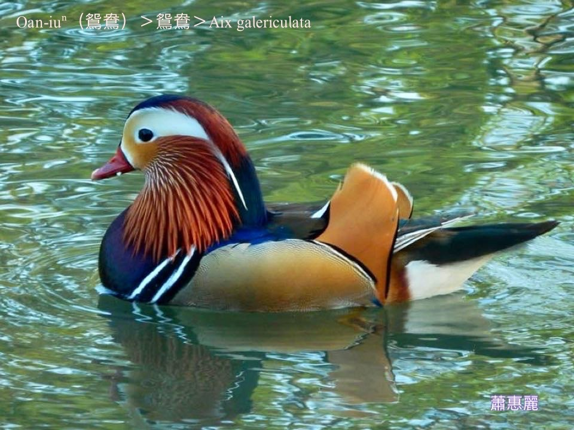
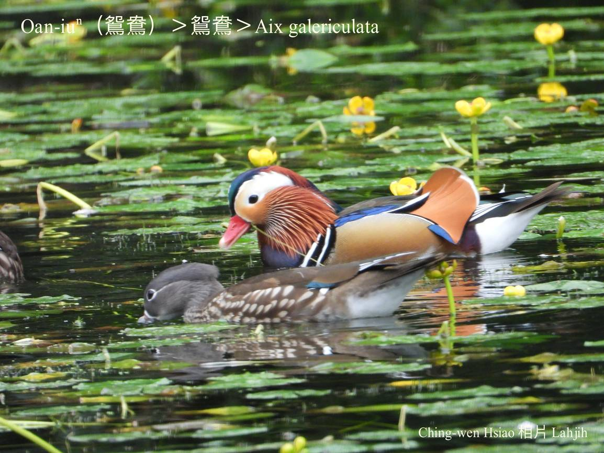
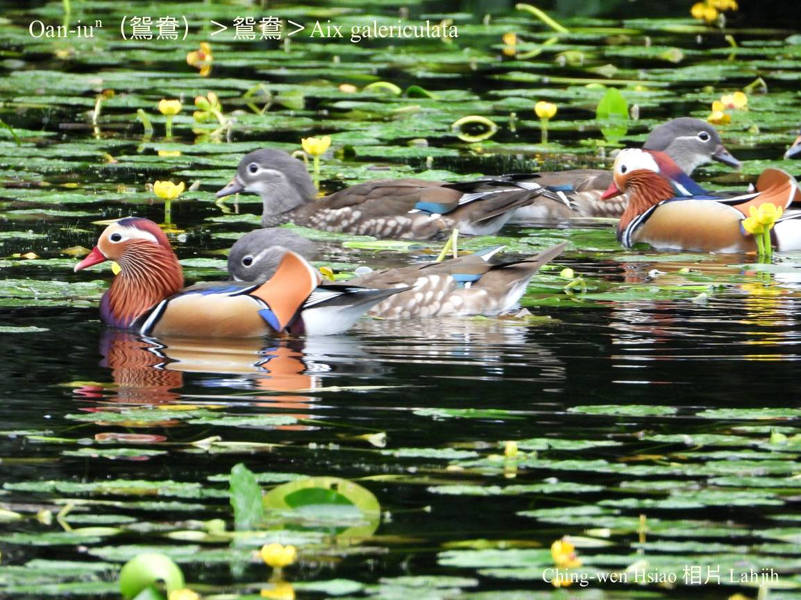
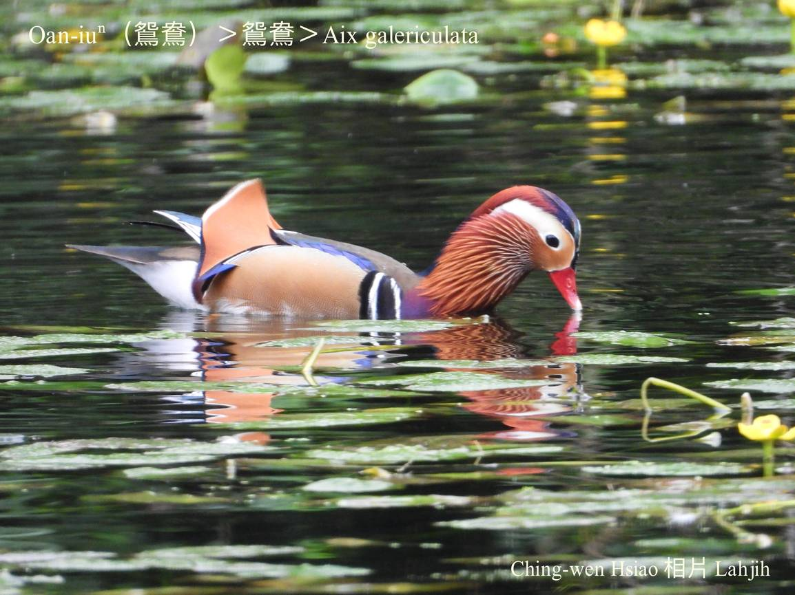
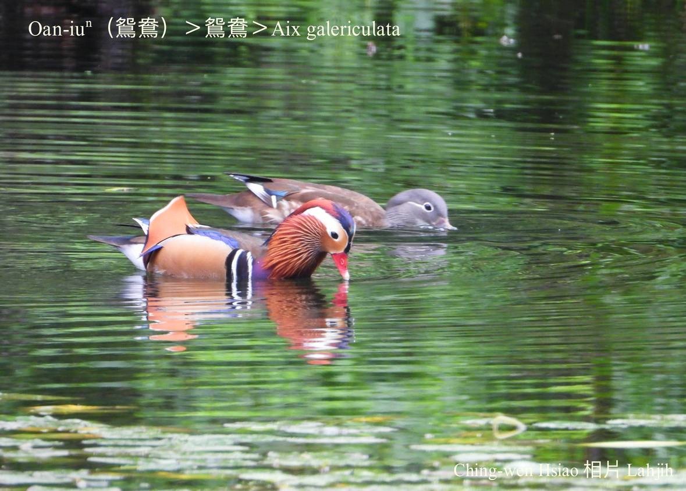
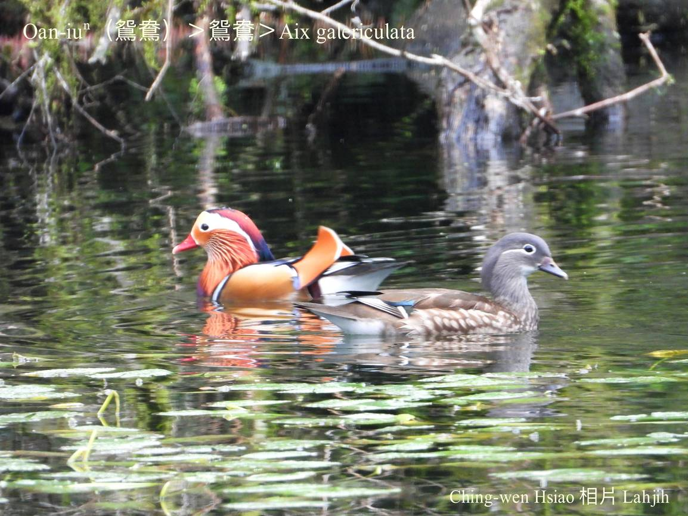
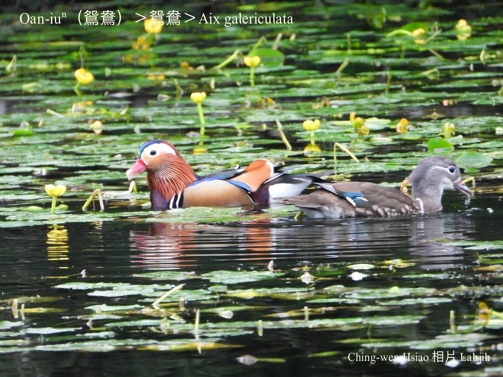
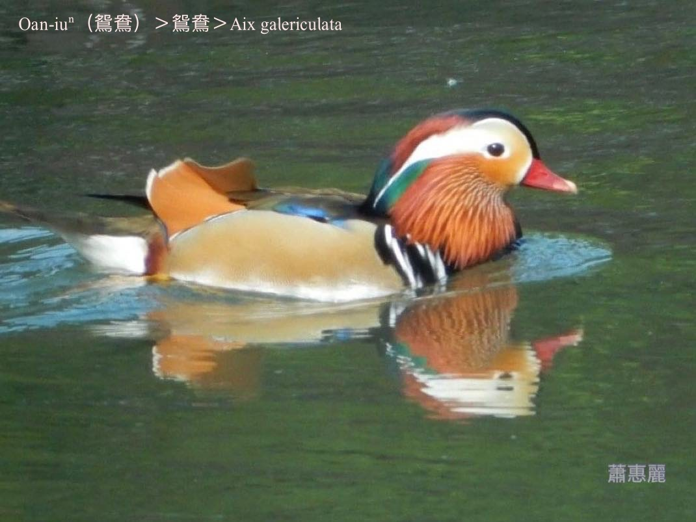
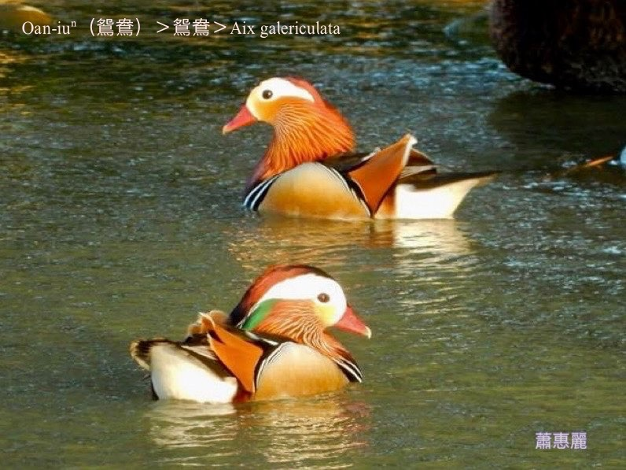
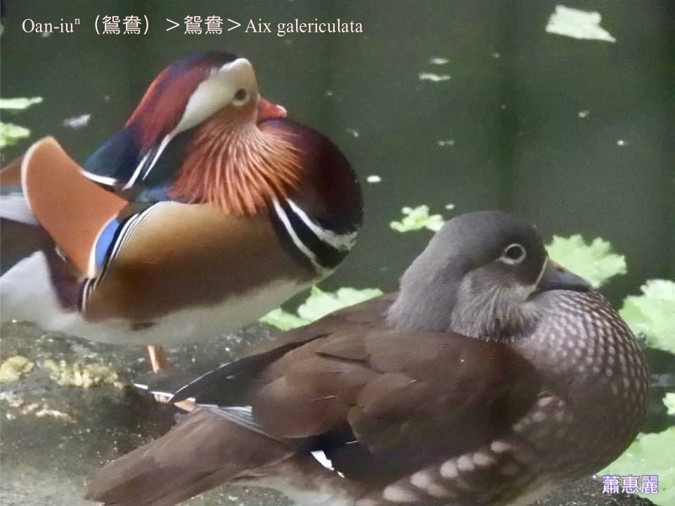

### 【註解】

|詞|解說|
|hāu-niáu|『候鳥』。|
|樹椏|Chhiū-oe。|
