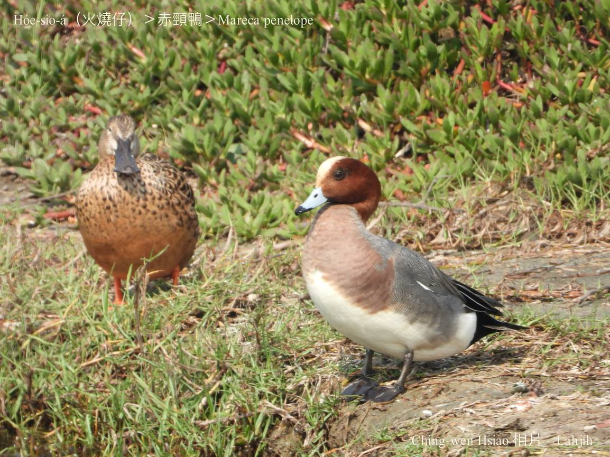
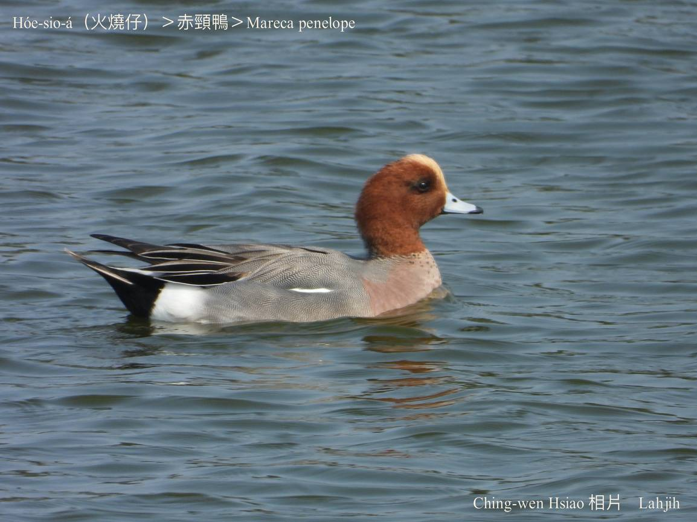
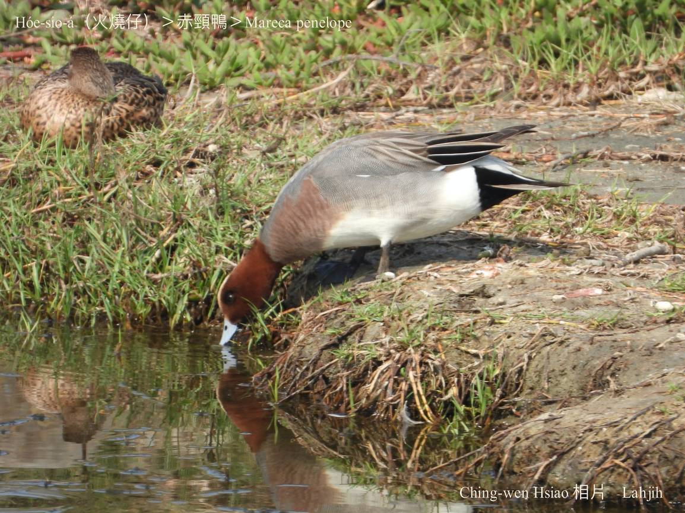
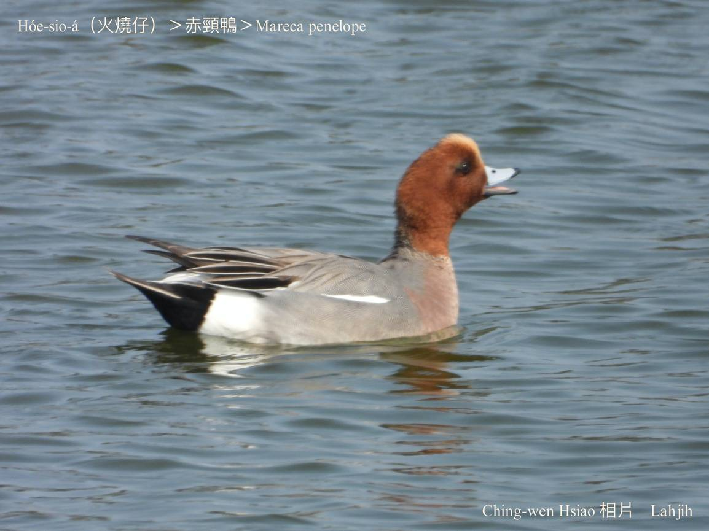

#### 7. Gān-ah Kho『雁鴨科』

|台灣名|中譯名|學名|
|Hóe-sio-á（火燒á）|赤頸鴨|Mareca penelope|

# 7-11. Hóe-sio-á（火燒á）

Hóe-sio-á公鳥ê頭殼kap ām-kún是牛屎紅色，頭額金黃色，看起來ná像hō͘火燒過，非常影目，chiâⁿ做伊ê特色。

Hóe-sio-á kah意淺水lòm地埤圳水草ōm-ōm岸邊，ē chhàng-chúi-bī，遷徙時ē hām其他雁鴨絞群飛行。Tī台灣是普遍過冬鳥，低海拔海岸濕地lóng有記錄，主要食水草過日。

# 【Tâi-oân Chiáu-á Liām Koa-si】

### **Hóe-sio-á Hō͘ Hóe Sio**

Kám ū-lâng o͘-pe̍h tiám-hóe sio chháu

Hóe-sio-á hóe-sio-á

Lí ná hō͘ hóe sio kah thâu-mo͘ âng-kì-kì

Hó-ka-chài  bô-tāi-chì

Chi̍t-chūn hóe-sio soah hō͘

Hóe-sio-á piàn-kah chiah-nī súi

### 【註解】

|詞|解說|
|影目|Iáⁿ-ba̍k。|
|遷徙|Chhian-sóa。|
