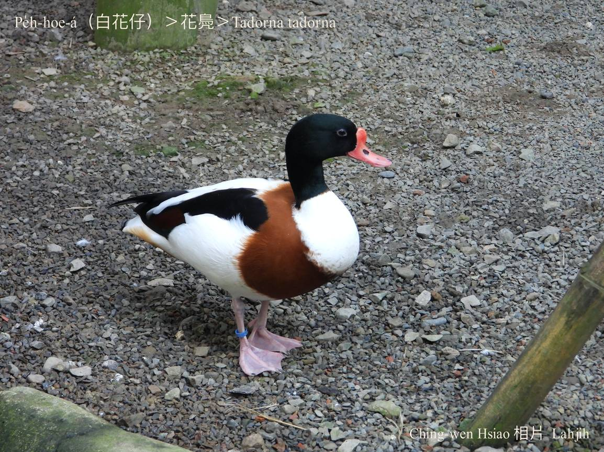
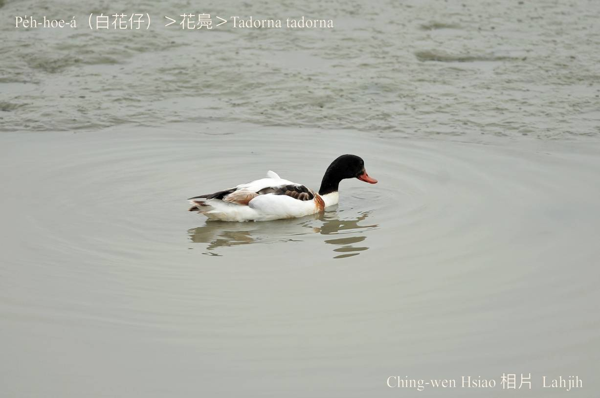
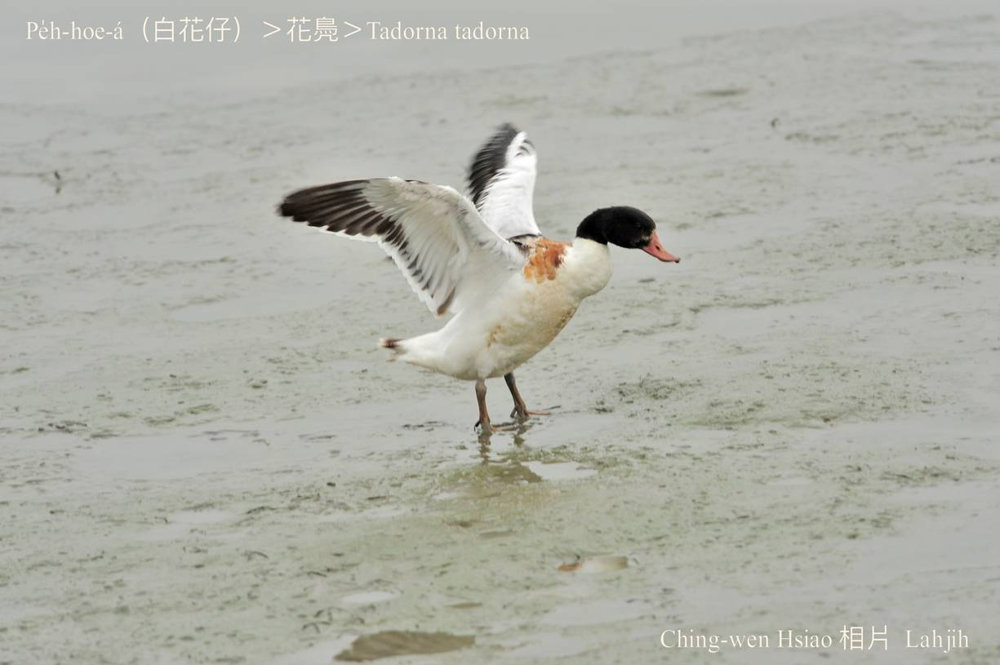
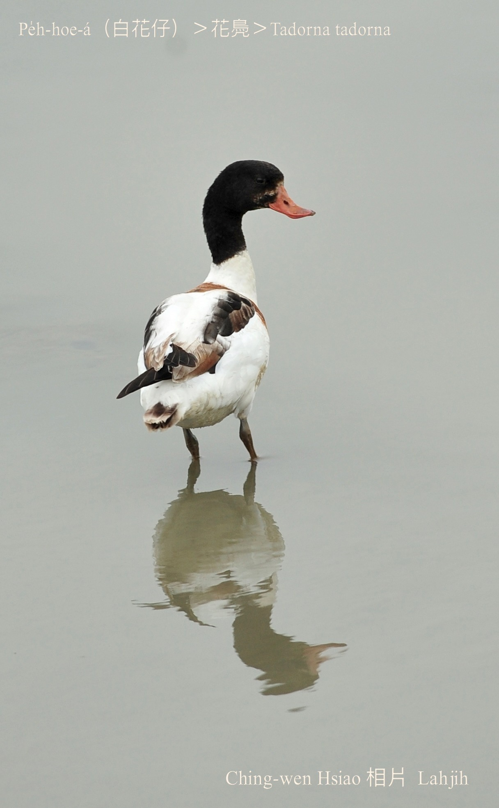
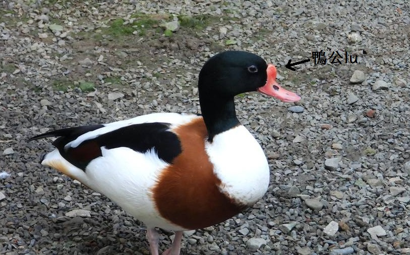

#### 7. Gān-ah Kho『雁鴨科』

|台灣名|中譯名|學名|
|Pe̍h-hoe-á（白花á）|花鳧|Tadorna tadorna|

# 7-12. Pe̍h-hoe-á（白花á）

Pe̍h-hoe-á ê特徵to̍h是kui身軀鳥毛烏、白、咖啡紅chi̍t-chhop chi̍t-chhop chhap kah chiâⁿ影目súi款。頭殼ām-kún烏綠色，ām-kui、腹肚、kha-phiaⁿ白色，胸坎咖啡紅，翼尾烏色，嘴pe尾溜sió-khóa翹翹，公鴨鼻khang頂有鴨公lu。

Pe̍h-hoe-á主要tī chiáⁿ水埤潭、溪流、鹽埕、海灣濕地活動，冬天時常幾十幾百隻做夥chhōe食。

Pe̍h-hoe-á好嘴斗，鹹水chiáⁿ水魚蝦、蟲thōa、ham-á、露螺、水蛙，植物種子ta̍k項食。

Pe̍h-hoe-á tī台灣是過冬鳥。

# 【Tâi-oân Chiáu-á Liām Koa-si】

### **Pe̍h-hoe-á Siāng Chhia-iāⁿ**

Pe̍h-hoe-á pe̍h-hoe-á gâu siat-kè

Tòe sî-kiâⁿ

Tōa-táⁿ chhap sek

Pe̍h-sek chhap o͘-sek sī tùi-pí

Ū o͘ ū pe̍h ū ka-pi

Ū-kàu iáⁿ-ba̍k ū-kàu siâⁿ-lâng

Âng súi o͘ tōa-pān

Pe̍h-hoe-á o͘ pe̍h ka-pi siāng chhia-iāⁿ

### 【註解】

|詞|解說|
|鳥毛|Chiáu-mn̂g。|
|影目|Iáⁿ-ba̍k。|

