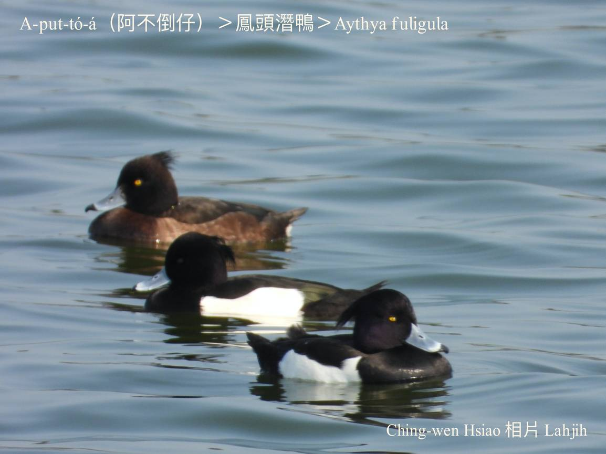
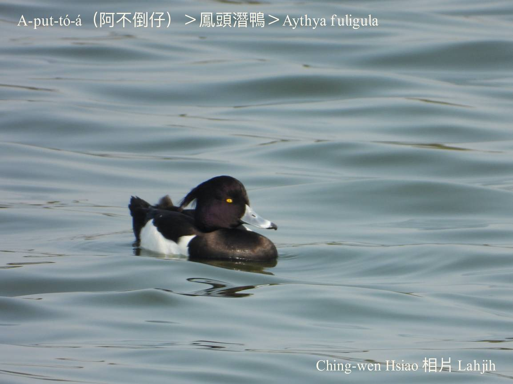
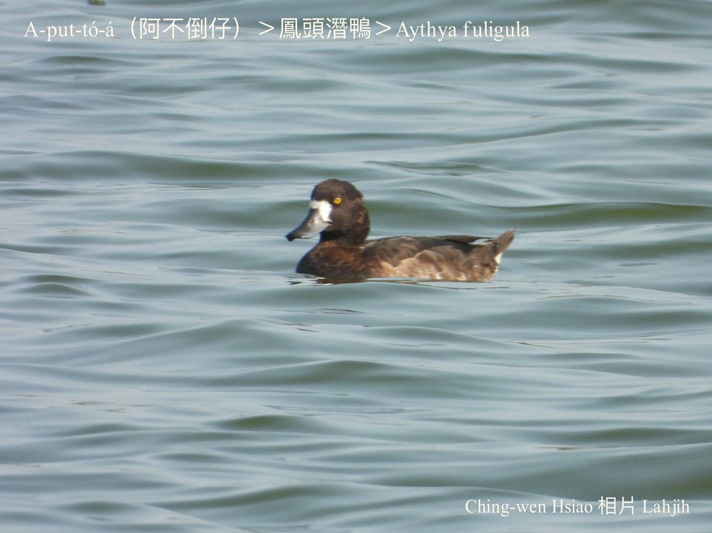
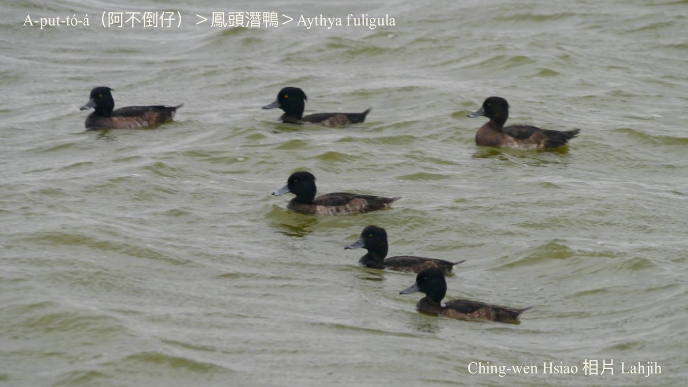

#### 7. Gān-ah Kho『雁鴨科』

|台灣名|中譯名|學名|
|A-put-tó-á（阿不倒á）|鳳頭潛鴨|Aythya fuligula|

# 7-13. A-put-tó-á（阿不倒á）

A-put-tó-á tī台灣是chiâⁿ普遍ê過冬鳥，chú-iàu出現tī khah深水ê lòm地、水池、大埤、魚塭所在。

A-put-tó-á身長40外公分，公母外形bô-kang，鴨公白phú色嘴pe、烏嘴尖，身軀烏色chhap白腹肚，後斗殼á有頭鬃尾á；鴨母嘴pe khah暗色，頭殼、ām-kún深咖啡色，翼股咖啡色，khim-heng、腹肚淺咖啡色。

A-put-tó-á hèng食水底水草、thâng-thōa、ham-á貝類，時常kui-tīn tiàm曠闊水面泅水thit-thô，倒頭栽chhàng-chúi-bī討食，看in tiàm水面搖--leh hiáⁿ--leh ná a-put-tó，有夠消遙心適。

### **Lahjih gín-á歌**
>**阿不倒**

阿不倒，真古錐，矮kò͘矮kò͘，兩撇短嘴鬚，

搖過來，搖過去，

笑伊thûi-thûi，伊攏bē受氣。

### 【註解】

|詞|解說|
|khim-heng|鴨kap雞等胸坎ê肉。|

