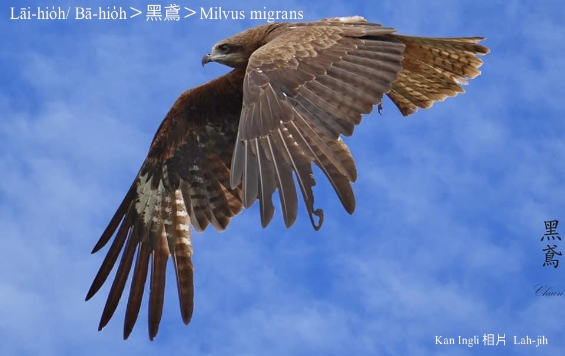

#### 8. Chiū-eng Kho『鷲鷹科』

|台灣名|中譯名|學名|
|Lāi-hio̍h/bā-hio̍h|老鷹、黑鳶|Milvus migrans|

# 8-1. Lāi-hio̍h／bā-hio̍h

Lāi-hio̍h，chit-mái tī台灣是罕有ê留鳥。Éng過ùi台灣頭到台灣尾，自低海拔ê山區、平洋到海邊，lóng有伊ê腳跡，常常看伊tī半空中飛來飛去leh bā雞á栽。除起生湠期間，lāi-hio̍h ē絞群thit-thô相jiok，boeh-àm-á時ē相招空中se̍h來se̍h去飛行。基隆港邊時常有lāi-hio̍h chhōe食ê形影，hông選做基隆市鳥。

1948 gín-á時代庄腳所在，時常有一隻、兩隻lāi-hio̍h飛來空襲lia̍h雞á-kiáⁿ，咱tio̍h趕緊kā門埕雞á-kiáⁿ kho͘轉來雞chho̍p-á內。Su-tong-sî ta̍k口灶lóng有飼cheng-seⁿ-á，日--時放tī外口thit-thô，boeh-àm-á chiah關雞寮鴨寮，he細隻雞á-kiáⁿ雞母to̍h-ē chhōa leh chhù前chhù後thit-thô chhōe食，chhéng蟲thōa khioh米粟。

Só͘-pái，lāi-hio̍h tī hit-ê年代是真有故事ê鳥仔。

### Lāi-hio̍h ê台灣俗語

「一隻lāi-hio̍h，bā七里雞á。」

「無罩雞母，phah人lāi-hio̍h。」

「M̄關雞母，phah人lāi-hio̍h。」	

### 嬰á滿月「hoah lāi-hio̍h」ê禮俗

1948 Lah-jih 8 hòe，大嫂生後生滿月，教我kō͘ āiⁿ巾āiⁿ嬰á去門口埕尾hoah「lāi-eh-hoh」，koh khioh chit粒súi型súi型石頭á轉來hō͘大嫂，嬰á tháu--落-來了後，大嫂giâ一ki雞腿叫我bih tiàm門後食，有夠歡喜。

Hit粒石頭á是boeh kā嬰á洗頭時，提來kō頭殼boeh hō͘嬰á「頭殼tēng」khah聰明。

### Lāi-hio̍h ê唸謠

「Lāi-hio̍h、lāi-hio̍h，恁娘腹肚痛，我有藥，你無藥，柑á皮，柚á葉。」

「Lāi-hio̍h、lāi-hio̍h，lāi-hio̍h飛chiūⁿ山，gín-á快做官。」

「Lāi-hio̍h飛koân-koân，gín-á中狀元；lāi-hio̍h飛低低，gín-á快做pē。」

「O͘-chhiu皇帝，lāi-hio̍h乞食。」

（Lāi-hio̍h偷咬雞á koh驚o͘-chhiu ê行為。）

# 【Tâi-oân Chiáu-á Liām Koa-si】

### **Lāi-hio̍h Poe Koân-koân**

Lāi-hio̍h lāi-hio̍h chin-gâu poe

Poe-koân poe-kē ná hui-hêng-ki

Lāi-hio̍h poe koân-koân

Chio lí lâi-khì Pó-táu chia̍h bah-oân

Lāi-hio̍h poe kē-kē

Chio lí lâi-khì Chhân-tiong bé hoan-be̍h

### 【註解】

|詞|解說|
|基隆|Ke-lâng/Koe-lâng。|
|黑鳶|O͘-iân。|
|bā|捕lia̍h。|
|雞á栽|雞á-kiáⁿ。|
