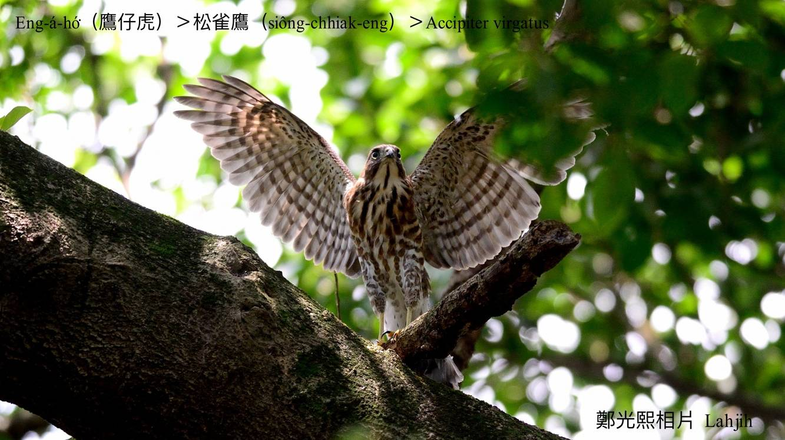
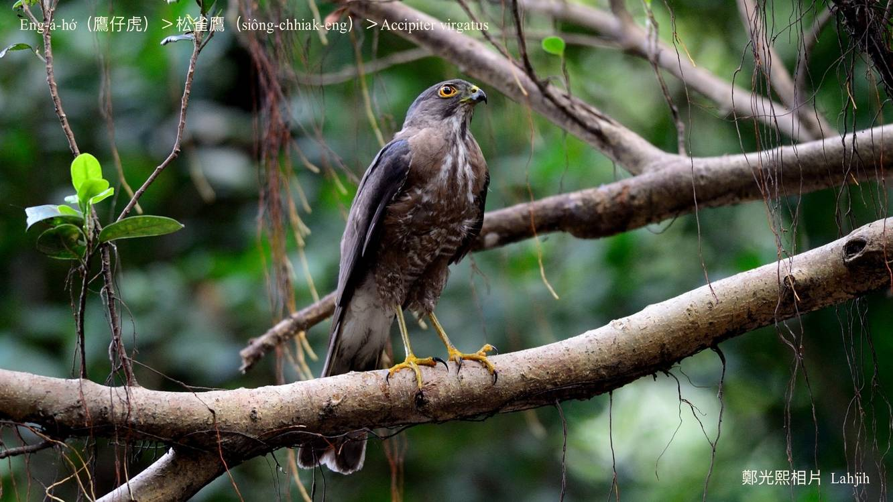
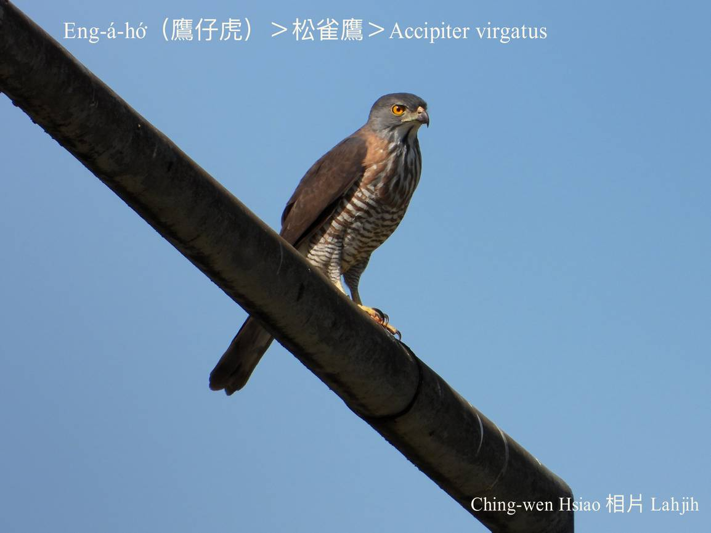
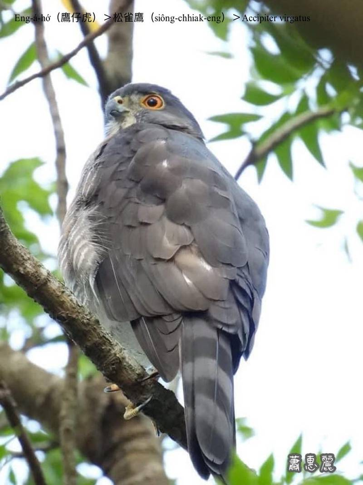
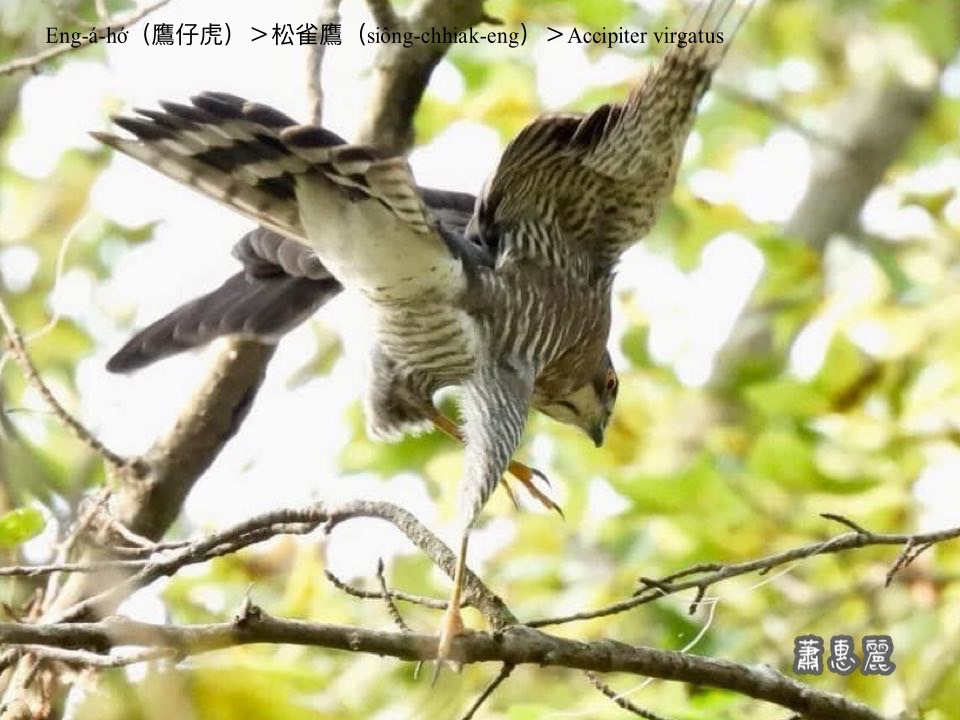
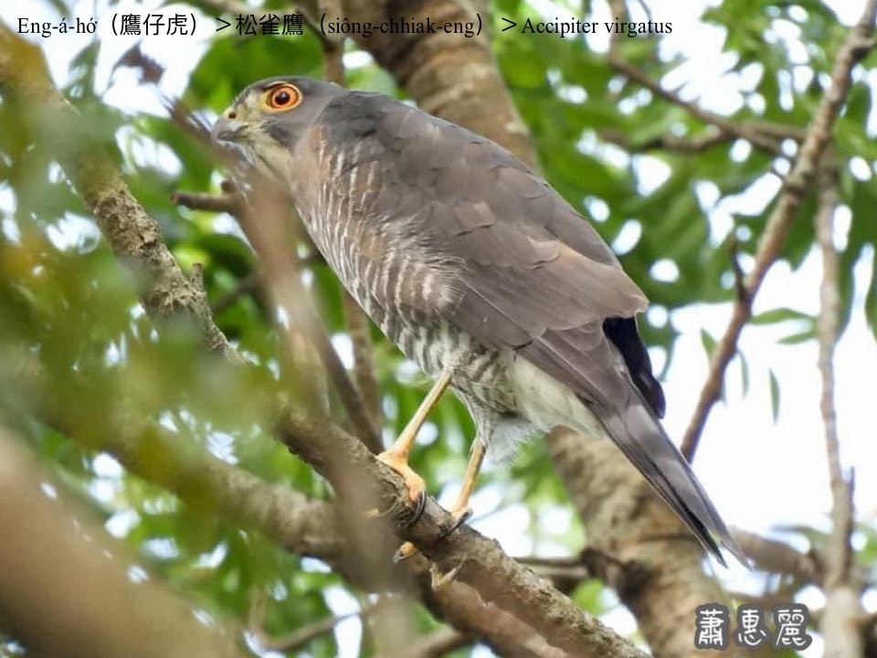
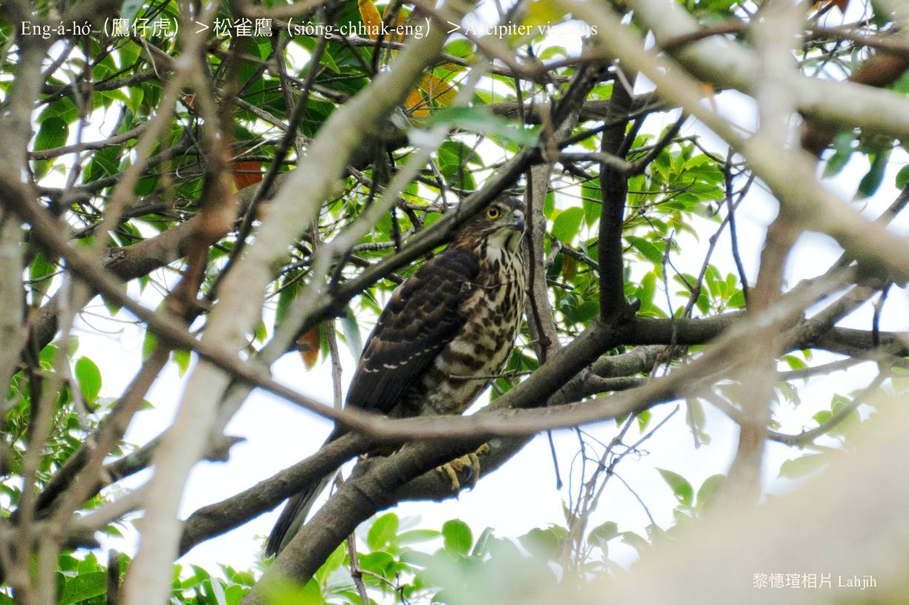

#### 8. Chiū-eng Kho『鷲鷹科』

|台灣名|中譯名|學名|
|Eng-á-hó͘（鷹á虎）|松雀鷹|Accipiter virgatus|

# 8-2. Eng-á-hó͘（鷹á虎）

Eng-á-hó͘是台灣猛禽在地鳥，kan-nā出現tī山區，鳥仔類是伊ê主食，行為凶猛ok-khia̍k-khia̍k，有法度tī樹林內追jiok飛鳥，甚至m̄驚烏鶖，所以有鷹á虎ê稱呼。

Eng-á-hó͘是台灣鷹á類siāng細隻--ê，嘴pe倒鉤利劍劍，hèng食小型鳥仔、niáu鼠、tō͘-tēng、水蛙、蟲thōa，時常單獨khiā tiàm樹椏等待飛來鳥隻。領域性chiok強，pháiⁿ-chhèng-chhèng，ē主動攻擊深入者。

鷹á虎hām hún-chiáu-eng chiok kāng-khoán pháiⁿ分別。

### 鷹á虎ê俗語

「鷹á虎，驚死烏鶖。」

（Lāi-hio̍h驚o͘-chhiu。O͘-chhiu tn̄g-tio̍h eng-á-hó͘驚到boeh死。）

「你真pháiⁿ，像鷹á虎。」

（罵gín-á ê話。）
			

# 【Tâi-oân Chiáu-á Liām Koa-si】

### **Eng-á-hó͘ Ū-kàu Pháiⁿ**

Eng-á-ba̍k lāi-kiàm-kiàm

Sèng-sò͘ pháiⁿ-chhèng-chhèng

Lāi-hio̍h kiaⁿ o͘-chhiu

O͘-chhiu tn̄g-tio̍h eng-á-hó͘

Soah kiaⁿ kah giōng boeh sí

Eng-á cho̍k tē-it pháiⁿ to̍h-sī lí

Eng-á-hó͘  lí chin pháiⁿ

### 【註解】

|詞|解說|
|松雀鷹|Siông-chhiak-eng。|
|樹椏|Chhiū-oe。|
