#### 8. Chiū-eng Kho『鷲鷹科』

|台灣名|中譯名|學名|
|Hún-chiáu-eng（粉鳥鷹）|鳳頭蒼鷹|Accipiter trivirgatus|

# 8-3. Hún-chiáu-eng（粉鳥鷹）

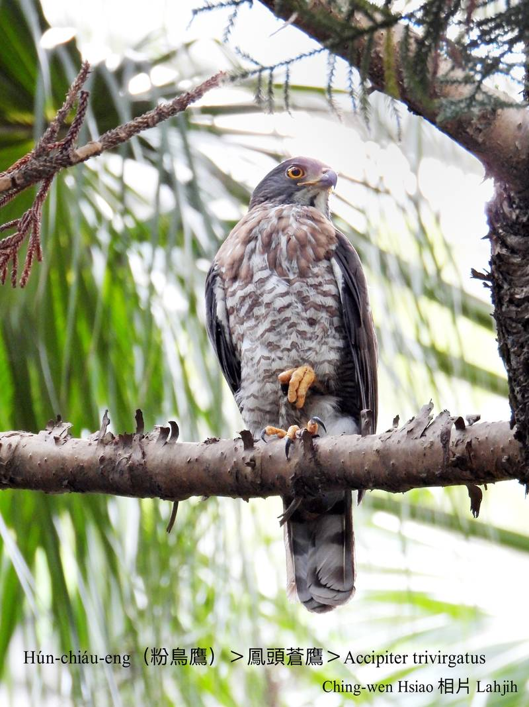

Hún-chiáu-eng sèng-sò͘ hiông-kài-kài有夠猛，是粉鳥斑鴿ê煞星，所以號做粉鳥鷹a̍h-sī斑鴿鷹， kan-nā出現tī山區，平洋無伊ê蹤影。

Hún-chiáu-eng飛行si̍t-kó͘ phia̍t chiok緊，罕得se̍h圓kho͘-á，歇tī視野曠闊iap-thiap ê樹椏，tiām-tiām等待獵物，hèng食niáu鼠、phòng鼠、tō͘-tēng、蟲thōa，mā-ē空中jiok飛鳥昆蟲。

Hún-chiáu-eng是二級保育在地鳥，活動tī海拔2000公尺以下山區，低海拔ê山崙á chiâⁿ普遍，適應人ê環境，hām都市公園to̍h ē做siū生湠。

	

# 【Tâi-oân Chiáu-á Liām Koa-si】

### **Hún-chiáu-eng Ū-kàu Béng**

Hún-chiáu-eng, ok-khia̍k-khia̍k, pháiⁿ-chhèng-chhèng

Eng-á-ba̍k, lāi-kiàm-kiàm, îⁿ-kùn-kùn, khòaⁿ chin-hn̄g

Tò-kau chhùi-pe kap kha-jiáu, lia̍h chiáu-á ū kàu béng

Khong-tiong jiok hún-chiáu

Sok-tō͘ ná phùn-siā-ki, tián chhut i pún-léng

Hún-chiáu-eng--ah hún-chiáu-eng

Khong-tiong ê ok-pà, sǹg lí tē-it-téng

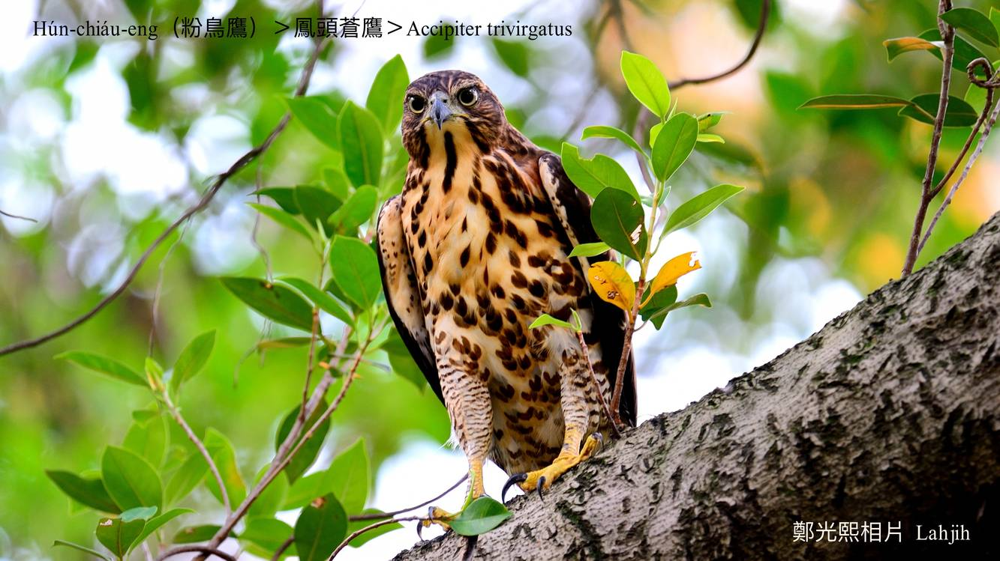
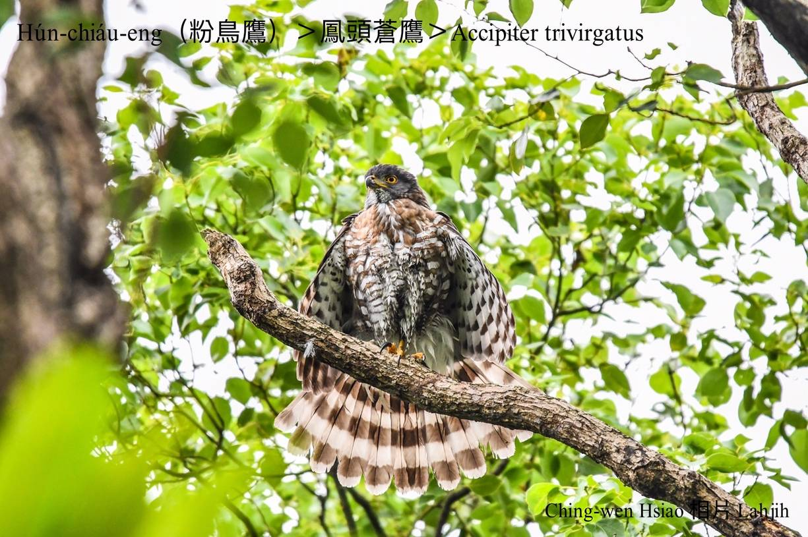
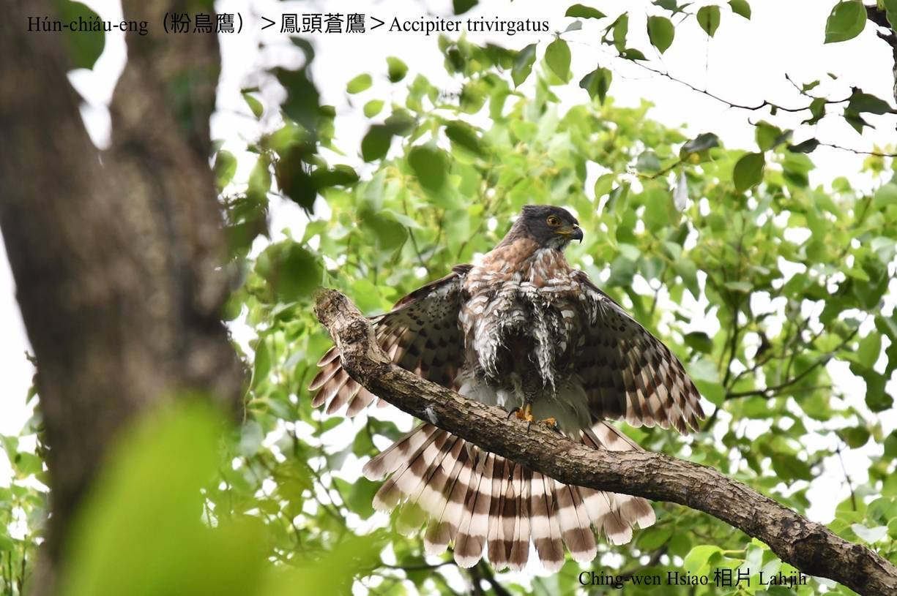
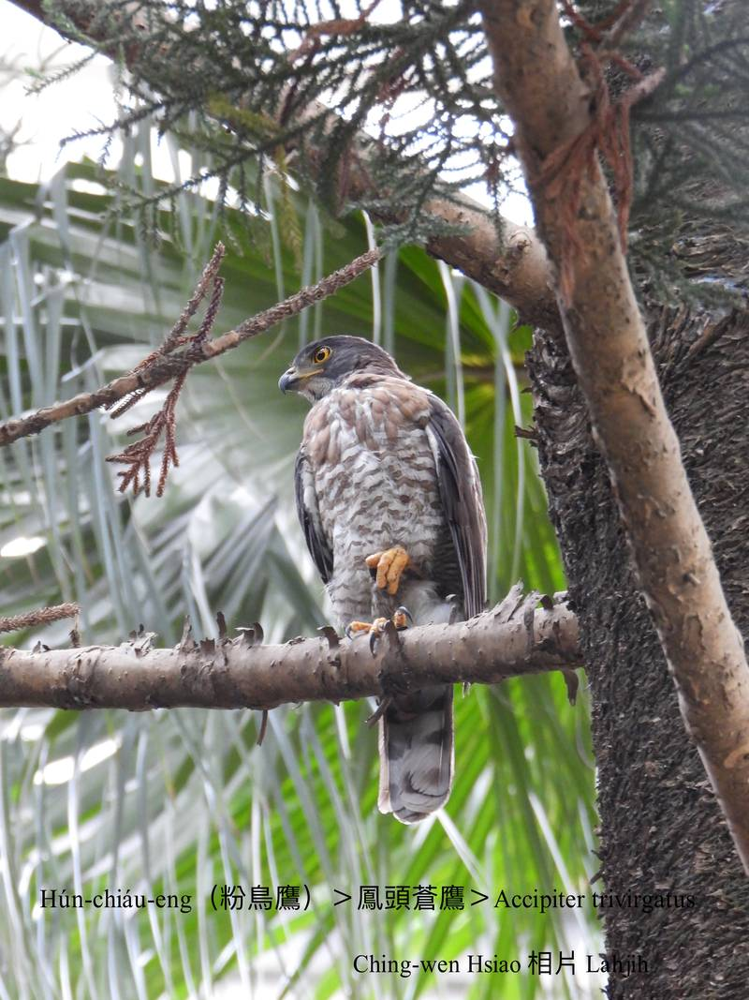
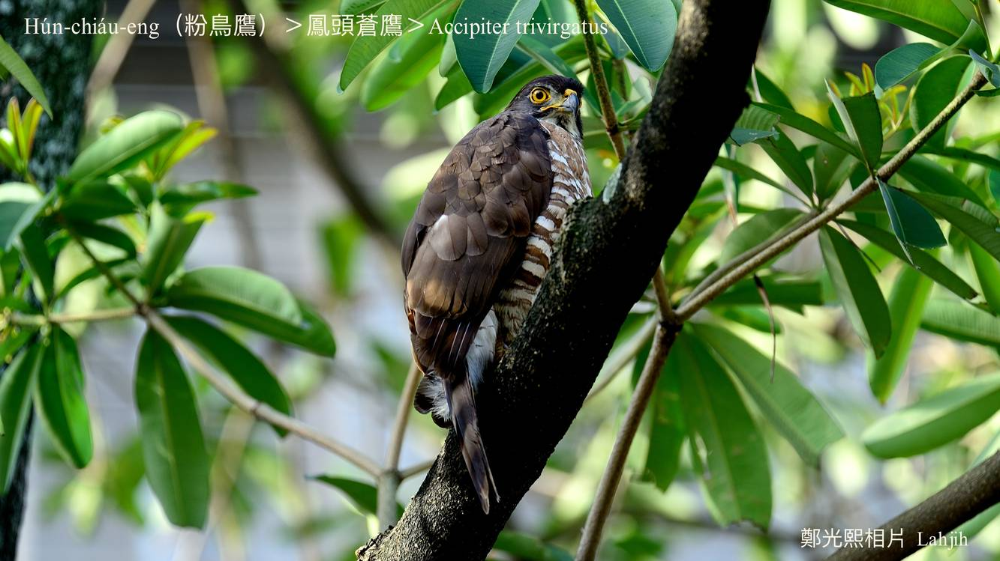
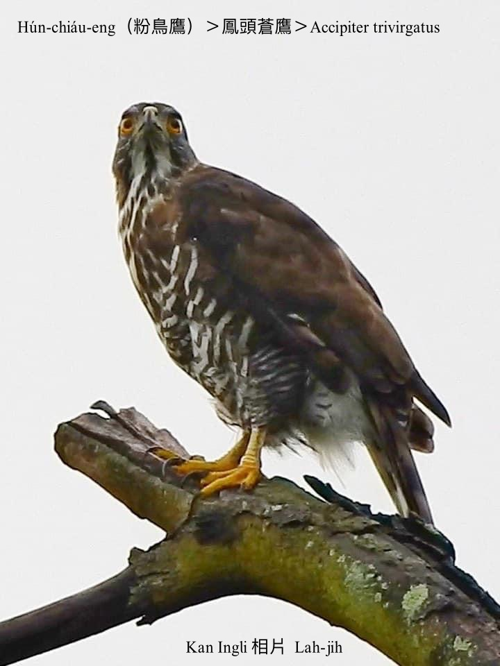
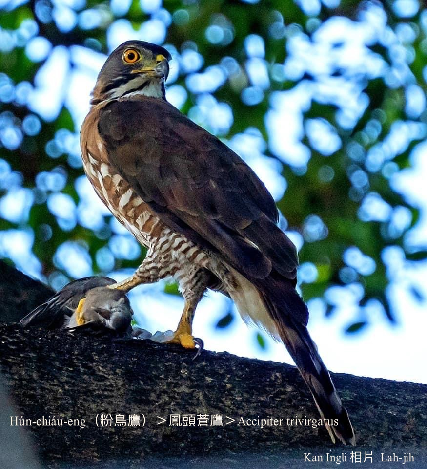
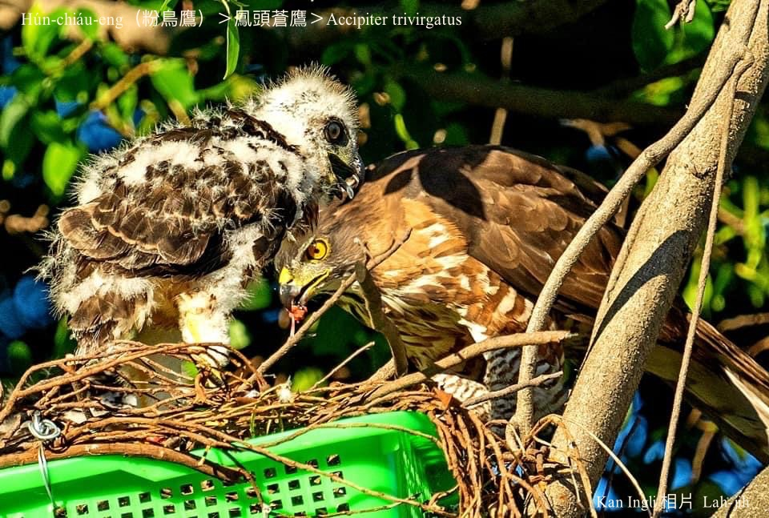
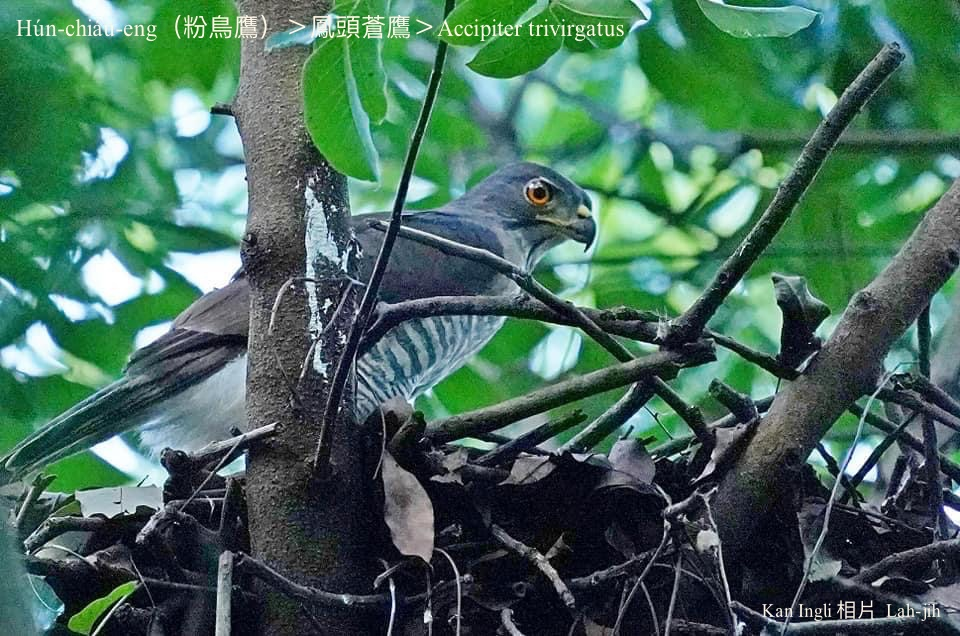
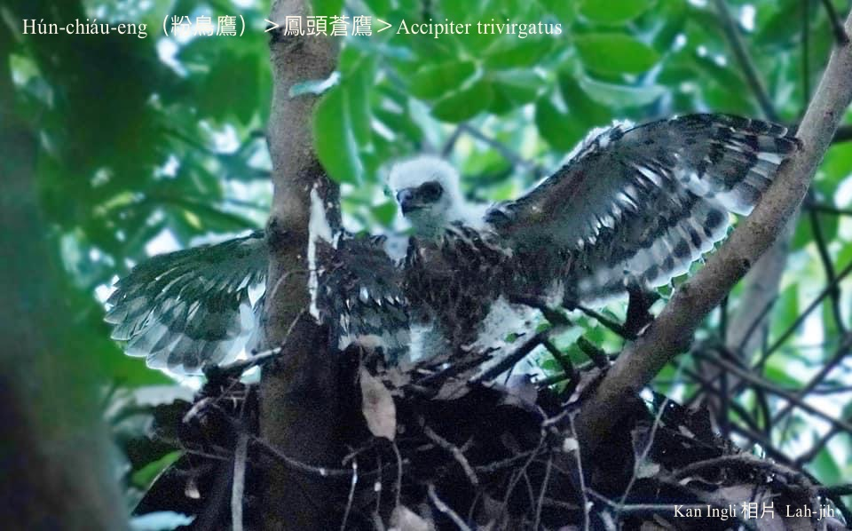

