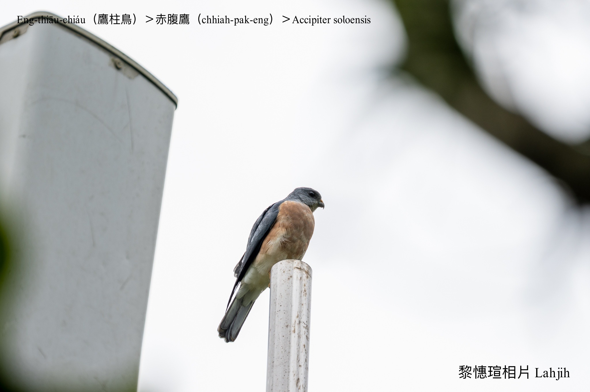

#### 8. Chiū-eng Kho『鷲鷹科』

|台灣名|中譯名|學名|
|Eng-thiāu-chiáu（鷹柱鳥）|赤腹鷹|Accipiter soloensis|

# 8-4. Eng-thiāu-chiáu（鷹柱鳥）

Eng-thiāu-chiáu tī台灣是chiâⁿ普遍ê過境渡鳥，tī秋天9--月to̍h-ē來到墾丁過暝，天光日伊ê族群ùi四邊絞倚--來，tòe氣流飛上空中se̍h kāng方向，絞做ná像一枝柱á kńg-lê-á風離開，「鷹柱」奇觀是號名因由，另外mā有「鷹河」、「落鷹」、「起鷹」ê奇景。

Eng-thiāu-chiáu過境台灣落南時間比南路鷹khah早，上北比南路鷹khah òaⁿ。
	

# 【Tâi-oân Chiáu-á Liām Koa-si】

### **Eng-thiāu-chiáu Kńg-lê-á-hong**

Boeh lâi chò chi̍t-chūn, boeh khì chò chi̍t-sî

Kan-nā keh-chi̍t-mê, bô boeh khòaⁿ kéng-tì

Thàn chi̍t-chūn hong, sio-chio kńg-lê-á-hong

Chài-hōe, goán boeh lâi-khì Lâm-iûⁿ kòe-tang

### 【註解】

|詞|解說|
|赤腹鷹|Chhiah-pak-eng。|
