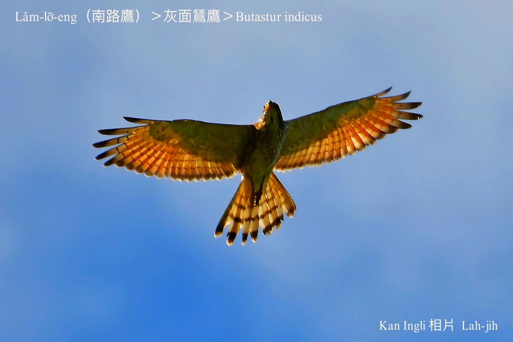
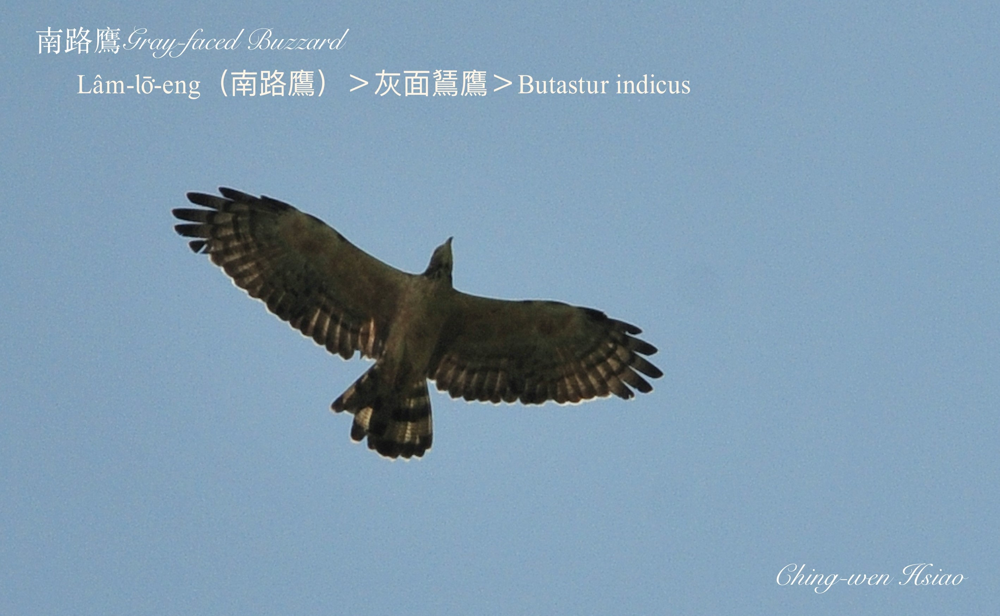
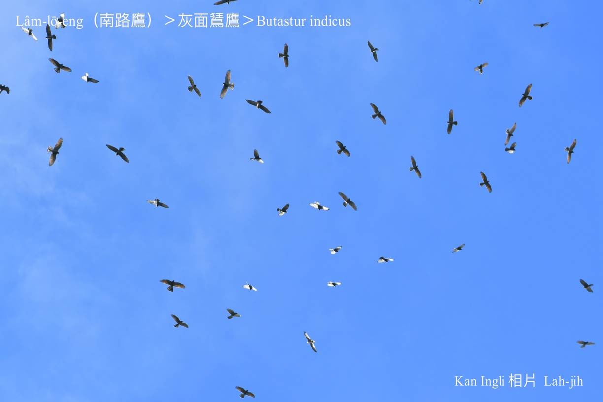
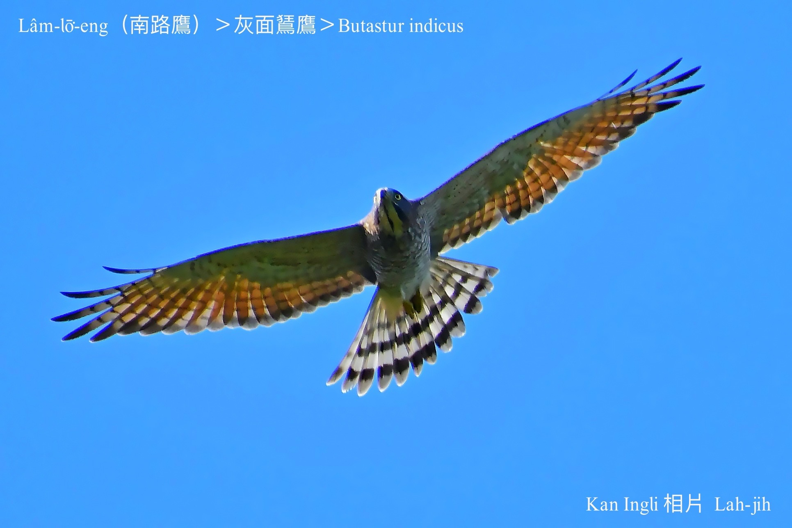
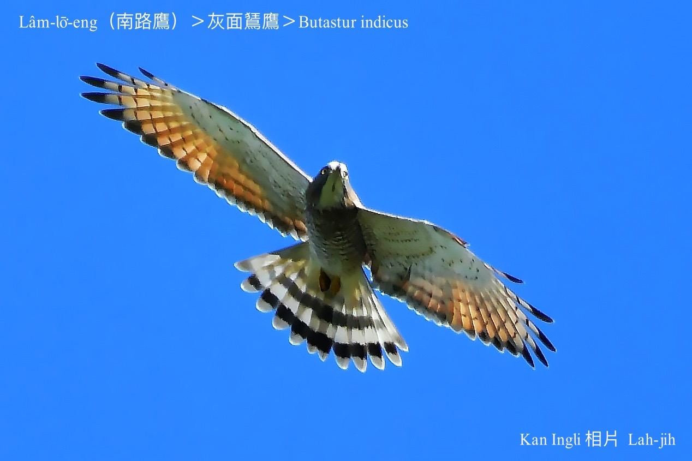

#### 8. Chiū-eng Kho『鷲鷹科』

|台灣名|中譯名|學名|
|Lâm-lō͘-eng（南路鷹）|灰面鵟鷹|Butastur indicus|

# 8-5. Lâm-lō͘-eng（南路鷹）

Lâm-lō͘-eng tī台灣是過境鳥，少數是過冬鳥，嘴pe倒鉤利劍劍，hèng食小型動物，數量比鷹柱鳥khah少，因為南路鷹ē se̍h圓kho͘-á飛行，khah早koh時常hō͘人lia̍h來做標本、piak鳥á pa，tī台灣是真有故事ê鷹鳥。

Lâm-lō͘-eng每年十--月經由南台灣滿州鄉，過境飛去東南亞heⁿh寒過冬；隔轉年清明前後chiah koh飛轉來彰化八卦山kap大肚山台地暫時歇睏。屏東Báng-sut號做山後鳥，彰化人kā in叫做南路鷹。

	

### 俗語

「南路鷹，每年一定轉來哭清明。」
> **（有「清明鳥」ê稱呼。）**

「南路鷹，一萬死九千。」
> **（八卦山、滿州鄉，自古以來to̍h有tng lia̍h南路鷹，piak鳥á pa ê pháiⁿ習慣。）**

### Lah-jih小說

### **〈鷹揚八卦——南路鷹，一萬死九千〉——蕭平治**
>**（1999.4.10寫2001.2.4修改。）**

「各位房長，各位兄弟，ta̍k ê koh勞煩巡巡看看--leh！看有tòe無tio̍h陣、身苦病痛、siuⁿ過thiám頭--ê-bò͘？一chōa路飛kah chiâⁿ勞苦，taⁿ已經來到Formosa中部地界，下面to̍h是出名濁水溪，濁水溪過--去ta̍k ê tio̍h小chhèng kôan--淡-薄-à，咱借春天ê風勢，然後放hō͘伊輕鬆á飛，像chhū行機、三角翼án-ne慢慢á chhu--落-去，liâm-mi to̍h到半線地頭。八卦山脈ê地形位置掠ho͘好，掠ho͘準，hia有一仙大佛為記， m̄-thang bē--記-得。A-éng！你做頭前趕去八卦山頂探--一-下，看有siáⁿ-mih動靜--bò͘？是m̄是有鳥á踏，a̍h是天羅地網，趕緊轉來報告。」

「Êng-á叔公！我知影，阮隨時to̍h來去！」負責探路顧安全ê A-éng隨時chhōa五六ê兄弟，ǹg北一直衝，負責ê精神hō͘總領隊A-êng感覺真放心。

無一tah久á，探路先鋒A-éng in已經斡倒轉--來：

「報告Êng-á叔公！天氣chiâⁿ好，風chiâⁿ順，八卦山頂好光景，今á日koh是禮拜日，有chiok-chē人來tī大佛附近leh散步thit-thô 看光景，ta̍k ê lóng笑bi-bi，歡歡喜喜，無siáⁿ-mih掛慮，而且樹林內mā無看tio̍h鳥á踏kap鳥網á，做咱放心ka紮營無問題。報告完畢！」

「猶有其他koh樣ê狀況--bò͘？」

「有人ê所在真鬧熱，無人ê樹林內kan-nā有一寡鳥隻tī hia chhi-chhi chhū-chhū，唱歌lā曲、phōng-chhiak跳舞，快樂ê心情比人無khah輸。」想bē到A-éng觀察chiah入心chiah詳細。

「各位房長，各位兄弟：Ta̍k ê注意聽，紮營ê營地八卦山tih-beh到，大佛tī頭前hia有看tio̍h--ho͘ⁿh，各房隊長隊伍小整理--一-下，chhōe khah iap-thiap ê樹林內紮營，m̄-thang siuⁿ óa車路邊，車路邊人chē、車chē chiâⁿ危險，而且siuⁿ chhap-cha̍p siuⁿ鬧熱ē hō͘ gín-á驚--tio̍h，án-ne知影--ho͘ⁿh？準備紮營…。」

一chōa路飛來千外里，有夠thiám，Êng--ā想boeh小歇睏--一-下，無，hia ê猴gín-á liâm-mi iū-koh吵 boeh聽講古，to̍h無thang歇喘--lò͘ 。

「Ŏe~！Bān-chhiáⁿ-sī--leh lah！危險--ò͘！各位隊長，趕緊叫ta̍k ê koh飛kôan，m̄-thang落基地，有聽見--bò͘？危險--lah⋯。」開路先鋒A-Éng hit五六ê兄弟緊張kah凊汗一直流，喝kah giōng-boeh sau聲，hoah-hiu了後，趕緊chhōe總領隊參詳：

「Êng-á叔公！Khah緊--起-來！你看he體育場東pêng，hia ê人群是leh chhòng-saⁿh？I-i o-o，hán hán hoah hoah，也有chhāi旗á，也有搭布棚á，有人提吊鏡（望遠鏡），有人kí-kí chí-chí，每粒頭殼lóng khiàn-thian khiàn-thian看tùi咱chia來，大概無好khang ê款，看破趕緊斡方向，徙tùi別位--來-去！」

「張持無蝕本，恁ê顧慮chiâⁿ tio̍h，m̄-kú taⁿ臨時臨iāu boeh徙去toeh？…小等--一-下，緊事khoaⁿ辦，mài急mài緊張，hō͘我斟酌看詳細，chiah做決定。」

「Hò͘！」

Êng--ā有影是老經驗，總領隊to̍h是總領隊，實在無簡單，看伊老神在在，飛tiàm半空中翼phiat--leh phiat--leh，thián開伊利劍劍ê鷹á目，巡視八卦山頂每一跡，尤其是人chē ê所在，伊特別chim-chiok，特別注神tī人ê穿插kap面腔目神，看in ta̍k ê穿kah sui-tang-tang，m̄是休閒服，to̍h是運動衫褲，面容像春天ê花蕾，歡頭喜面，不時都看對有鷹á ê所在，嘴笑目笑，比比指指；ah！有--ā！『鷹揚八卦』ê橫批隨風phia̍t來phia̍t去，ah！He是leh迎接咱來到位--ê-lah！

是leh迎接咱--ê無m̄ tio̍h！Ka siòng khah真--leh！Koh有幾ê-á熟似面--ê lio͘h，tio̍h！He to̍h是愛咱鳥á族ê「鳥盟」人士，ah！Mā有外國人--neh，lóng是leh迎接咱！Lóng是leh歡迎咱！莫怪chiah-ni̍h鬧熱，人chiah-ni̍h chē，比舊年有khah chē無khah少。

Êng--ā kui-ê心肝頭開了了，心情做一下輕鬆--起-來，taⁿ免驚，kap舊年kāng一樣，有驚無危險：

「Éng--à！趕緊廣播，請ta̍k ê免tio̍h驚，放心ka安營，he是leh歡迎咱--ê，做恁免驚，bē kā咱害--lah！In chiah-ni̍h大陣人集合tī chia，to̍h是等boeh看咱ê風釆，boeh欣賞咱ê技術，優美飛行ê姿勢。

Kau-tài--落-去，叫ta̍k ê bān-chhiáⁿ-sī歇睏，表演hō͘ in看，看咱鷹á族ê hiâu-pai，無論飛kôan飛kē，孤一隻a̍h是掠相排，thián翼飛chiūⁿ天，a̍h是iap尾衝落地，se̍h圓箍á、chhia-pùn-táu pha-chhia-lin，nā歡喜就做恁kĭ！Kĭ！Kĭ！唱出歌聲hō͘ in聽，免客氣免驚惶，隨在恁chông，隨在恁kek-khong，人客看了nā爽，to̍h無枉費咱來chit-chōa路，來chia kā in chak-chō--lò͘！」

自án-ne天頂kap地上做夥hi-hi hoa-hoa，喊喊喝喝，鬧熱滾滾，歡喜寫tī面腔，天頂飛kah chhiāng-chhiāng滾，八卦山頂ê每一人lóng歡喜kah笑bún-bún。Êng-á叔公in鷹á族今á日siāng歡喜，台灣人ê面子今á日趁了siāng富裕，『鷹揚八卦』自án-ne出名到國外。

「阿公！你今á日siāng-kài歡喜--ho͘ⁿh！」Boeh-àm-á鷹á族安營好勢，八卦山頂回復tiām靜，chhun hia ê細隻鷹á猶leh無時閒，ki-ki kā-kā一直吵總領隊Êng-á叔公tio̍h-ài講古hō͘ in聽：「Tiāⁿ-tio̍h有故事boeh講hō͘ goán聽--ê，阿公！阿公！阮boeh聽你講古--lah！……Ta̍k ê pho̍k-á聲ka chhui--lo̍h-khì！阿公boeh講古hō͘咱聽--a！」

Pho̍k！Pho̍k！Pho̍k！Pho̍k！Pho̍k-á聲phah無停…

「好！好！好--lah！Boeh講to̍h來講，boeh聽to̍h tiām-tiām-á聽，m̄-thang koh一直吵：

古早古早，咱ê祖先tòa-tiàm北方真遠真遠ê所在，為tio̍h boeh hō͘咱ê kiáⁿ孫有khah好ê生活環境，每年lóng tī秋天時ùi咱ê故鄉起程，飛向南旁boeh去南洋度假，sūn-sòa kā恁chia ê序細飼hō͘大漢koh健康，教恁生活ê才調，hō͘恁ka-tī ē-tàng獨立，tī隔轉年ê春天，chiah koh chhōa恁轉去故鄉，kā恁完成婚事，生湠咱ê族群，保持咱Lâm-lō͘-eng（Butastur indicus）ê傳統kap特質。

每一年tī落南a̍h是chiūⁿ北ê路--ni̍h，咱lóng ài借台灣chit塊Formosa土地暫時歇睏，習慣上落南歇tī屏東、恒春一帶，chiūⁿ北就歇tī咱chit-mái歇睏ê八卦山頂。」

「阿公！阮khah愛歇tī彰化ê八卦山頂，無愛歇屏東kap恒春。」

「為siáⁿ-mih？」

「八卦山頂有人歡迎，好sńg好thit-thô，屏東恒春hia chiâⁿ危險，有鳥á-tah，mā有網á ē hō͘ goán bē tín動，有夠驚死人--ê neh！」

「恁gín-á人m̄知影鳥á-tah kap鳥網á有外厲害，kan-nā知影ē hō͘恁bē tín動，無thang sńg，無thang thit-thô--niâ，he是boeh ti̍h咱ê生命，恁kám知？」

「有影--ò͘！Ah tī半線八卦山頂，ná-ē lóng無鳥á-tah kap鳥á網？Koh有hiah chē人來欣賞咱ê飛行，按呢m̄-chiah有趣味好thit-thô。」

「是時代leh進步，人類已經有保育ê觀念，知影保護咱chia ê歹命鳥，古早時代咱ê祖先to̍h無chiah-ni̍h好運，每一年見nā飛來到台灣停腳暫歇睏，to̍h去hō͘ in剿kah giōng-boeh斷種，恁kám知？「南路鷹，一萬死九千」…aih！」

突然間，Êng-á叔公soah目kho͘紅紅，目屎一大滴一大滴liàn--落-來…

「阿公！你ná leh流目屎？」

Êng--ā無kā in應聲，繼續講--落-去：

「想tio̍h祖先ê phah-piàⁿ，為tio̍h生存，為tio̍h尊嚴，無惜生命，甘願犧牲認命，aih！Lóng是人ê無知，soah hō͘咱世世代代liân-hôe歹命。

古早古早，咱ê祖先to̍h教咱ài tòe節氣搬徙，寒天時，咱ê故鄉寒sih-sih，chiâⁿ pháiⁿ徛起，m̄-chiah隨人組隊，趁冬季猶未到ê秋天，千里迢迢飛過海洋到南洋度假，sūn-sòa教恁技藝，kā恁chhiâⁿ大漢，chiah koh趁熱--人boeh到chìn前ê春天，搬徙轉來去故鄉，hō͘恁少年--ē完婚生湠，che to̍h是祖先留--落-來ê傳統，不幸每一kái經過Formosa地界，to̍h-ē去遇tio̍h「南路鷹，一萬死九千」ê災厄，mā是宿命無奈，hó-ka-chài，chit-mái ê台灣人已經覺醒，進入文明社會，有野生動物保育ê觀念，而且經過一寡有心ê愛鳥人kap彰化縣政府ê認真宣傳，得tio̍h國際保育界ê重視， m̄-chiah有chiah-ni̍h鬧熱hō͘人感心ê活動，ǹg望明年、後年，一直到以後，咱ê後代kiáⁿ孫，lóng-ē親像今á日án-ne，平平安安，順順序序來過日，無驚惶，無死傷來經過Formosa chiah-ni̍h súi ê地界，免歡迎無要緊， mài kā咱thâi，mài kā咱掠就真感謝。」

「阿公！Ná-ē kā咱叫做南路鷹--leh？」

「Che是in ê祖先，看咱ta̍k年都ài飛向南洋去，m̄-chiah án-ne kā咱稱呼，無pháiⁿ意--lah！Taⁿ chiâⁿ暗--à，tòe阿公祈禱了後tio̍h-ài去睏，bîn-á早起tio̍h-ài koh chiūⁿ路，無，ē peh bē--起-來。」

「好！」

「感謝天！感謝地！感謝上帝！賜hō͘咱平安，賜hō͘咱歡喜，過去--ê mài koh鬱卒，未來--ê，tio̍h-ài phah-piàⁿ sè-jī。感謝台灣人，感謝半線ê兄姊，恁ê仁慈，恁ê疼心，阮ē記得，願  恁mā ē-tàng平安快樂，免受恐嚇，免受壓霸，khioh回尊嚴，tio̍h-ài ka-tī piàⁿ！感謝！感謝！感謝！」

### 【註解】

|詞|解說|
|Báng-sut|屏東縣滿州鄉。|
|heⁿh寒|Hioh-kôaⁿ。|
|吊鏡|Tiàu-kiàⁿ，『望遠鏡』。|
|chhū行機|『滑翔機』。|
|三角翼|Saⁿ-kak-si̍t，『三角翼』。|

