#### 8. Chiū-eng Kho『鷲鷹科』

|台灣名|中譯名|學名|
|Chôa-tiau（蛇鵰）|大冠鷲|Spilornis cheela|

# 8-6. Chôa-tiau（蛇鵰）

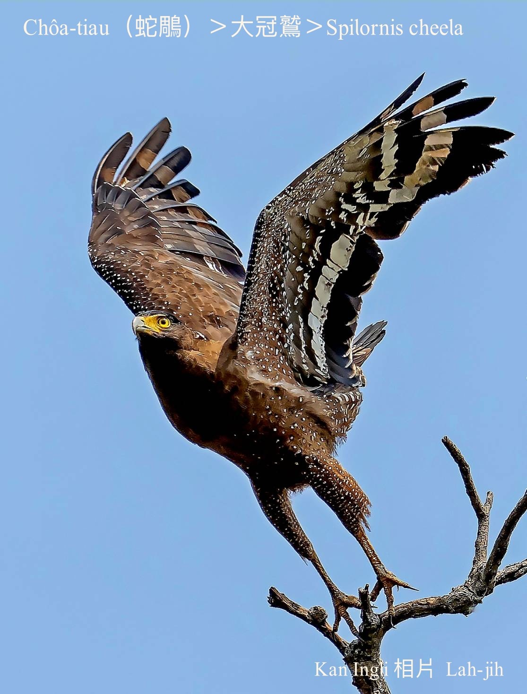

Chôa-tiau hèng食蛇類、爬蟲類動物，蛇肉是伊ê主食，是蛇類ê剋星，所以有蛇鵰、蛇鷹ê名。Tī台灣是珍貴罕有ê第二級保育在地鳥。做siū tī淺山樹頂，chiok ài tī溫暖天氣ê早起時3-4隻5-6隻tàu陣飛行，利用氣流chhèng-koân se̍h圓kho͘-á飛來飛去，姿勢優雅穩重tiāⁿ-tio̍h，koh-ē háu「hiŭ hiŭ hiŭ⋯」好聽ê聲音。Chiok大隻，展翼有170公分長。

	

# 【Tâi-oân Chiáu-á Liām Koa-si】

### **Chôa-tiau Hèng Chia̍h Chôa-bah**

Khòaⁿ góa ê hêng, kap lāi-hio̍h chiok sêng

Góa kah-ì tòa lāi-soaⁿ

Lāi-hio̍h khah ài tòa pêng-iûⁿ

Góa bô lāi-hio̍h hiah chhut-miâ

In-ūi góa tī lāi-soaⁿ lia̍h chôa chia̍h

Lāi-hio̍h hèng chia̍h ke-á-kiáⁿ

Thau-lia̍h thau-kā pháiⁿ miâ-siaⁿ

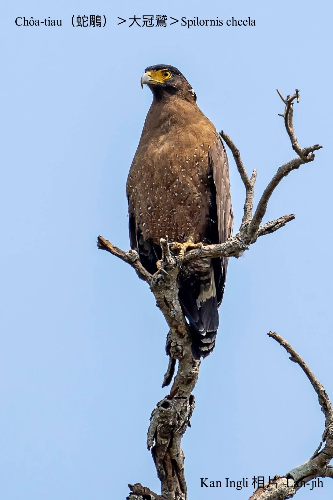
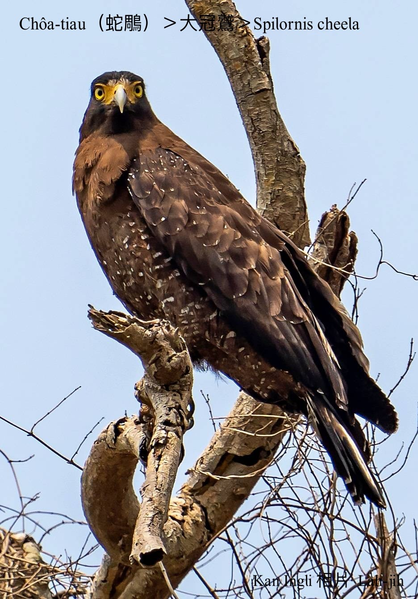

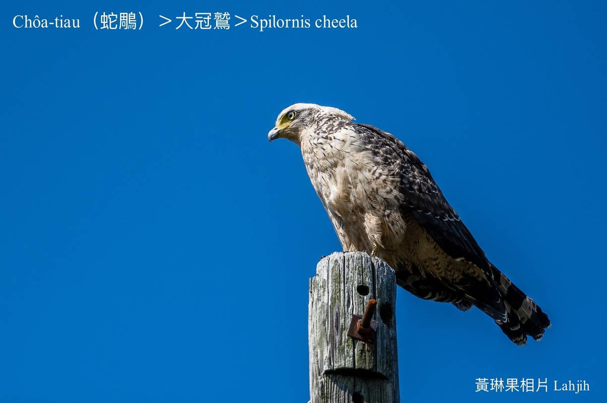
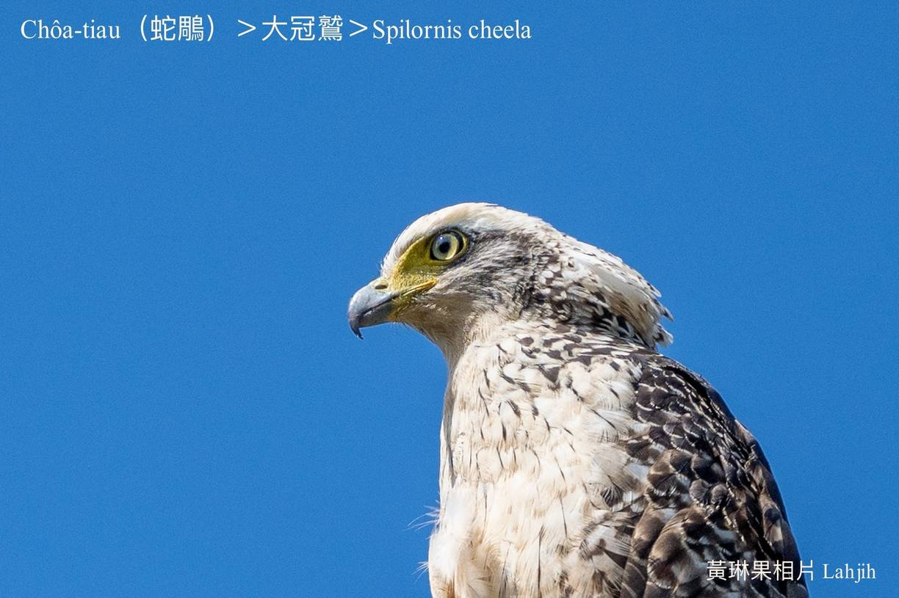
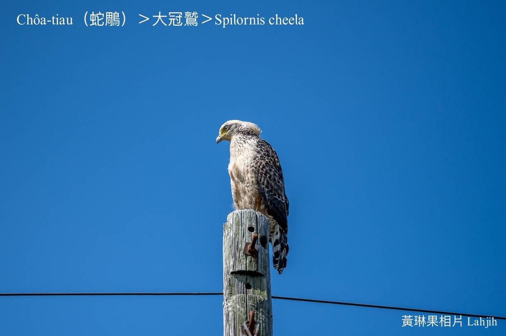
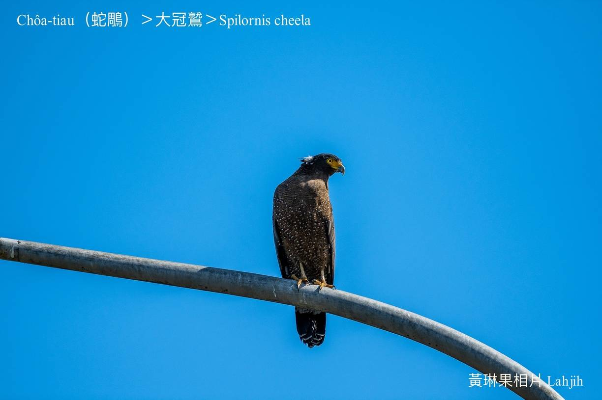
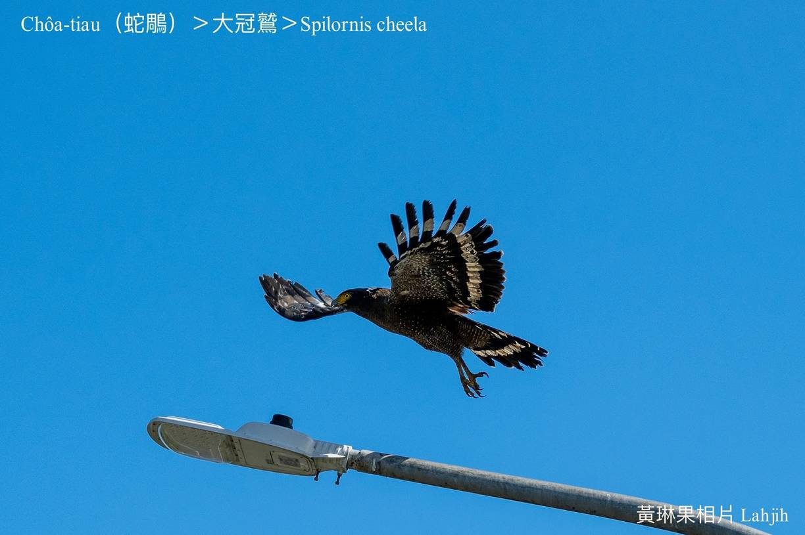
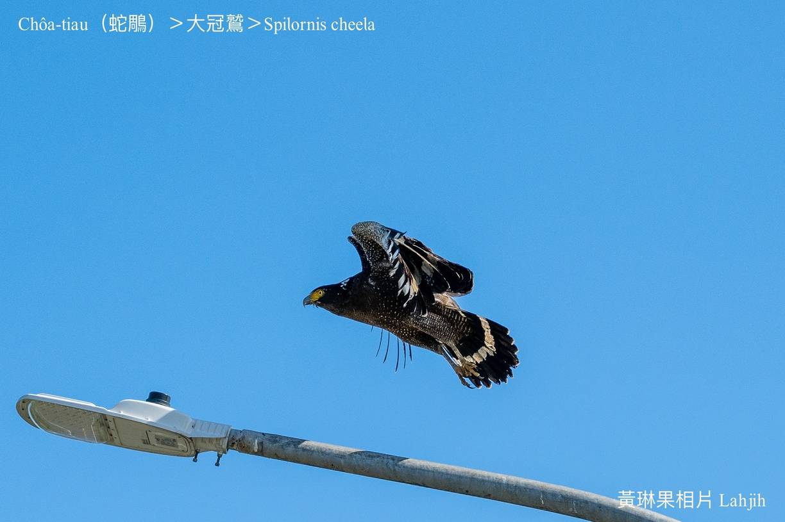
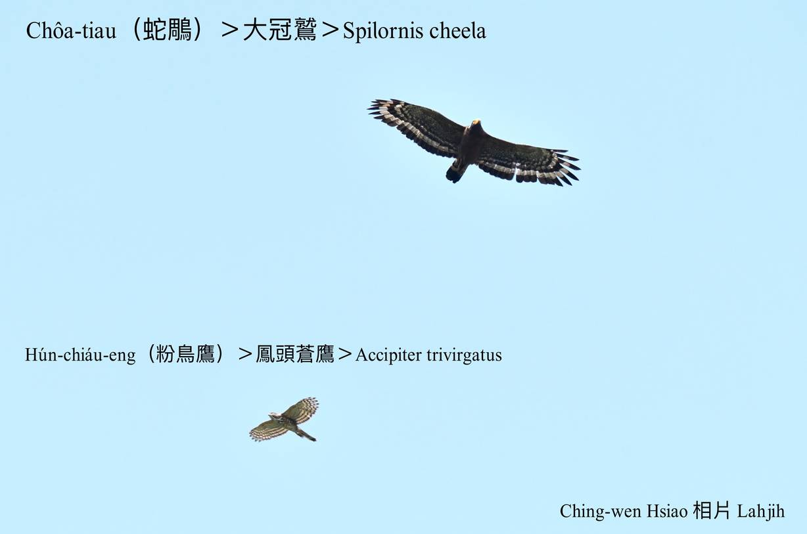
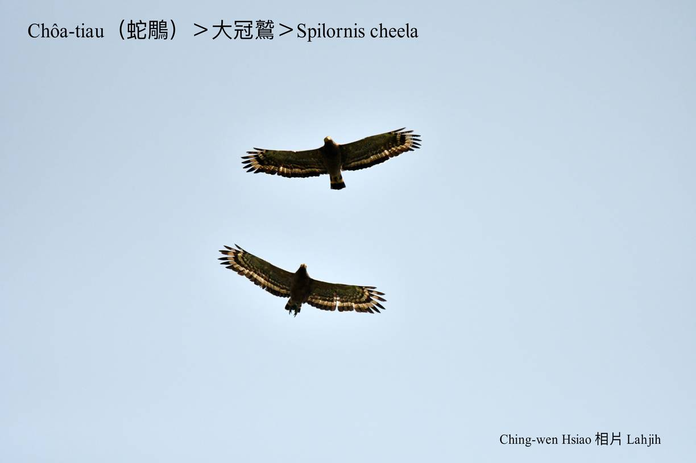
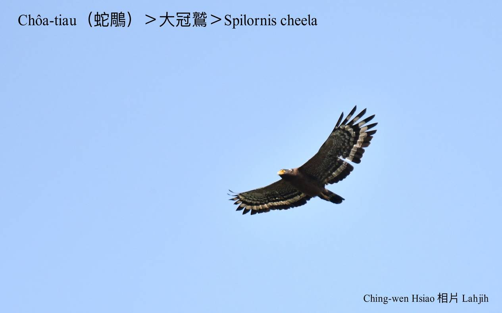
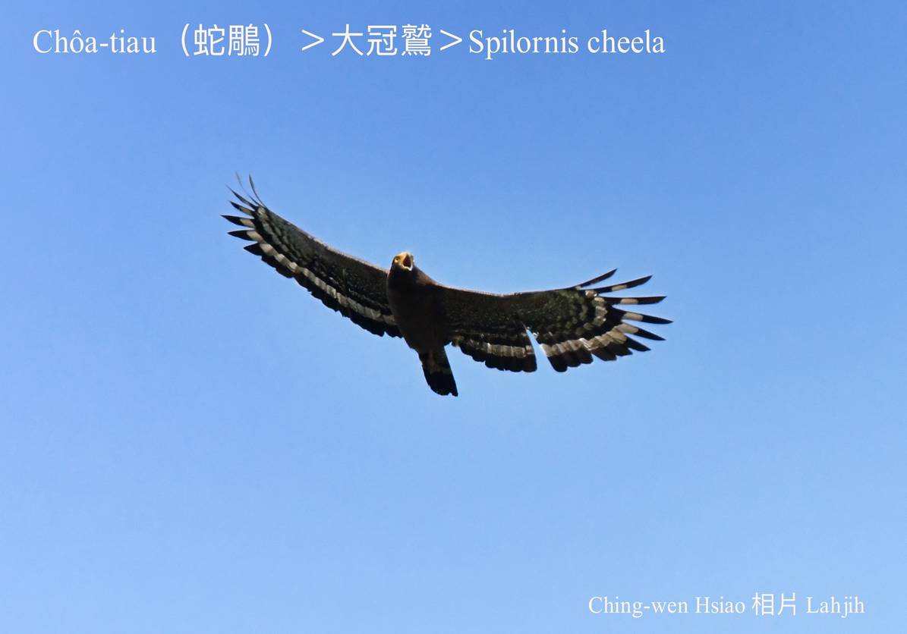
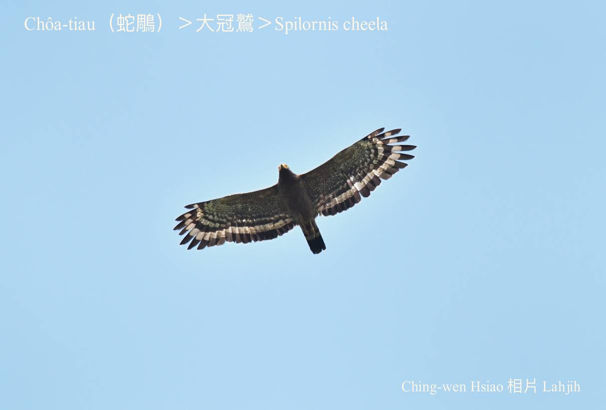

### 【註解】

|詞|解說|
|大冠鷲|Tōa-koan-chiū。|
