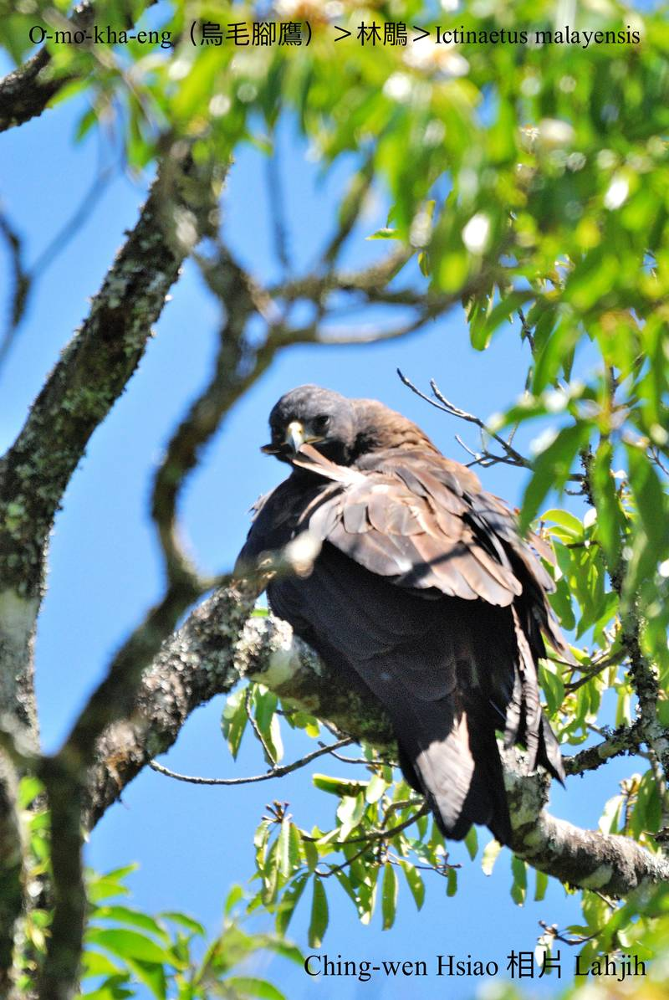

#### 8. Chiū-eng Kho『鷲鷹科』

|台灣名|中譯名|學名|
|O͘-mo͘-kha-eng（烏毛腳鷹）|林鵰|Ictinaetus malayensis|

# 8-7. O͘-mo͘-kha-eng（烏毛腳鷹）

O͘-mo͘-kha-eng tī台灣本島是數量真少ê在地鳥，列入giōng-boeh che̍h種等級，展翅180公分，是台灣展翅siāng長ê鷹鳥。

O͘-mo͘-kha-eng kah意海拔2600公尺以下山區原始林樹頂chhōe飛鼠、phòng鼠做食物，有時mā-ē lia̍h細隻羌á、猴山á。飛行技術choa̍t-téng，ē-tàng tī雺霧中一直飛來飛去。公母鳥kāng型，kui身是暗咖啡色，腳有毛烏色，m̄-chiah號做烏毛腳鷹。

