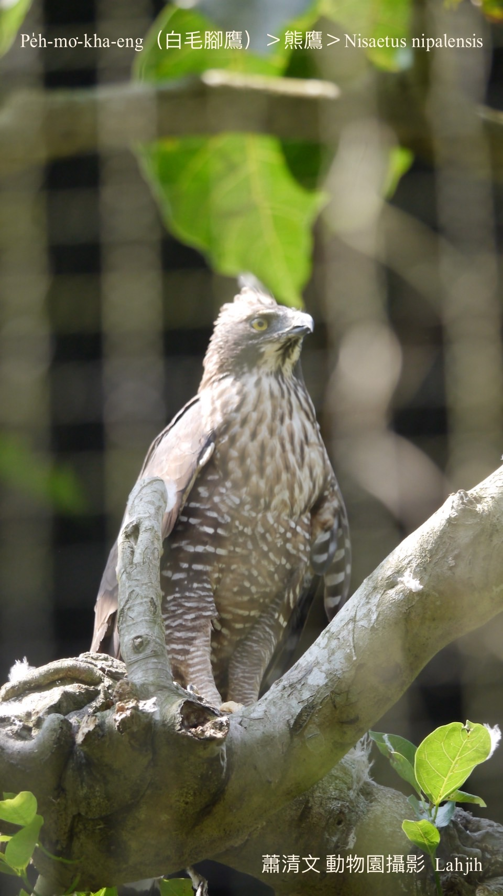
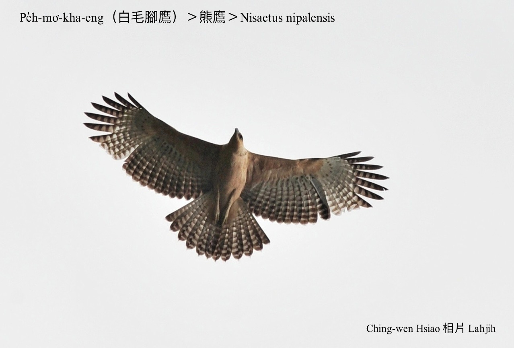
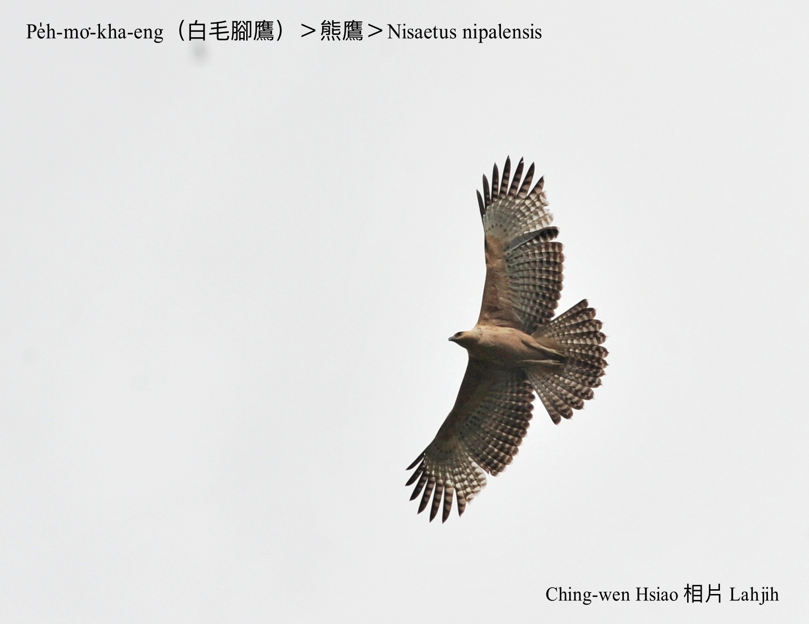
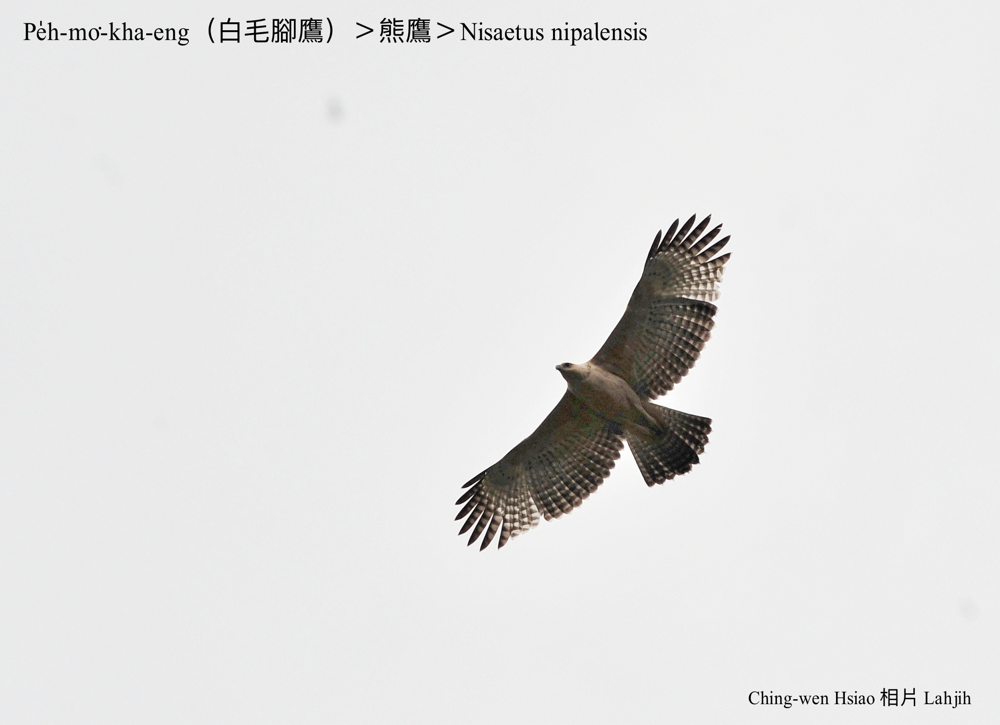
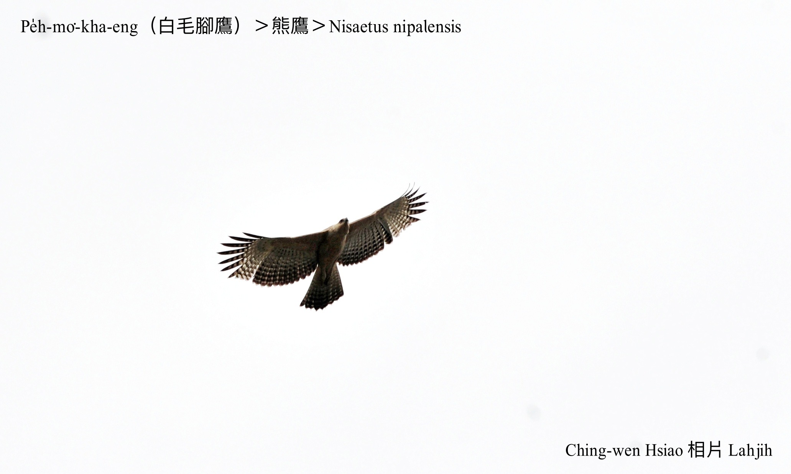
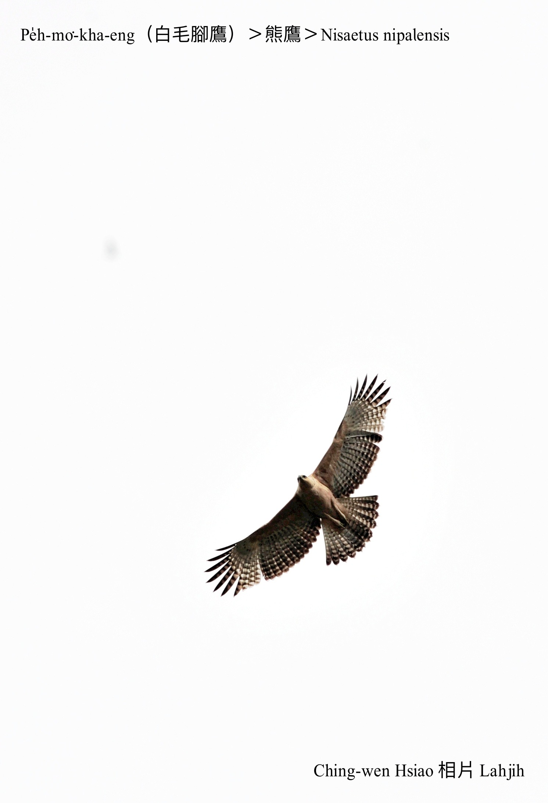

#### 8. Chiū-eng Kho『鷲鷹科』

|台灣名|中譯名|學名|
|Pe̍h-mo͘-kha-eng（白毛腳鷹）|熊鷹|Spizaetus nipalensis|

# 8-8. Pe̍h-mo͘-kha-eng（白毛腳鷹）

Pe̍h-mo͘-kha-eng是當今台灣真罕有siāng大隻ê猛禽留鳥，to̍h是在地鳥，罕罕bat tī深山林內看--tio̍h，因為頭殼頂有4-5枝khiā-khiā ê羽毛，ná像發角，hō͘人號做『角鷹』。因為伊ê腳有白色ê腳毛，台語ka號做白毛腳鷹a̍h-sī鬍腳鷹。

Pe̍h-mo͘-kha-eng生活tī海拔1000-3000公尺ê樹林內，通常lia̍h細隻哺乳動物、鳥類和爬行動物拆食落腹。因為烏白phah獵，數量ná來ná少，估計全台kan-nā chhun 500隻kha-tau。林務局為tio̍h了解白毛腳鷹生態，2005年起委託屏東科技大學進行三年ê研究計畫，ǹg望ē-tàng保護giōng-boeh che̍h-chéng ê白毛腳鷹。

### 【註解】

|詞|解說|
|猛禽留鳥|Béng-khîm liû-chiáu。|
|鬍腳鷹|Hô͘-kha-eng。|

