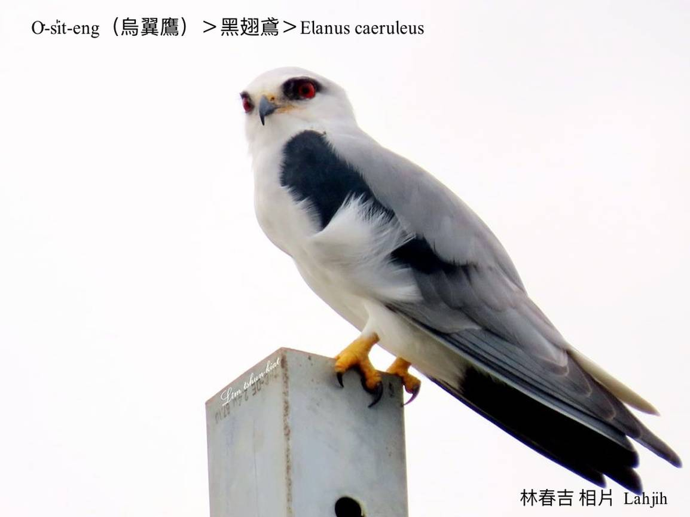
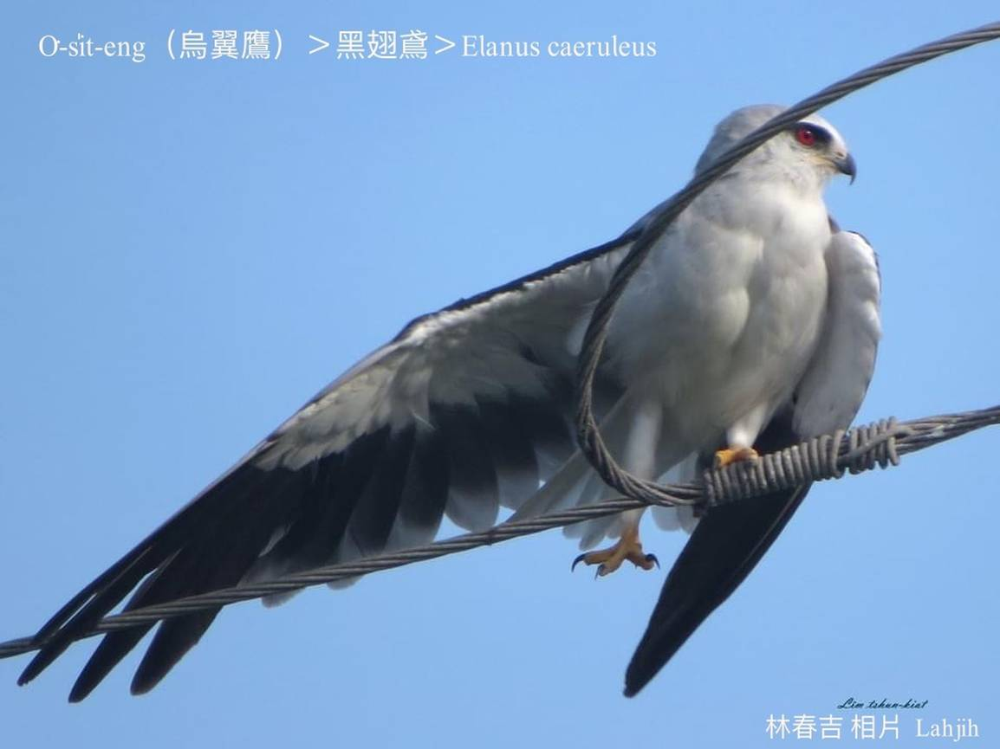
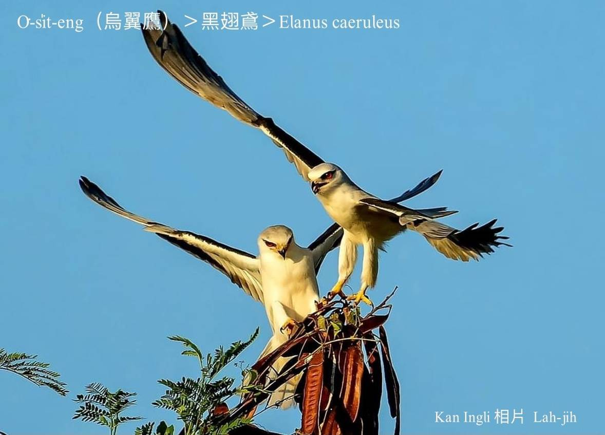
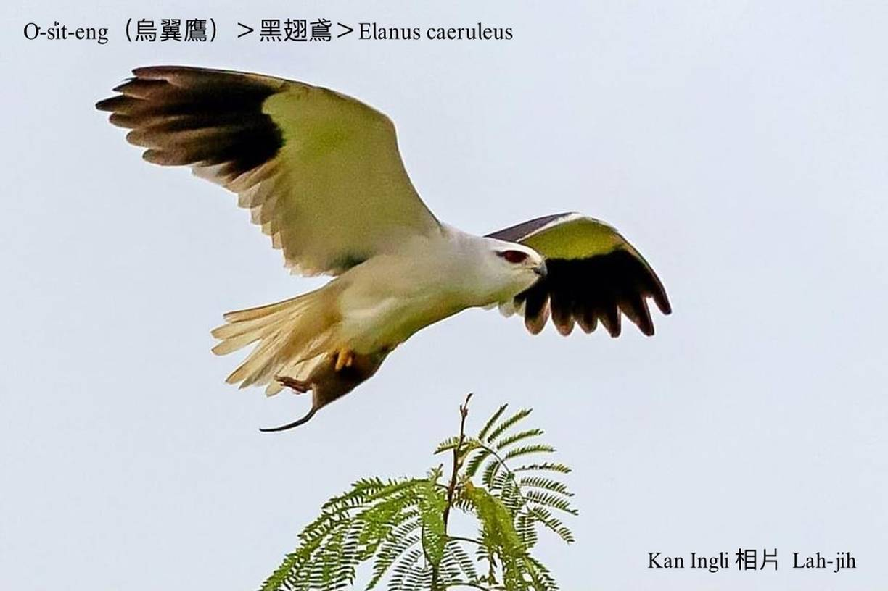
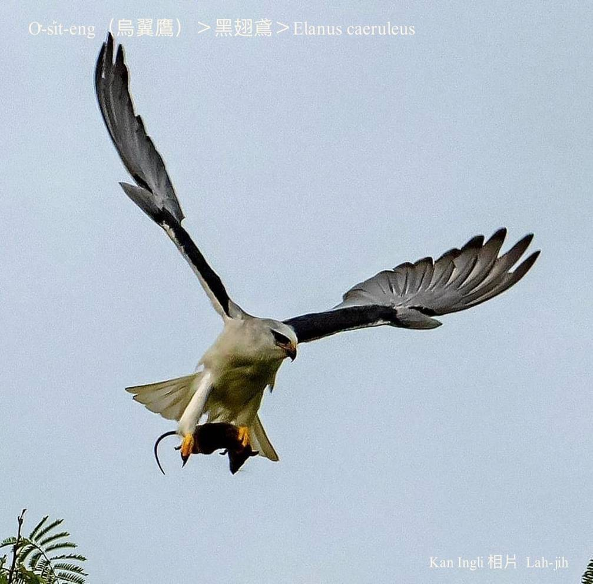
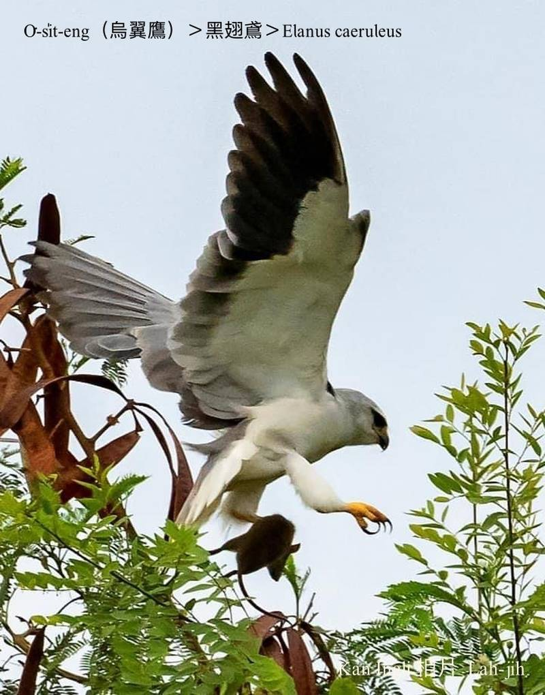
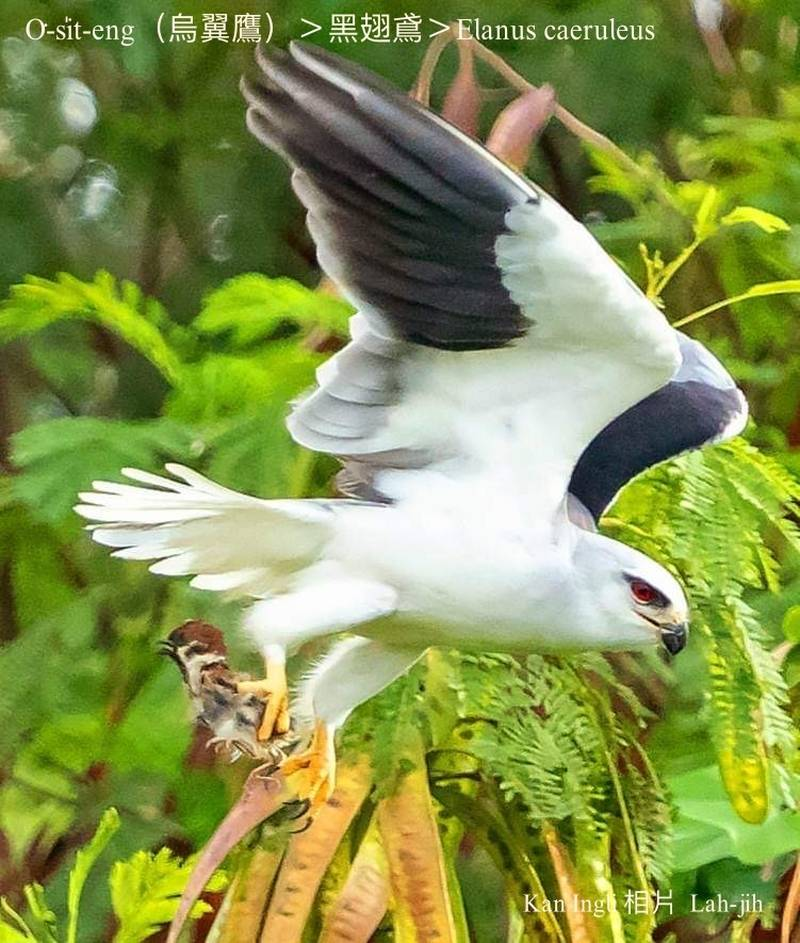
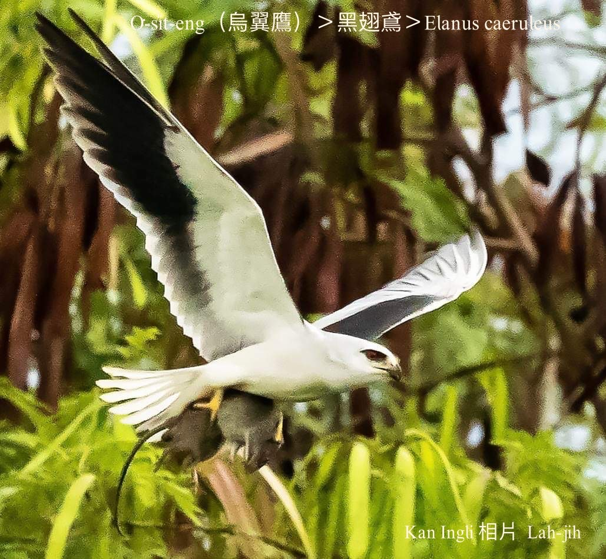
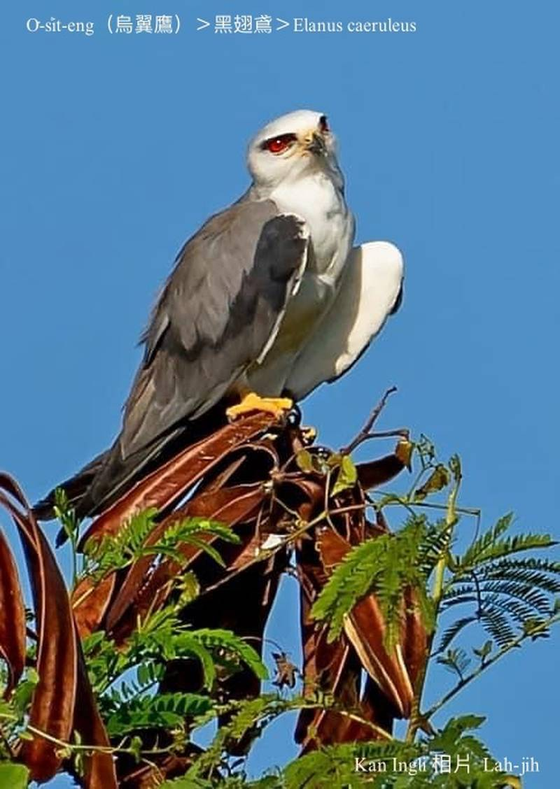
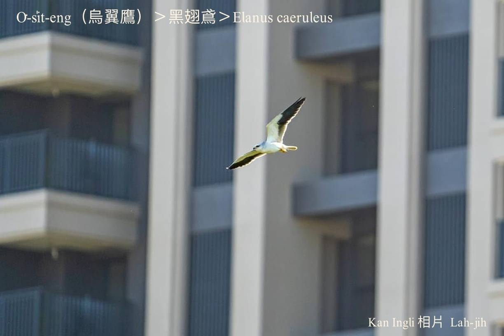

#### 8. Chiū-eng Kho『鷲鷹科』

|台灣名|中譯名|學名|
|O͘-si̍t-eng（烏翼鷹）|黑翅鳶|Elanus caeruleus|

# 8-9. O͘-si̍t-eng（烏翼鷹）

根據網路資訊，早期boeh看o͘-si̍t-eng tio̍h-ài去金門，自從2001年tī雲林記錄繁殖seⁿ-thòaⁿ成功了後，o͘-si̍t-eng to̍h漸漸tī台灣本島四界lóng看ē-tio̍h。

O͘-si̍t-eng kui身軀白色鳥毛kah烏鐵灰翼股，深色目眉配血紅色目chiu，是台灣siāng-kài súi ê鷹鳥，hō͘鳥友看kah無nih-ba̍k。

O͘-si̍t-eng時常翼股gia̍h-koân飛行，khau一個角度停tiàm樹椏ê姿勢，配合烏白對比ê羽毛，有夠phiau-phiat siâⁿ人注目。

O͘-si̍t-eng hèng lia̍h niáu鼠，是平洋niáu鼠ê剋星，台灣平洋田地真闊，ē lia̍h niáu鼠ê猛禽真少，o͘-si̍t-eng soah pìⁿ-chiâⁿ防治鼠害ê好幫手。

O͘-si̍t-eng已經chiâⁿ做台灣在地鳥。

	

# 【Tâi-oân Chiáu-á Liām Koa-si】

### **Niáu-chhí Khek-chheⁿ O͘-si̍t-eng**

Âng ba̍k-chiu o͘ ba̍k-bâi

Sin-khu pe̍h-pe̍h si̍t-kó͘ o͘-thih-hoe

Poe-hêng phiau-phiat ū mê-kak

Lia̍h niáu-chhí chin pún-sū

Kò͘ chhân-hn̂g m̄-jīn-su

O͘-si̍t-eng

Sī hui-hêng sai-hū

Chiáu-iú chiok-ài khòaⁿ lí tián kang-hu

### 【註解】

|詞|解說|
|樹椏|Chhiū-oe。|
