#### 9. Go̍k Kho『鶚科』

|台灣名|中譯名|學名|
|Hî-eng（魚鷹）|鶚（魚鷹）|Pandion haliaetus|

# 9-1. Hî-eng（魚鷹）

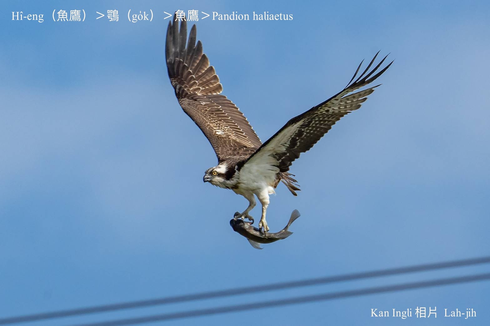

Hî-eng，愛食魚類，伊ê腳爪鉤鉤特別長，利koh有力，好lia̍h魚，是普遍ê冬候鳥，不過有chi̍t-kóa ē留落來到熱天。台灣四界大水潭、水庫、海墘、魚池lóng有機會看伊lia̍h魚精彩姿勢。

Hî-eng kan-nā興lia̍h魚食魚肉，腳爪長koh尖，iap翼股chhu-chhu飛行伸出腳爪lia̍h魚ê姿勢有夠liú-lia̍h有夠精彩，身軀構造ná像天生to̍h是boeh lia̍h魚。

# 【Tâi-oân Chiáu-á Liām Koa-si】

### **Hî-eng Lia̍h Môa-sat-ba̍k**

Thiaⁿ-tio̍h lí-ê miâ kiò hî-eng

Hî-ùn-á lāi ê hî-cho̍k, sûi-sî cháu kah phùn-kheng

Khòaⁿ lí tián hui-hêng ê hó kang-hu

khak-si̍t ū-kàu chhèng

Pòaⁿ-khong-tiong, cho̍k-lo̍h-khì ùn-á lāi

Siang-kha giap môa-sat-ba̍k, si̍t-chāi ū-kàu lī-hāi

Bo̍k-koài lâng o-ló lí ê te̍k-ki, pâi-tio̍h tē-it-téng

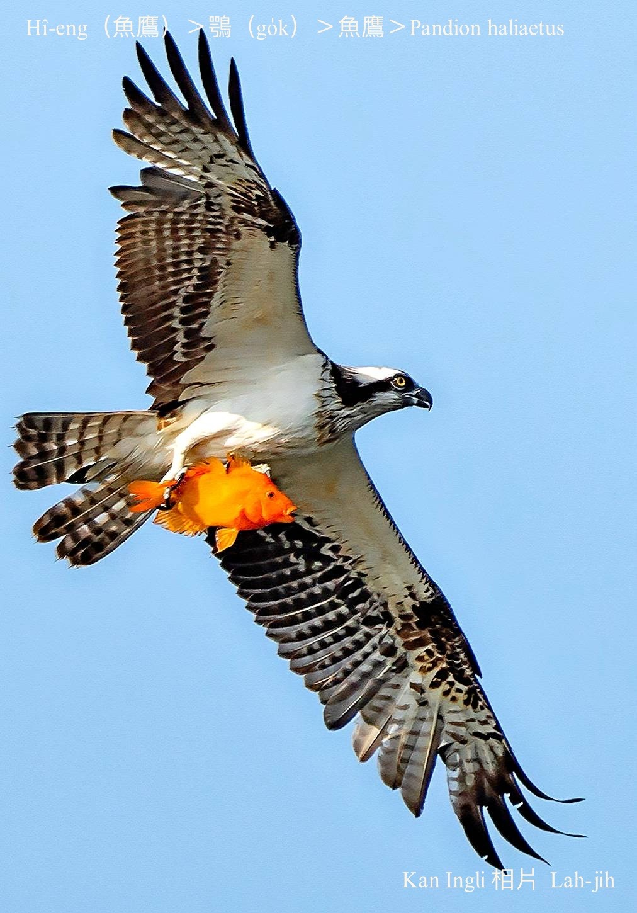
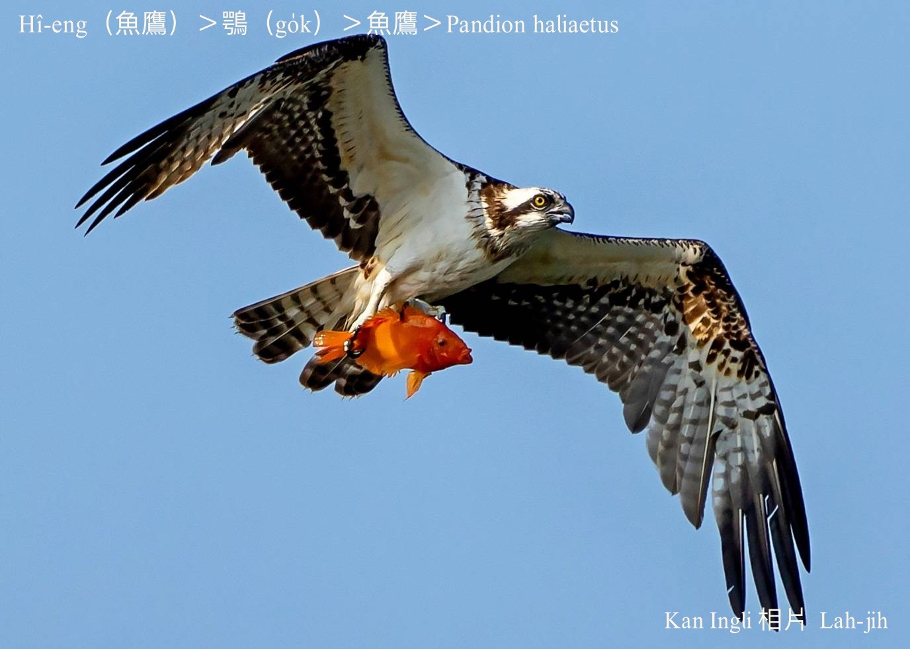
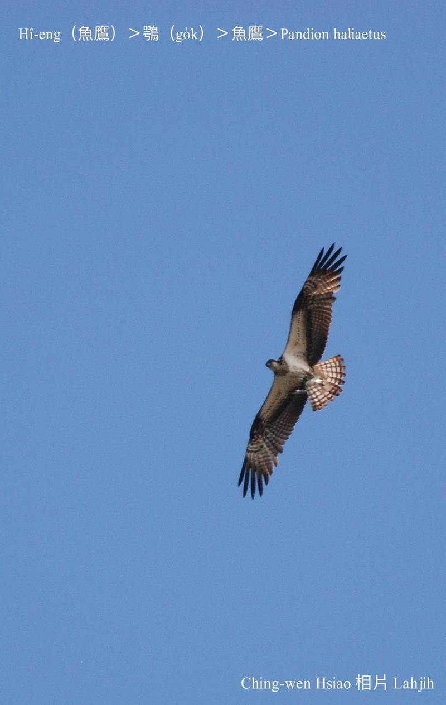
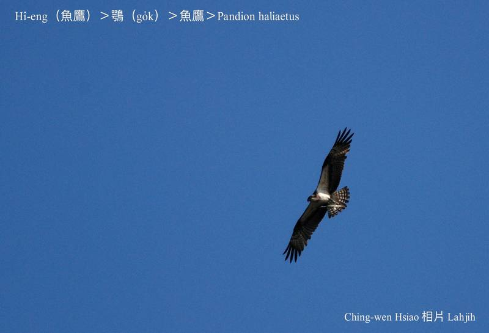
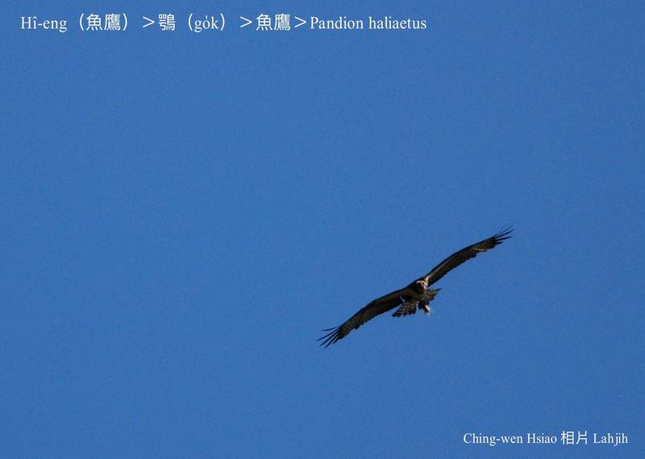
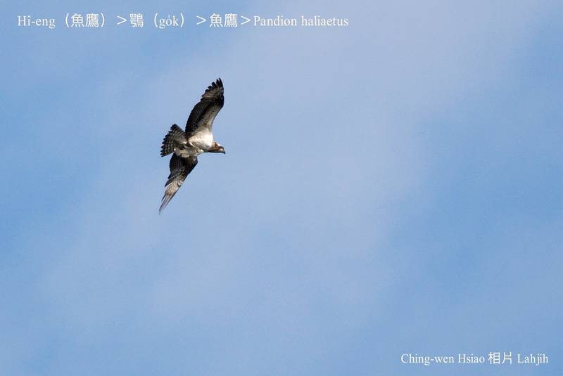
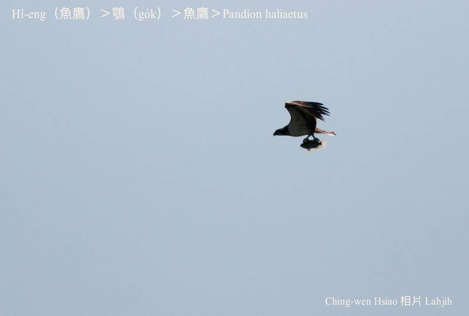
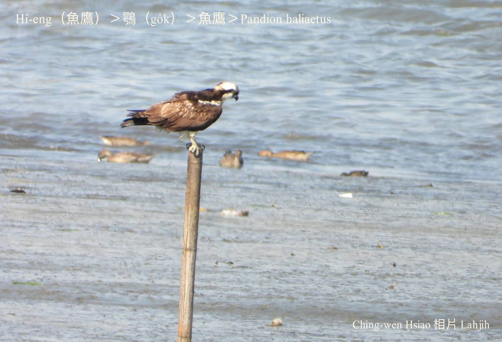
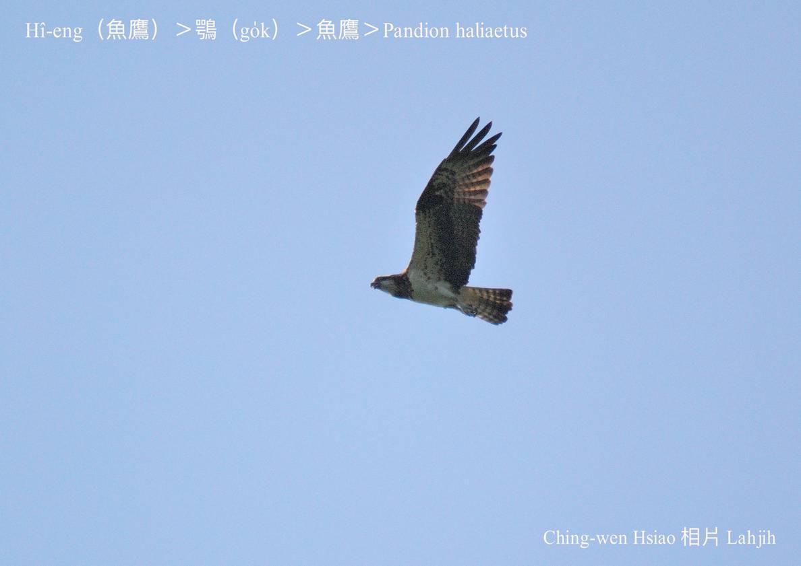
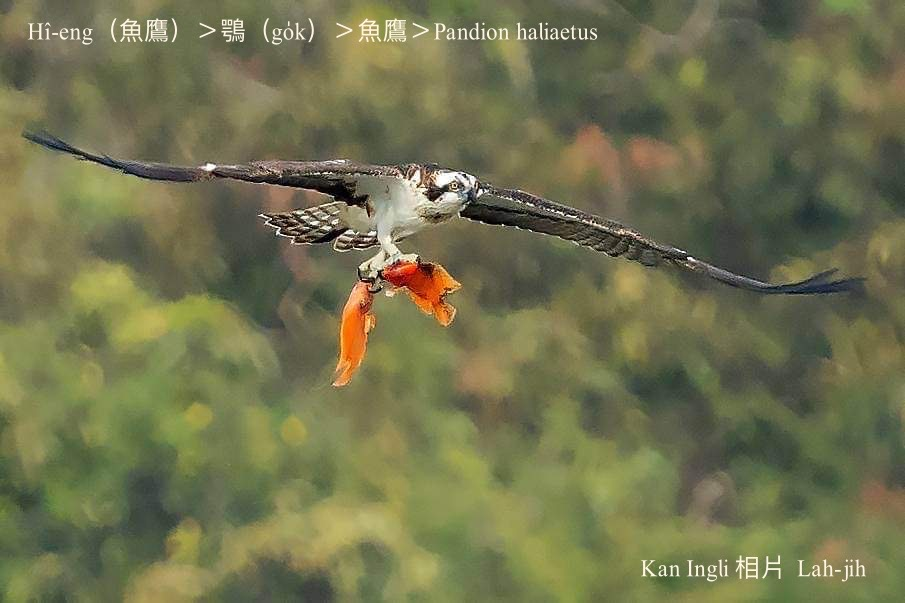
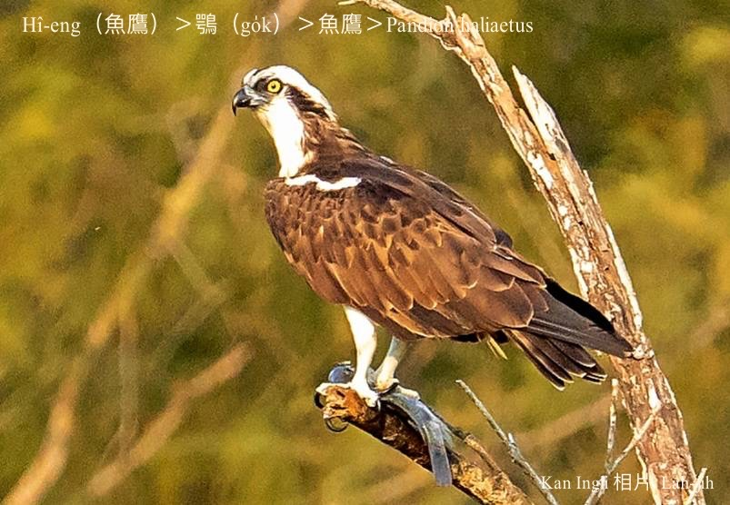
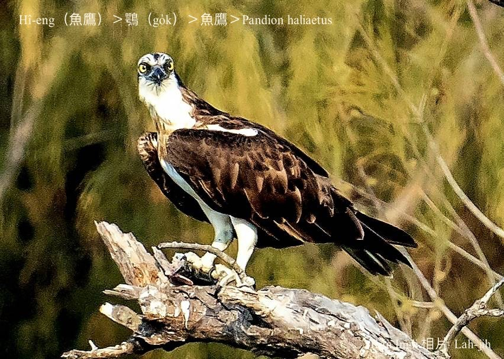

### 【註解】

|詞|解說|
|鶚|Go̍k。|
