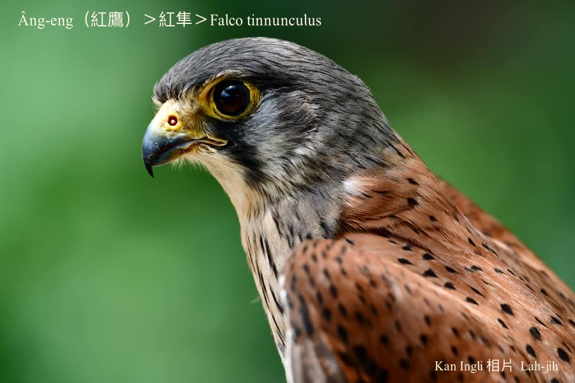
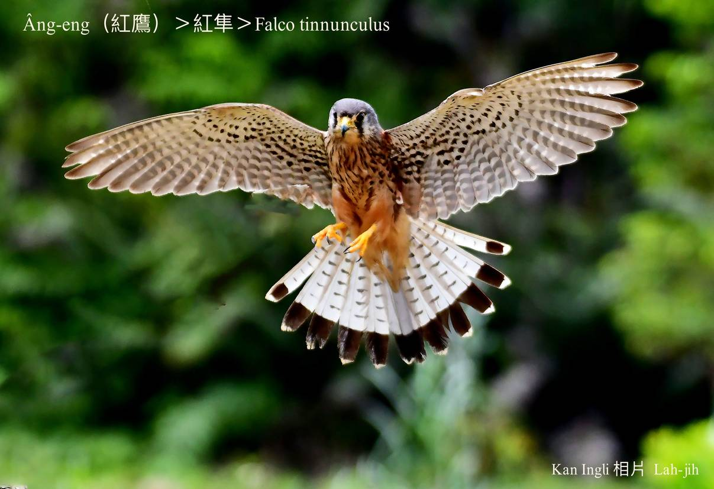
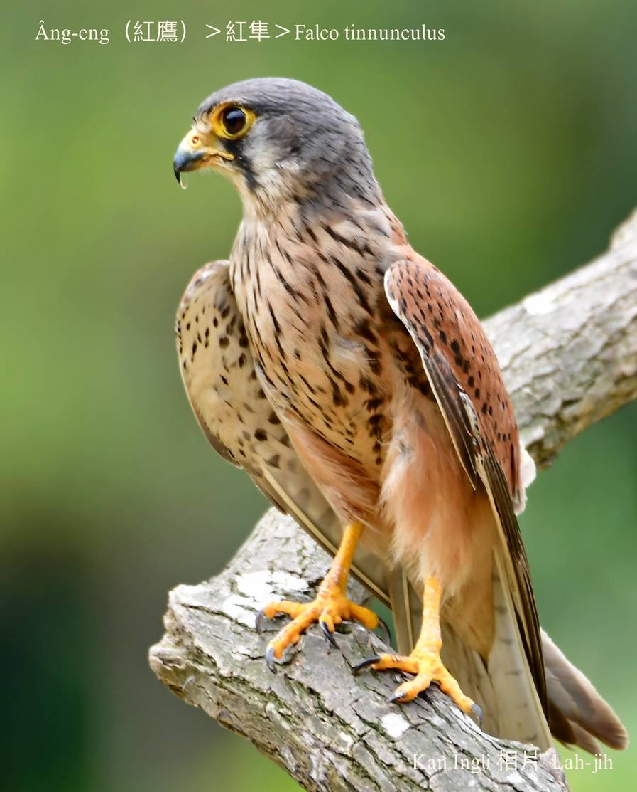
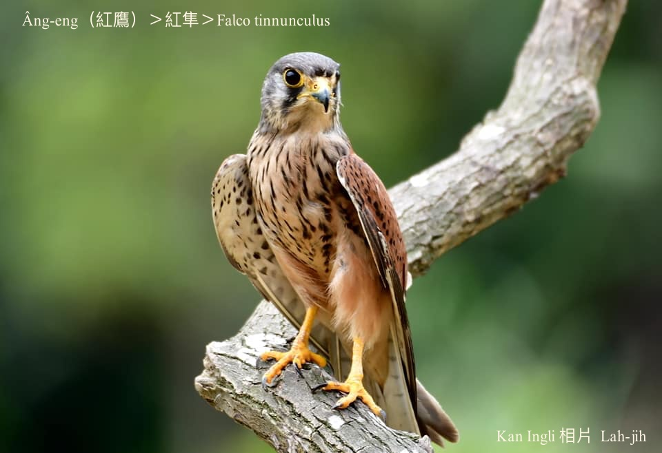
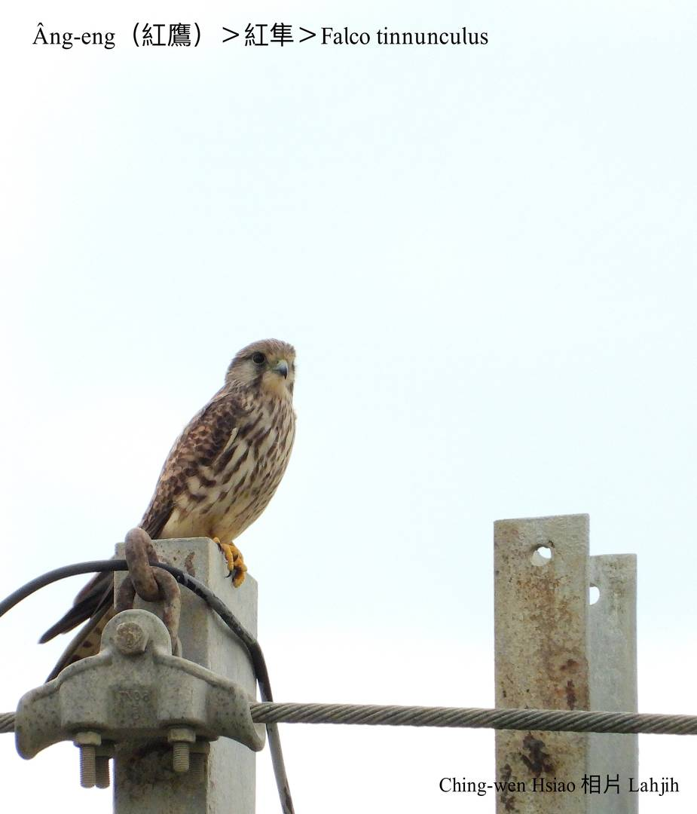

#### 10. Chún Kho『隼科』

|台灣名|中譯名|學名|
|Âng-eng（紅鷹）|紅隼|Falco tinnunculus|

# 10-1. Âng-eng（紅鷹）

分類學âng-eng屬隼科，m̄-koh庄腳人iáu是ka看做鷹á，kha-chiah-phiaⁿ羽毛赤紅色，是普遍ê冬候鳥。

每年秋天9--月飛來台灣，隔轉年3--月離開。

Âng-eng出現tī低海拔ê山區、溪埔á、田洋，單獨活動，ē-tàng像風吹án-ni停留tī半空中phia̍t--leh phia̍t--leh siòng土腳，nā有發現目標，隨時chhiong落去lia̍h獵物，有時khiā tī khah koân ê所在lia̍h細隻鳥類、niáu鼠、蟲thōa。

# 【Tâi-oân Chiáu-á Liām Koa-si】

### **Âng-eng Pháiⁿ-chhèng-chhèng**

Sui-bóng góa bô châi-tiāu lia̍h tōa-chiah chiáu

M̄-kú góa ê kha-chhiú chin liú-lia̍h

Pí góa khah sè-chiah ê thâng-thōa

Piān-nā hō͘ góa hoat-kak

Tiāⁿ-tio̍h bô pàng i soah

It-tēng kā i thiah-chia̍h lo̍h-pak

