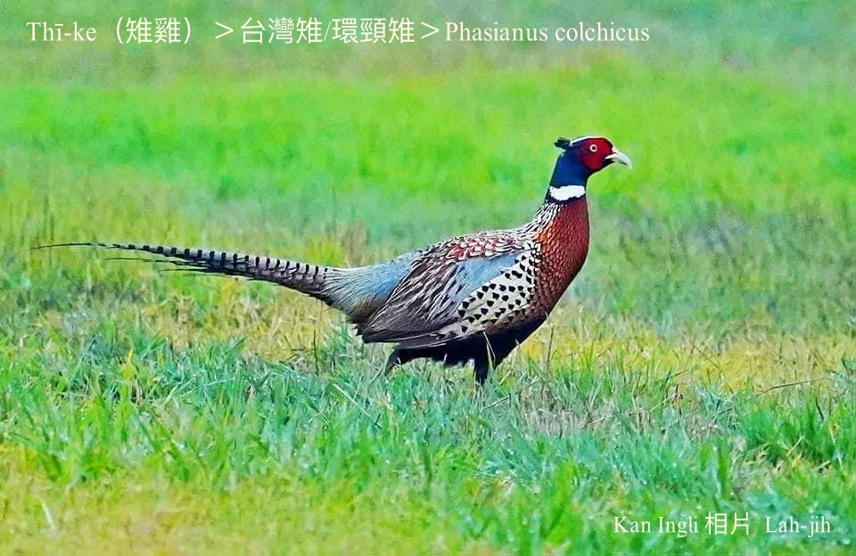
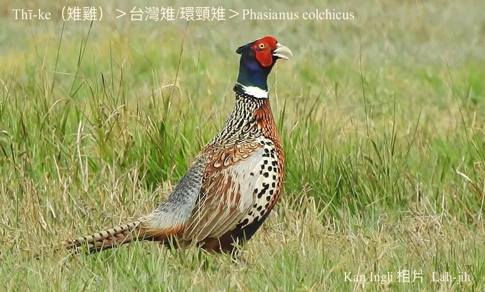
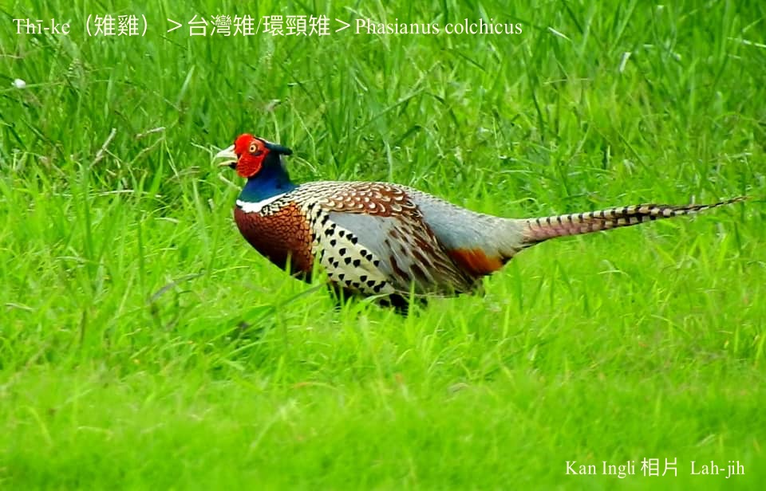
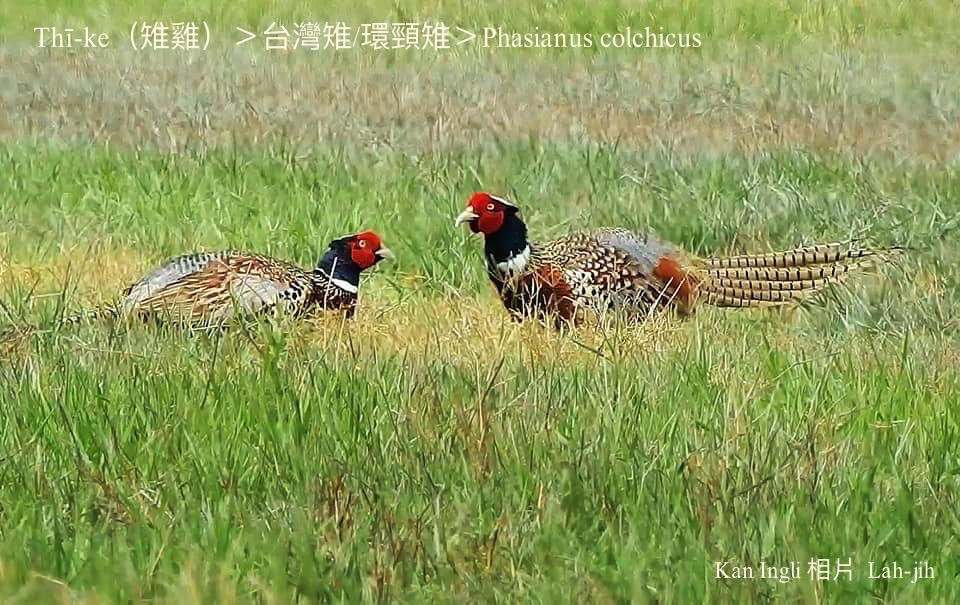
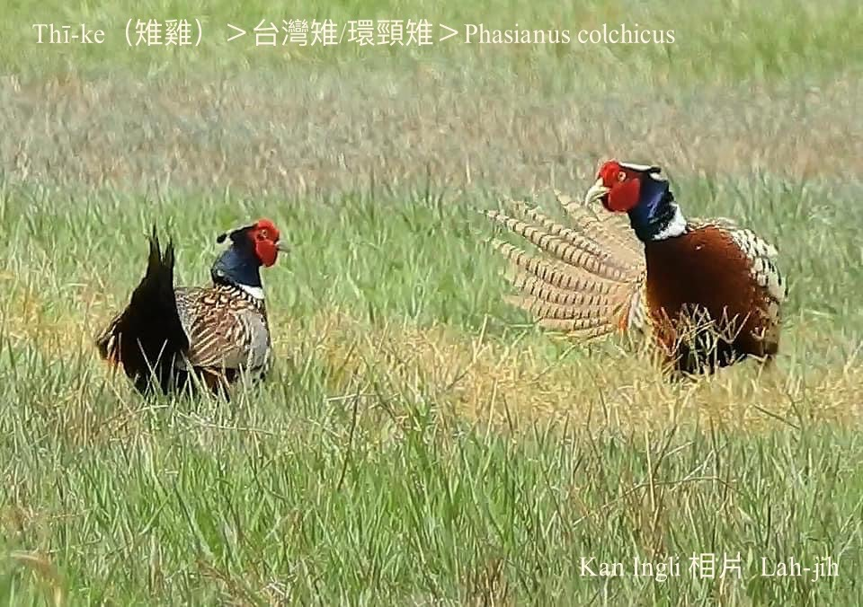
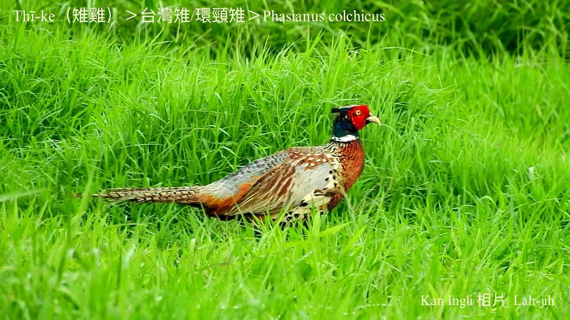
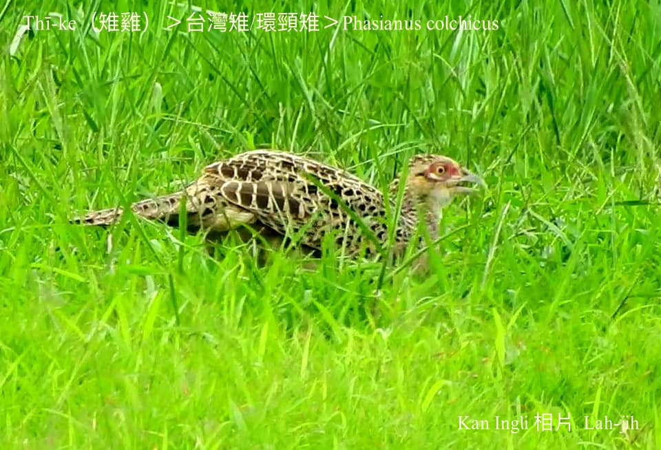

#### 11. Thī Kho『雉科』

|台灣名|中譯名|學名|
|Thī-ke（雉雞）|環頸雉|Phasianus colchicus|

# 11-1. Thī-ke（雉雞）

Thī-ke，四百年來台灣人to̍h án-ne稱號，mā誤會叫做thî-ke，腳有力gâu走，ē飛飛bē遠，是台灣稀有鳥類。

Thī-ke屬二級保育類，kah意草埔chhōe食，果子園、田地、樹林有草ê所在，to̍h有伊ê腳跡。Hèng食果子、種子、蟲thōa、tō͘-ún。

台灣亞種P.c formosanus號做台灣環頸雉，金門ê環頸雉是華東亞種P.c torquatus。

### 俗語

「假仙，插雉雞尾。」

# 【Tâi-oân Chiáu-á Liām Koa-si】

### **Tâi-oân Thī-ke Chin Gâu Thî**

Thī-ke Thî-ke bô-siáⁿ ē poe

Bīn âng-âng  bóe tn̂g-tn̂g

Chhēng hoe-á-saⁿ

Háu--khí-lâi ná ke-kang

Seⁿ-chò ū-iáⁿ súi

Jiá lâng kā i lia̍h

Ū-kàu khó-liân-tāi

### 【註解】

|詞|解說|
|thî-ke|啼雞。|
|tō͘-ún|『蚯蚓』。|

