#### 11. Thī Kho『雉科』

|台灣名|中譯名|學名|
|Hôa-ke（華雞）|山雞（藍腹鷴）|Lophura swinhoii|

# 11-2. Hôa-ke（華雞）

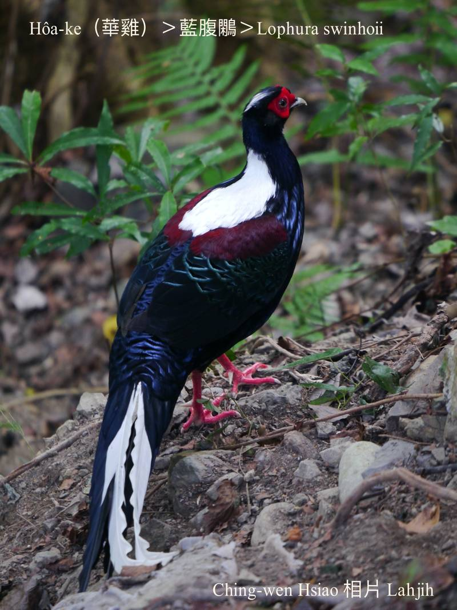

Hôa-ke，庄腳人choa̍h音去講做oa-ke，華雞腳骨紅色，有人叫做紅腳á，是樹林性鳥類，早boeh暗á出來活動討食，暗時歇tī樹á頂。

Hôa-ke是大型雉類，是台灣特有種，全世界kan-nā台灣有。生活tī海拔300–2500公尺森林內。

Hôa-ke雞公紅面、紅翼股頭、紅腳骨，白色kha-chiah-phiaⁿ、白色長尾溜，chhun--ê lóng是khóng-sek金sih-sih羽毛，有夠chhiⁿ-chhioh艷麗；雞母sui-bóng khah暗色，毛草kāng-khoán chiâⁿ-súi。

# 【Tâi-oân Chiáu-á Liām Koa-si】

### **Hôa-ke Kiaⁿ Kiàn-siàu**

Hôa-ke! Hôa-ke! Lí ná tiām-tiām m̄ kóng-ōe

Lí mài kiaⁿ kiàn-siàu hó--bò͘

Lí kám-chai, lí sī kok-pó-kip--ê neh

Sī Tâi-oân chiáu-cho̍k ê hiau-pai

Khòaⁿ lí kui-ji̍t, kiu-kiu lun-lun

Bih-bih chhih-chhih, m̄-káⁿ kìⁿ lâng

Án-ni sī éng-oán bē-tàng chhut-thâu-thiⁿ

Ài ū chū-sìn, m̄-thang khòaⁿ-khin ka-tī

Ióng-kám tōa-siaⁿ thî

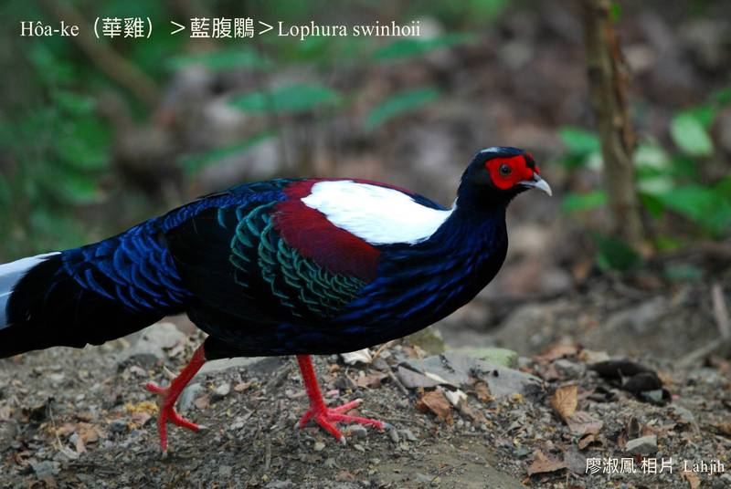
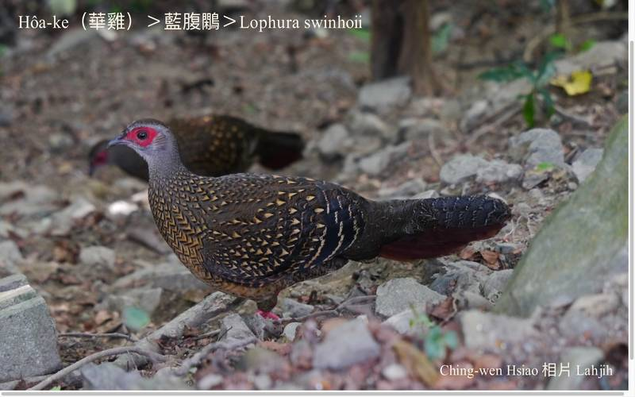
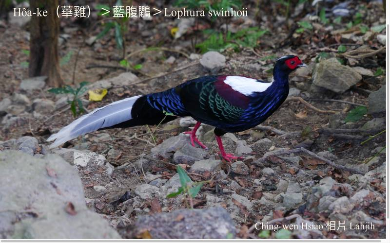
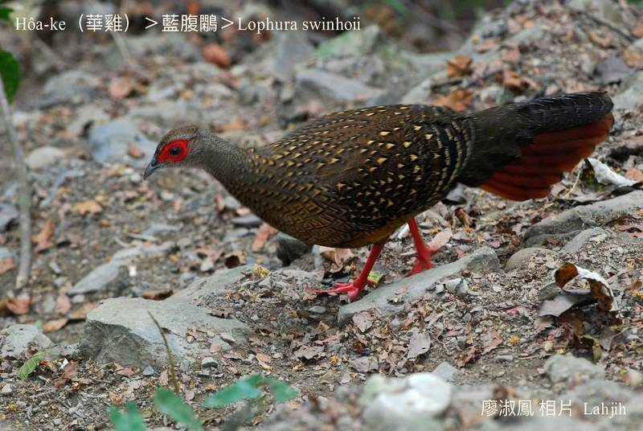
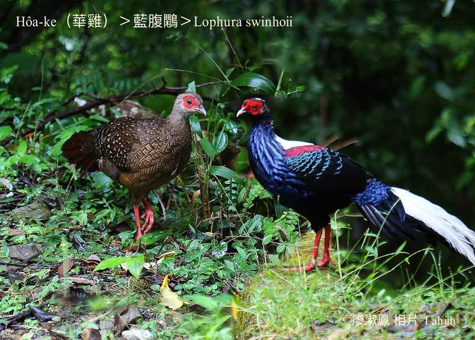
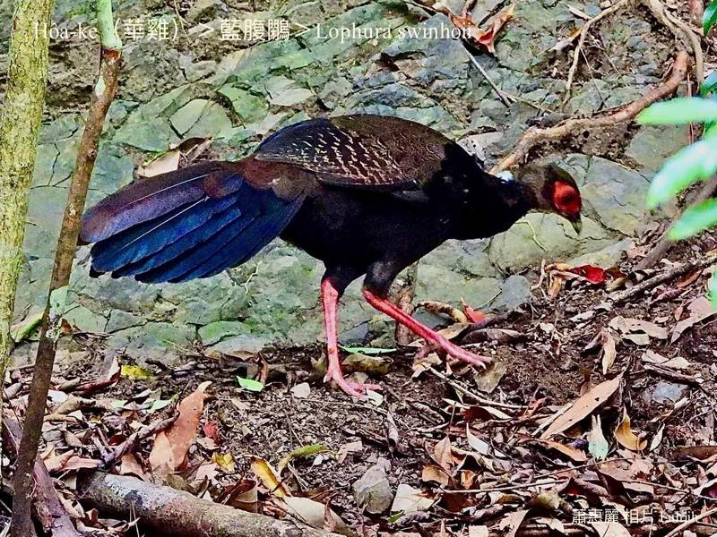
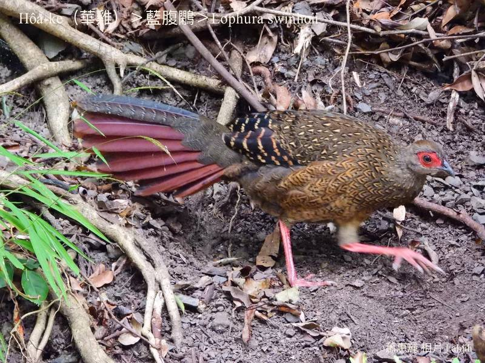
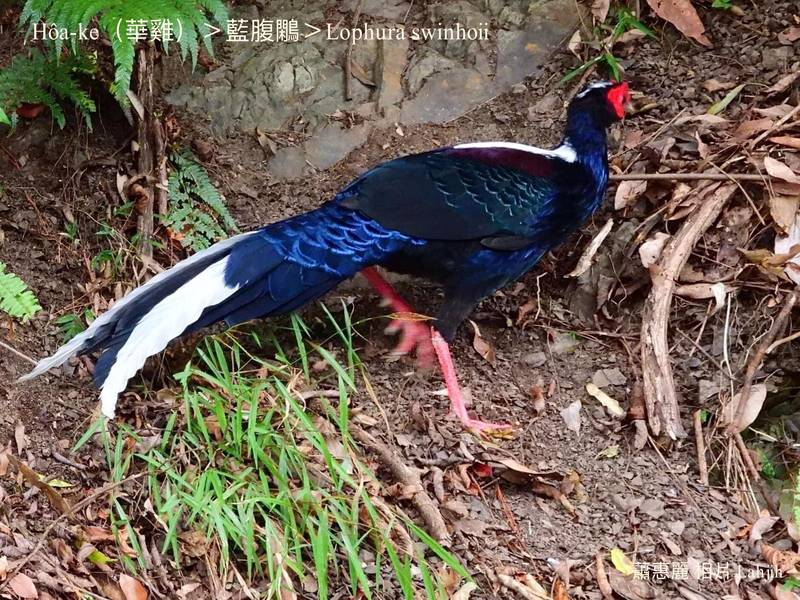
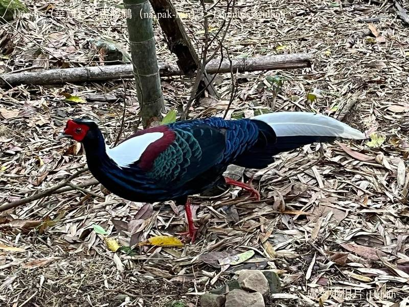
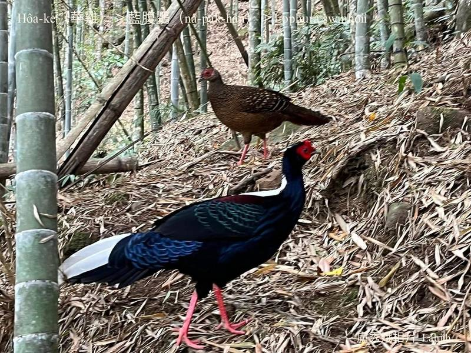

### 【註解】

|詞|解說|
|藍腹鷴|Nâ-pak-hân。|
|oa-ke|哇雞。|
|kiu-kiu lun-lun|Kiu-kiu，『畏縮』。|
|bih-bih chhih-chhih|『躲躲藏藏』。|
