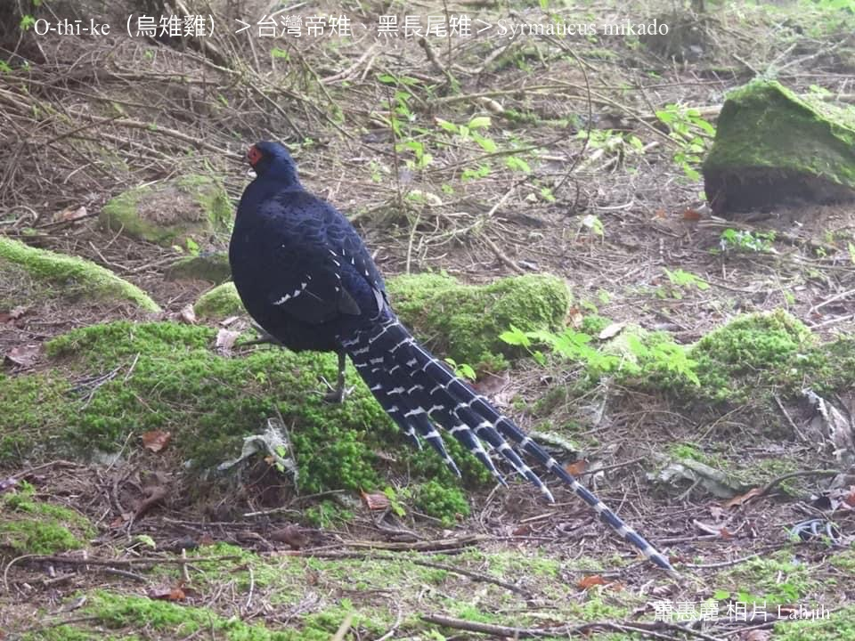
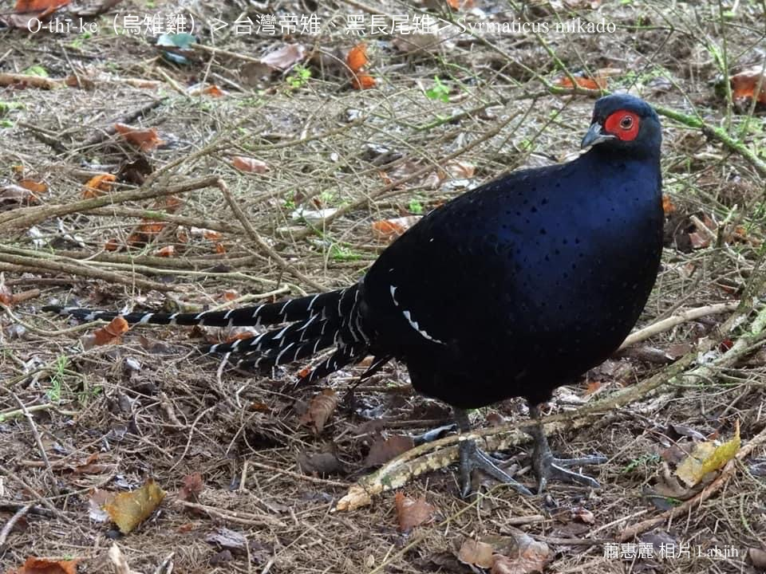
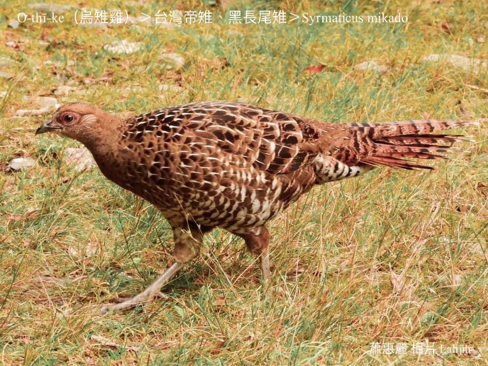
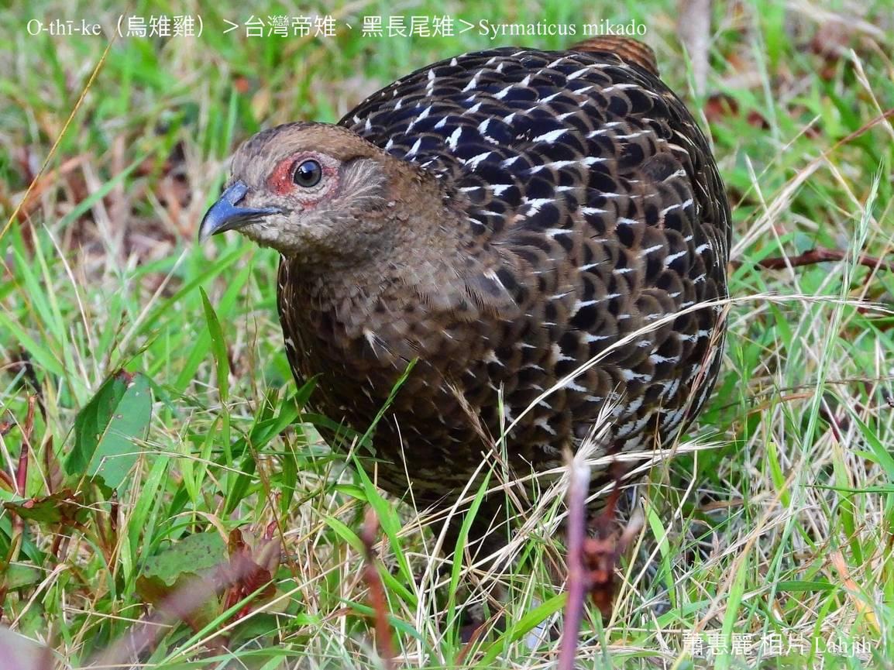
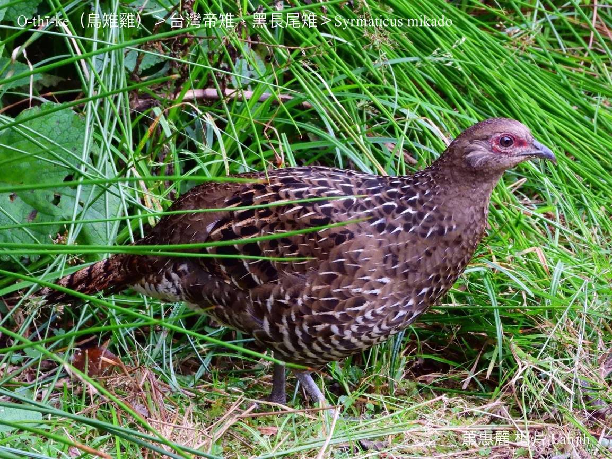
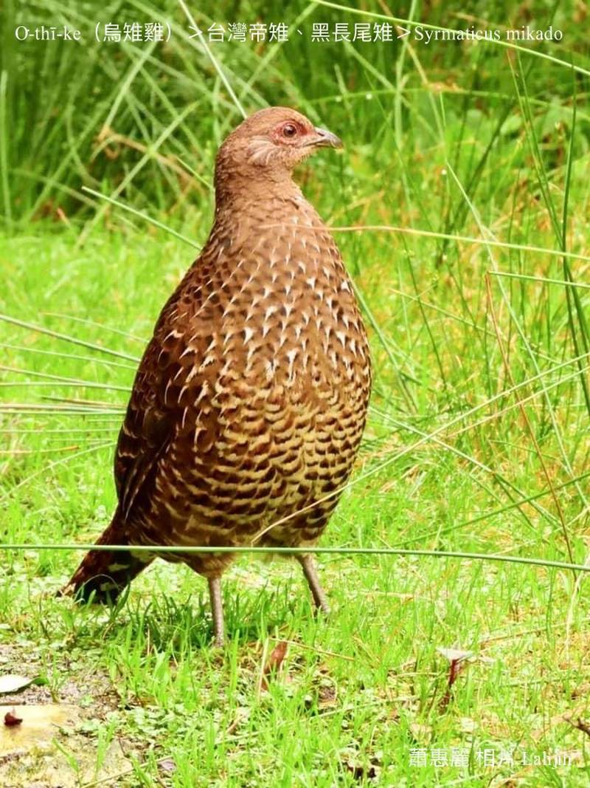
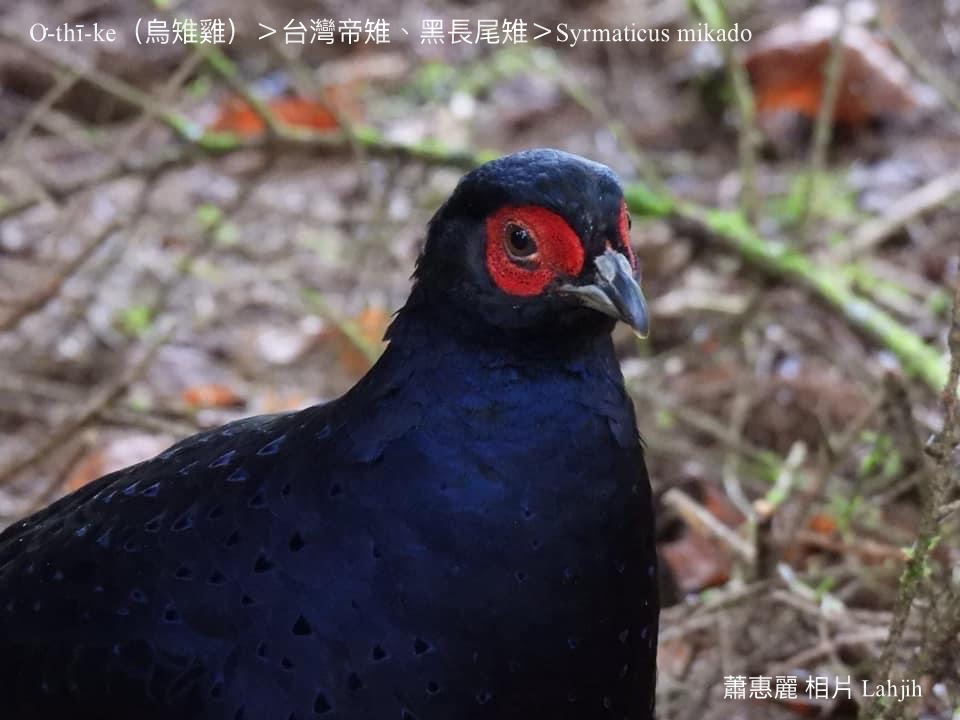
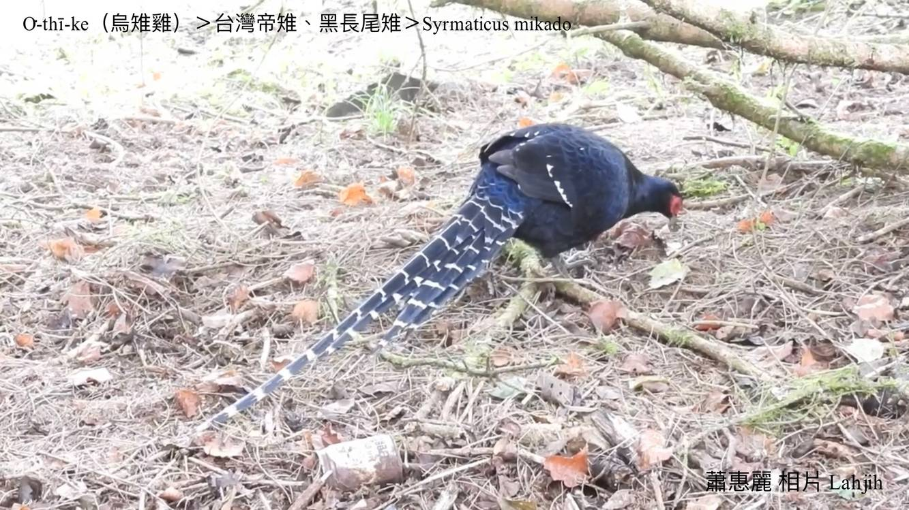
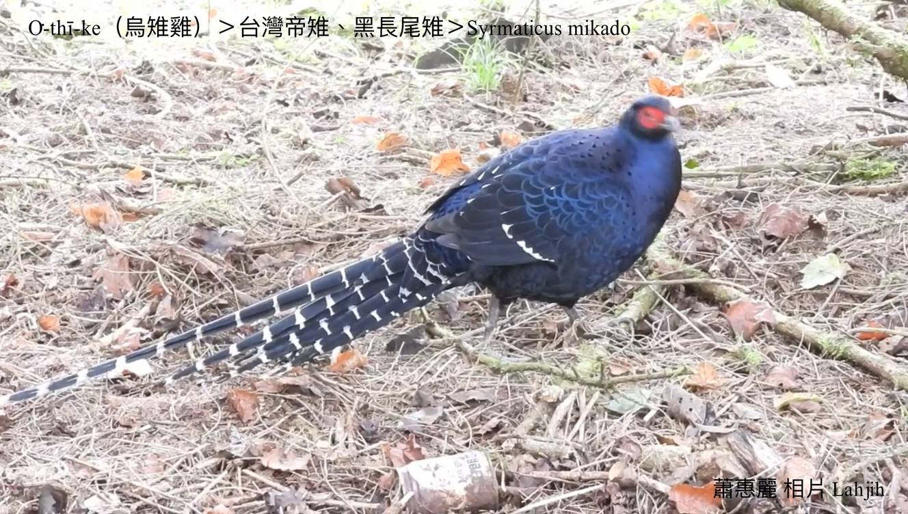

#### 11. Thī Kho『雉科』

|台灣名|中譯名|學名|
|O͘-thī-ke（烏雉雞）|帝雞、黑長尾雉|Syrmaticus mikado|

# 11-3. O͘-thī-ke（烏雉雞）

全身是真súi ê深烏藍色羽衣，日本名叫帝雞，生活tī中、高海拔山區，是罕有鳥類。

O͘-thī-ke是台灣特有雉科鳥類，hām hôa-ke kāng-khoán是被保護ê保育鳥類。生活tī中高海拔山區，平常時hèng食植物草籽，生湠、寒天chiah-ē食蟲thōa、káu-hiā、tō͘-ún。

O͘-thī-ke公鳥kan-nā目chiu紅色，kui-seng-khu是金sih-sih暗khóng-sek，長尾溜chhap一節一節ná甘蔗ê白sûn，非常súi。Kah意早暗出現tī雺霧中chhōe食，hō͘人o-ló是「雺霧中ê王者」。影像hông印tī 1000-kho͘新台幣頂面。

O͘-thī-ke母鳥羽毛色水khah素，有魚鱗形ê花紋，hām華雞母chiok kāng-khoán，siāng簡單分別o͘-thī-ke母kap hôa-ke母ê差別，to̍h是o͘-thī-ke母腳骨是暗phú-sek，hôa-ke母腳骨是紅色。

# 【Tâi-oân Chiáu-á Liām Koa-si】

### **O͘-thī-ke Bông-bū Tiong ê Ông-chiá**

Seⁿ-chò phiau-phiat kiâⁿ-lō͘ ún-chāi tiāⁿ-tio̍h

Kài sêng chhim-soaⁿ-nâ-lāi ê ún-chiá

Bo̍k-koài hông ìn tiàm gîn-phiò

Tián-hiān lí-ê hiau-pai

