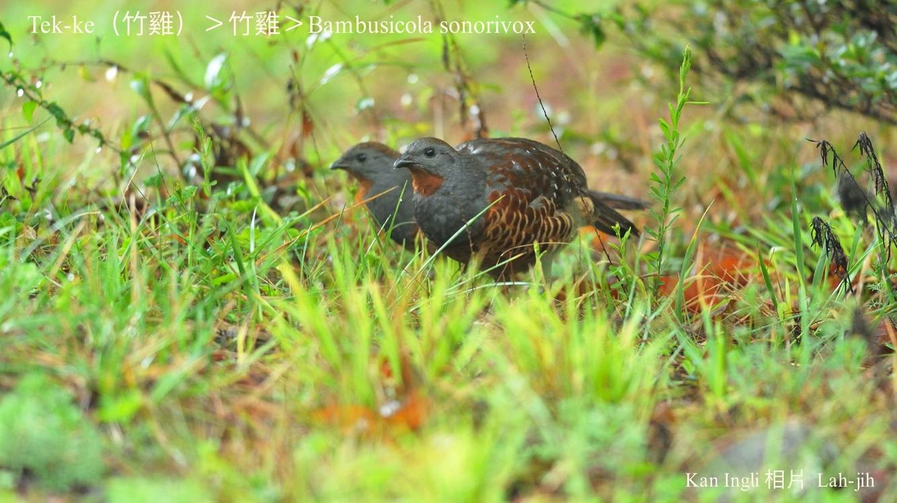
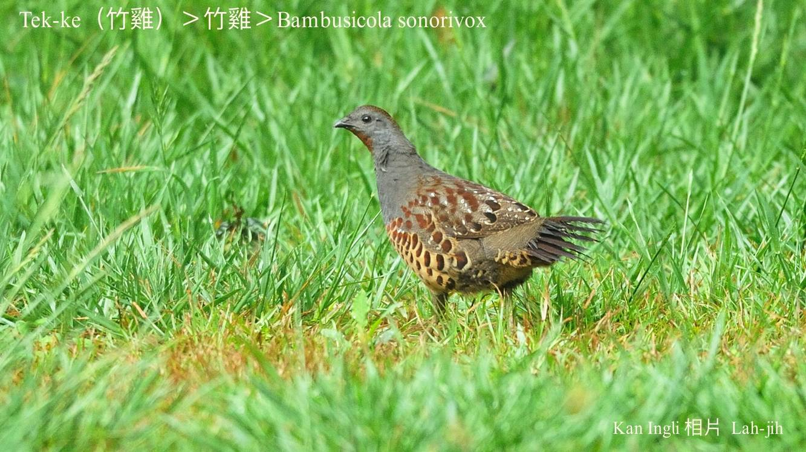
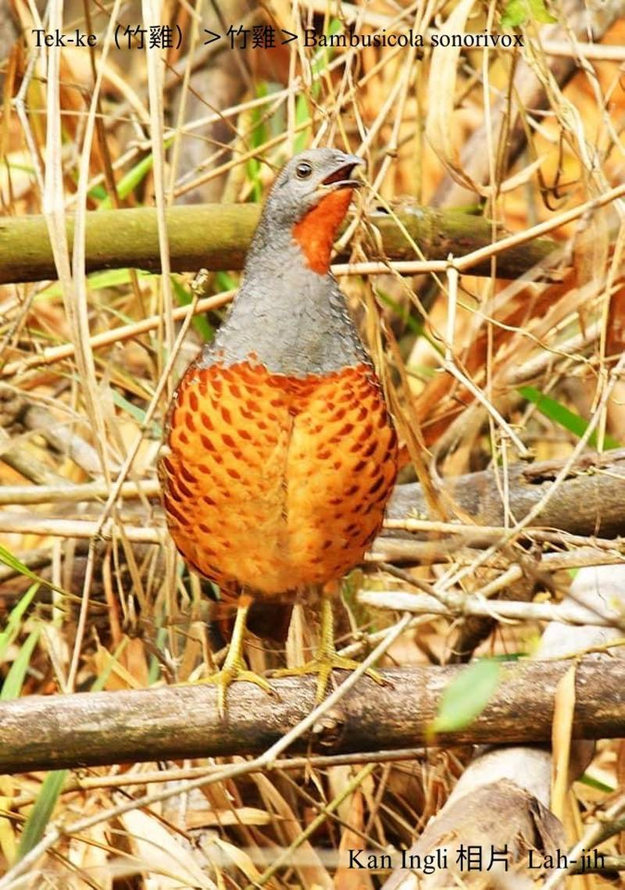
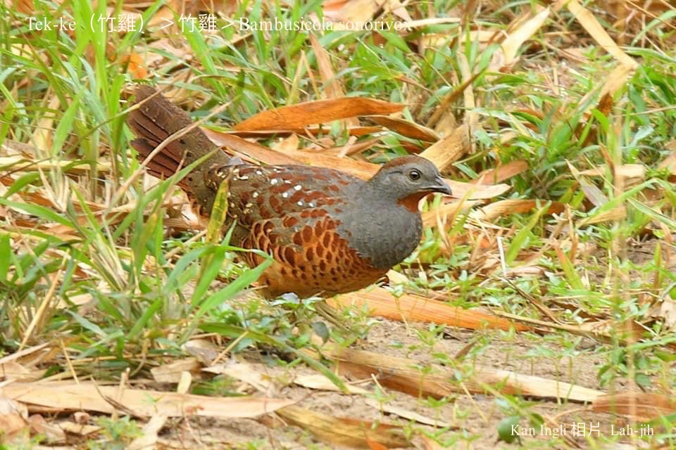

#### 11. Thī Kho『雉科』

|台灣名|中譯名|學名|
|Tek-ke（竹雞）|竹雞|Bambusicola sonorivox|

# 11-4. Tek-ke（竹雞）

Tek-ke生活tī海拔1200公尺附近ê山坪，活動tī竹林、草埔內，所以號做竹雞、竹雞á，透早kap黃昏時，常常kih-ko̍k-kŏai kih-ko̍k-kŏai kiuh-kiuh háu，庄腳人ài lia̍h伊來piak-pa食肉，所以有人滾笑講伊ê叫聲親像：「四隻一盤、四隻一盤…」a̍h是「食boeh死，食boeh死…」。

Tek-ke是台灣特有種鳥類之一，時常3-5隻做夥tok食果子、種子、蟲thōa、樹葉，háu聲kih-ko̍k-kŏai kih-ko̍k-kŏai chiok大聲，bô-siáⁿ ē飛。

# 【Tâi-oân Chiáu-á Liām Koa-si】

### **Tek-ke-á Pi-koa**

Kih-ko̍k-kŏai kih-ko̍k-kŏai hiáng kah kui soaⁿ-phiâⁿ

Ū thiaⁿ-kìⁿ siaⁿ bô khòaⁿ-tio̍h iáⁿ

To̍h-sī chiah phòa-keh chiah ē jiá lâng kā lí lia̍h

Lia̍h-khì ê kiat-kó 1-pôaⁿ 4-chiah piak chiáu-á-pa

Kih-ko̍k-koăi kih-ko̍k-koăi

Chia̍h boeh sí chia̍h boeh sí

### 竹雞á悲歌

### **Kih-ko̍k-kŏai Chia̍h Boeh Sí**
>**（Lah-jih 20120205）**

Kih-ko̍k-koăi kih-ko̍k-koăi響kah kui山坪

有聽kìⁿ聲 無看tio̍h影

To̍h是chiah phòa-keh chiah-ē惹人kā你lia̍h

Lia̍h--去ê結果1盤4隻，2盤8隻piak鳥仔-pa

「Kih-ko̍k-koăi！Kih-ko̍k-koăi！食boeh死！食boeh死！」

「Kih-ko̍k-koăi！Kih-ko̍k-koăi！食boeh死！食boeh死！」

自從阿竹á in兄妹á去hō͘「人」lia̍h去piak鳥仔-pa了後，竹模--ē in翁某to̍h起siáu--à，暝日「kih-ko̍k-koăi，kih-ko̍k-koăi⋯。」Háu無停，「食boeh死，食boeh死⋯。」罵bē-soah，一直詈 一直罵，無論siáⁿ-mih叔孫弟兄ka苦勸ka安慰，in lóng kài-sêng無聽見，iáu是bih-tiàm暗sàm ê kē樹叢草phō內「kih-ko̍k-koăi，kih-ko̍k-koăi⋯，食boeh死，食boeh死⋯。」一直háu一直哭，háu kah sau聲，哭kah giōng boeh斷氣，hit種失去kiáⁿ-jî ê悲傷哀啼，hō͘  in竹雞á族心碎nâ-âu-kńg tīⁿ，忽然間ê tiām靜無聲，是竹模--ē in翁某已經thiám kah kiu tī siū內chhngh--leh chhngh--leh 。

講--起-來！實在是bô-siá-sì可憐tāi，自in搬來chit粒山頭khiā起，to̍h注心boeh tiàm-chia tòa一世人，翁某認真phah-piàⁿ ê結果，真無簡單chiah開墾1-phiàn有竹phō有草埔山坪，koh iā生湠一tīn古錐ê gín-á，日日chhōa出chhōa入，chhōe食thit-thô，日子過了不止á快樂滿意。

Siáng知hit日chi̍t-tīn peh山朋友來到chit-phiàn山埔了後，in ê hit-tīn gín-á to̍h phah-m̄-kìⁿ--lò͘，代先in kioh是gín-á káu-koài gia̍t-siâu四界走四界滾，sńg kah m̄知影chhōe路倒轉--來，in to̍h走去隔壁山坑á chhōe，kāng-khoán無看影跡，連chi̍t-ê gín-á影mā無，是路--裡tn̄g-tio̍h Ka-ka-á kā in講：「免koh chhōe--ā-lah，已經去hō͘ nn̄g-ê pháiⁿ人lia̍h--去-à，taⁿ m̄ hō͘ in piak成鳥仔-pa吞食落腹--à。」

竹模--ē in翁某聽一下差一點á to̍h暈--去，「Ka-ka-á姊，你kám有親目看--tio̍h？」

「有--lah！無，我ná-ē敢烏白講？最近常看peh山朋友中間，有2 ê m̄-chiâⁿ gín-á，peh山無sêng peh山，散步無sêng散步，ku-ku-sui-sui，1 ê手--裡kōaⁿ 1領網á，1 ê giâ 1支hop網，ná行ná kí，2蕊賊á目不sám時都siòng對草埔內面，kài-sêng leh chhōe siáⁿ-mih物件ê款，在我經驗看--來，一定對咱野生動物無好khang--ê，lín-ê寶貝kiáⁿ一定是去hō͘ in網去piak-pa--a，絕對無m̄-tio̍h--ê-lah！」

竹模--ē翁某聽Ka-ka-á講了後，隨時mà-mà-háu：「我ê寶貝後生我ê寶貝cha-bó͘-kiáⁿ--lah，ná-ē chiah pháiⁿ命，chiah tăⁿ轉大人niâ，to̍h hō͘ he iáu-siū-á害--死-à，天公伯--à！你ná-ē chiah-nī無公平，goán kám有做siáⁿ-mih失德ê tāi-chì--hio͘h，ná-ē得tio̍h chit款報應，我「pháiⁿ命--ā~我pháiⁿ命⋯。」竹模--ē in翁某ná唸ná哭，hō͘人愈聽心愈酸，khiā tiàm樹頂kuh-kuh無講話ê斑鴿兄哥，mā開嘴安慰竹模á嫂：「Taⁿ mài koh háu--à，kiáⁿ koh生to̍h有，保重身體要緊，後pái tio̍h教lín kiáⁿ，m̄-thang tín-tāng-tio̍h to̍h chiah大聲kih-ko̍k-koăi kih-ko̍k-koăi háu bē-soah，m̄-nā噪人耳，koh-ē惹來ta̍k ê ê麻煩。你敢知影，hit 2 ê m̄-chiâⁿ gín-á mā tī山頂牽1領chiah大kâi ê天羅地網boeh kā咱lia̍h，你kám知影⋯。」斑鴿ná講ná比，青笛á聽了感覺siuⁿ離經，to̍h chhap嘴講：「斑鴿兄，ah你是leh kā人安慰a̍h是leh kā人教示？竹模á嫂已經哭kah chiah-nī悲慘，你iáu-koh講he五四三--ê，án-ne kám tio̍h？」

「Pháiⁿ勢--lah，竹模á嫂，是我一時siuⁿ氣惱，氣hit 2 ê iáu-siū-á chiah無天良，soah講了siuⁿ超過，請mài見怪，無pháiⁿ意--lah。」

「Taⁿ竹模á兄、竹模á嫂，mài-koh傷心--a，死都死去--à，lín iáu少年，koh生to̍h有，chit種ê淒慘tāi，只要有親像chit 2 ê iáu-siū-á tī--leh，不管時lóng-ē發生，以後ta̍k ê tio̍h khah sè-jī--leh chiah-tio̍h。」

平靜日子過了chiâⁿ個月，「阿竹á in pâ，我koh有--ā neh！」竹模--ē in某tī竹模ê耳khang邊kā伊sai-nai。

「真--ê？我iū-koh boeh做lāu-pē--ā，你趕緊去hio̍h-khùn，m̄-thang siuⁿ勞動，討食ê khang-khòe我來做to̍h好。」 

竹模--ē歡喜kah「kih-ko̍k-koăi kih-ko̍k-koăi」chiah大聲喝--出-來，ká-ná驚人m̄知伊boeh做老爸--leh。

「Taⁿ mā好--à，khah細聲--leh-lah，你是boeh-koh惹麻煩--hio͘h？歡喜tī心內to̍h好，m̄-thang án-ne lōng-iâng，以後to̍h hō͘你khah無閒--lò͘！」

無外久，竹模--ē in翁某iū-koh chhōa 1-tīn細隻竹雞á出來thit-thô，過去ê傷痕漸漸放bē記得，山坪每日kāng-khoán hiah-nī鬧熱，peh山散步ê朋友kāng-khoán hiah-nī chē，in mā kāng-khoán tòe人行出行入，chi̍t-sut-á to-bē感覺驚惶，kāng-khoán歡喜ê時陣to̍h大聲「kih-ko̍k-koăi kih-ko̍k-koăi」háu無停，引起peh山朋友kí-kí chí-chí：「Chiâⁿ-súi ê鳥仔，緊來看！」

「He叫做竹雞á--lah！」

「Ná像bē-hiáu飛ê款？」

「聽in leh háu kih-ko̍k-koăi kih-ko̍k-koăi，koh真心適！」

竹模--ē in一家伙á soah愈來愈得意，愈hō͘人o-ló愈感覺hiau-pai，一下歡喜soah kui-ē做1群「kih-ko̍k-koăi kih-ko̍k-koăi」háu--起-來，響kah kui山坪。

天氣有測bē準ê時陣，鳥仔有想bē到ê災厄，chit一工peh山ê朋友當中，koh出現2 ê chah家私--ê，1 ê提hop-á，1 ê kōaⁿ網á，chim-mī行chim-mī笑，ná行ná講話，「eng-àm ún sut--ê，4隻1盤，8隻2盤，燒酒已經chhoân好勢⋯⋯。」

Hit boeh暗á，竹模--ē in翁某iū-koh四界leh chhōe gín-á，chhōe kah心狂火to̍h，chhōe kah目屎流目屎滴，chhōe kah無望起siáu狂。「Kih-ko̍k-koăi！食boeh死！」「Kih-ko̍k-koăi！食boeh死！」「Kih-ko̍k-koăi！食boeh死！」⋯⋯⋯⋯。

### 【註解】

|詞|解說|
|詈|Lóe／lé。|

