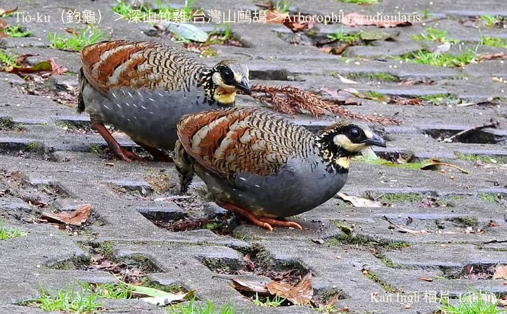
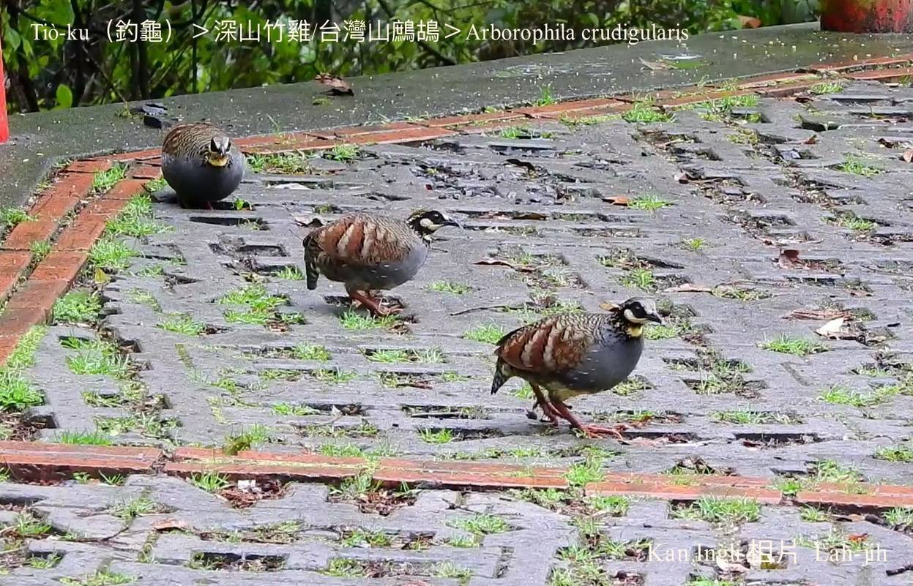
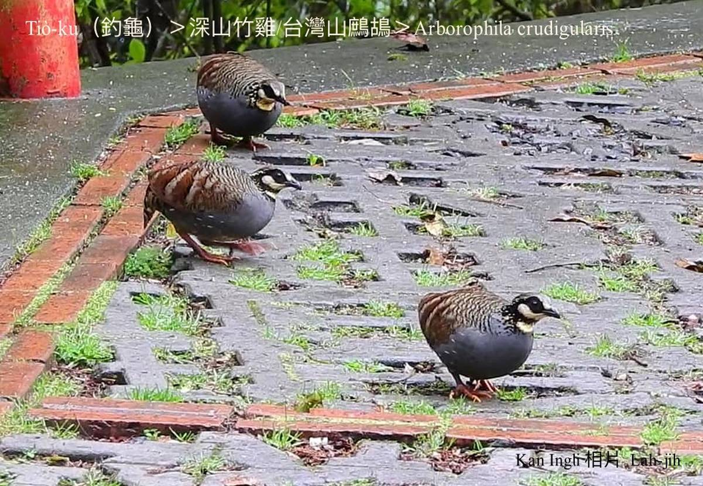

#### 11. Thī Kho『雉科』

|台灣名|中譯名|學名|
|Tiò-ku（釣龜）|深山竹雞（台灣山鷓鴣）|Arborophila crudigularis|

# 11-5. Tiò-ku（釣龜）

Tiò-ku早暗lóng-ē大聲「tiò-ku tiò-ku tiò-ku tiò-ku …」háu bē-soah，m̄-chiah hō͘人號做tiò-ku；因為形態sêng竹雞á，而且雙腳紅紅，mā號做紅腳竹雞。

Tiò-ku歇tī雜木林，警戒心真強，bih-tiàm iap-thiap所在，oh-tit看--tio̍h，食細隻蟲á kap植物ê chíⁿ芽、種子。

Tiò-ku是台灣特有種，hioh-tī中低海拔樹林內，算是chiâⁿ普遍ê鳥á。

# 【Tâi-oân Chiáu-á Liām Koa-si】

### **Tiò-ku Tiò-ku Tiò-ku Tiò-ku**

Sim-sek ê kiò-siaⁿ

M̄-sī ī su khí he-ku

Tiò-ku bih tī chhim-soaⁿ nâ-lāi

Kiaⁿ-lâng ka hāi

M̄-chiah chiok kiaⁿ-hiâⁿ

Sió-khóa giâu-gî siaⁿ-im

I sûi-sî bih khì chháu-phō lāi

