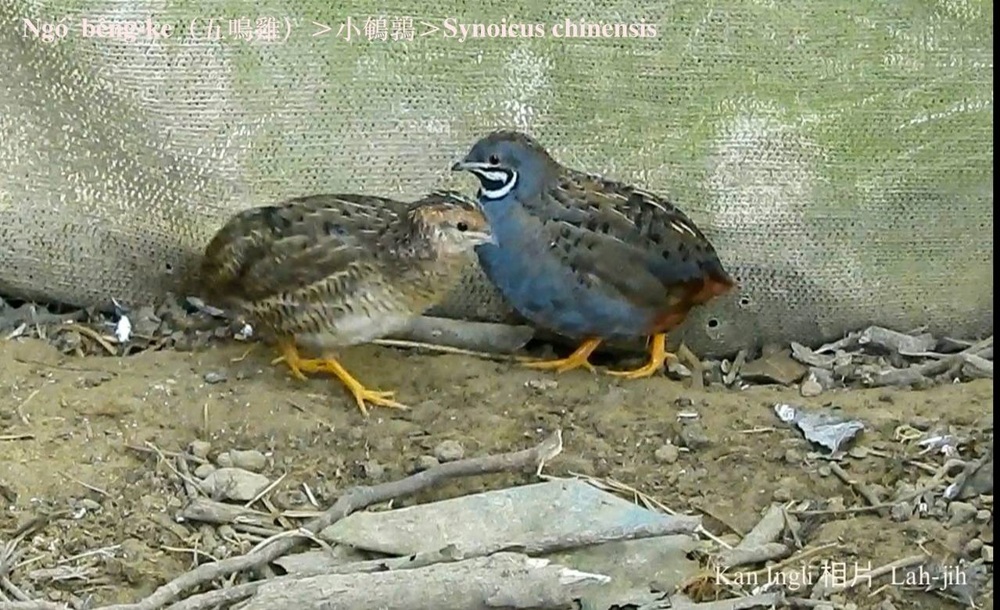
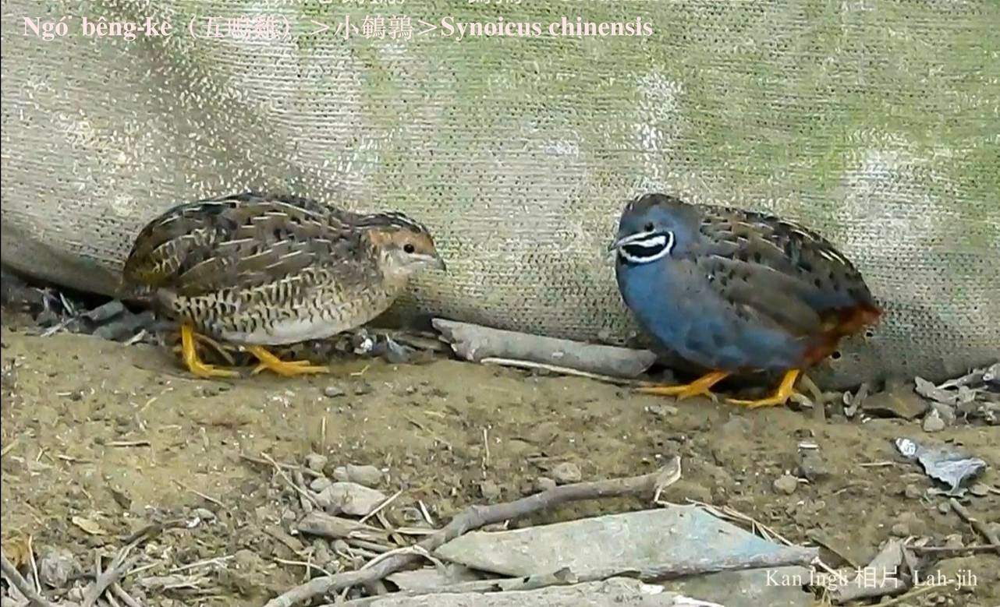

#### 11. Thī Kho『雉科』

|台灣名|中譯名|學名|
|Ngó͘-bêng-ke（五鳴雞）|小鵪鶉|Synoicus chinensis|

# 11-6. Ngó͘-bêng-ke（五鳴雞）

Ngó͘-bêng-ke，mā號做五更雞，公--ê ām-kún下有烏插白ê花紋，親像太極圖，古早時暗暝，五鳴雞nā聽tio̍h更鼓聲，to̍h-ē toè-leh háu三五聲，ná像leh報更。

Ngó͘-bêng-ke是在地鳥，大部分歇tī曠闊ê甘蔗園、溪埔近水邊ê草埔內，比鵪鶉khah細隻，hèng食幼草、草íⁿ、草籽。

