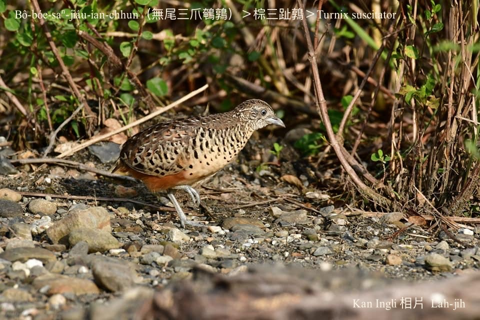

#### 11. Thī Kho『雉科』

|台灣名|中譯名|學名|
|Bô-bóe Saⁿ-jiáu-ian-chhun（無尾三爪鵪鶉）|棕三趾鶉|Turnix suscitator|

#### 11-8. Bô-bóe Saⁿ-jiáu-ian-chhun（無尾三爪鵪鶉）

『小鵪鶉、鵪鶉、棕三趾鶉』lóng是無尾鵪鶉， ngó͘-bêng-ke是『小鵪鶉』，bô-bóe-ian-chhun是『鵪鶉』，só͘-pái咱kā『棕三趾鶉』號做無尾三爪鵪鶉。

Bô-bóe saⁿ-jiáu-ian-chhun和粟鳥á差不多大，生活tī田洋、樹林邊、田園雜草內，無容易發現，是台灣特有亞種鳥類，警戒性chiâⁿ koân，nā有動靜，隨時bih--起-來，受攻擊ê時，chiah-ē飛走。

### 【註解】

|詞|解說|
|ngó͘-bêng-ke|五鳴雞，『小鵪鶉』。|
|bô-bóe-ian-chhun|無尾鵪鶉，『鵪鶉』。|
