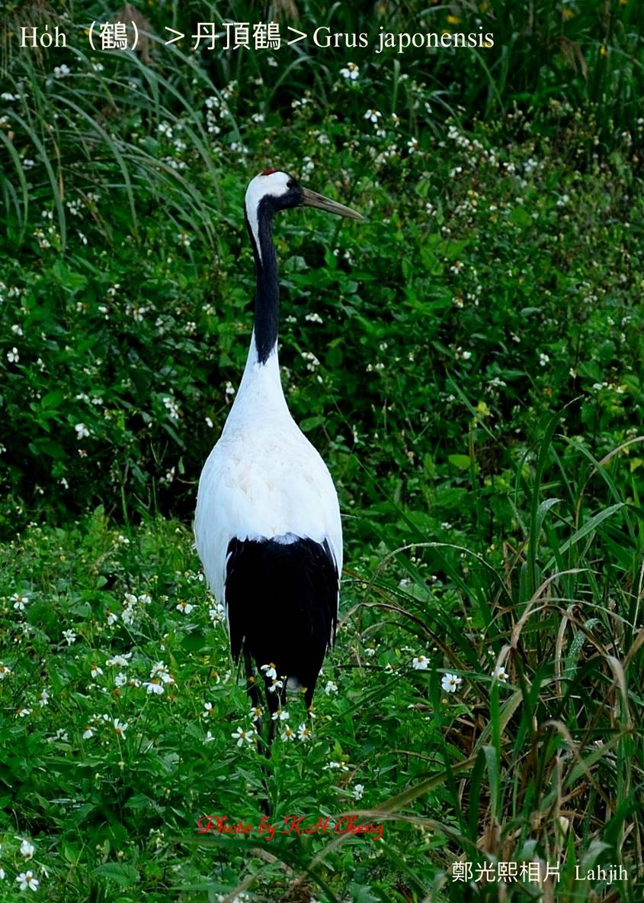
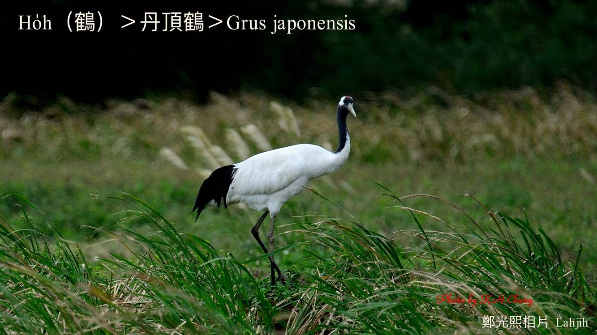

#### 12. Ho̍h Kho『鶴科』

|台灣名|中譯名|學名|
|Ho̍h（鶴）|丹頂鶴|Grus japonensis|

# 12-1. Ho̍h（鶴）

Ho̍h，kah意hioh tī tâm溼ê草埔地，日--時討食，暗時hioh-khùn。鶴ê腳爪，三前一後，後爪khah koân koh khah短，所以無法度khip tiàm樹枝，水墨畫ài畫鶴hioh-tiàm松柏樹枝頂，可能是對鶴ê一種誤解。

丹頂鶴是日本名，生做腳lò ām-kún長，高雅優美，羽毛烏白明顯，頭殼有紅色肉髻，高雅真美。

Ho̍h是外來迷路鳥，tī台灣出現幾pái，chiâⁿ稀罕。

# 【Tâi-oân Chiáu-á Liām Koa-si】

### **Tan-téng-ho̍h  Thâu-khak Bóe-téng Ū Kì-hō**

Khòaⁿ ho͘ hó, khòaⁿ ho͘ chheng-chhó

Goán ê thâu-khak bóe-téng, ū chò kì-hō

Chi̍t-chhop âng-âng ná sian-tan

Ji̍t-pún-lâng kā goán hō-chò tan-téng-ho̍h

Ài tòa tâm-sip ê chháu-po͘

Bē-hiáu hioh-tiàm chhiū-á oe

Mā m̄-sī sîn-sian khiâ ê sian-ho̍h

### 【註解】

|詞|解說|
|肉髻|Bah-kòe。|

