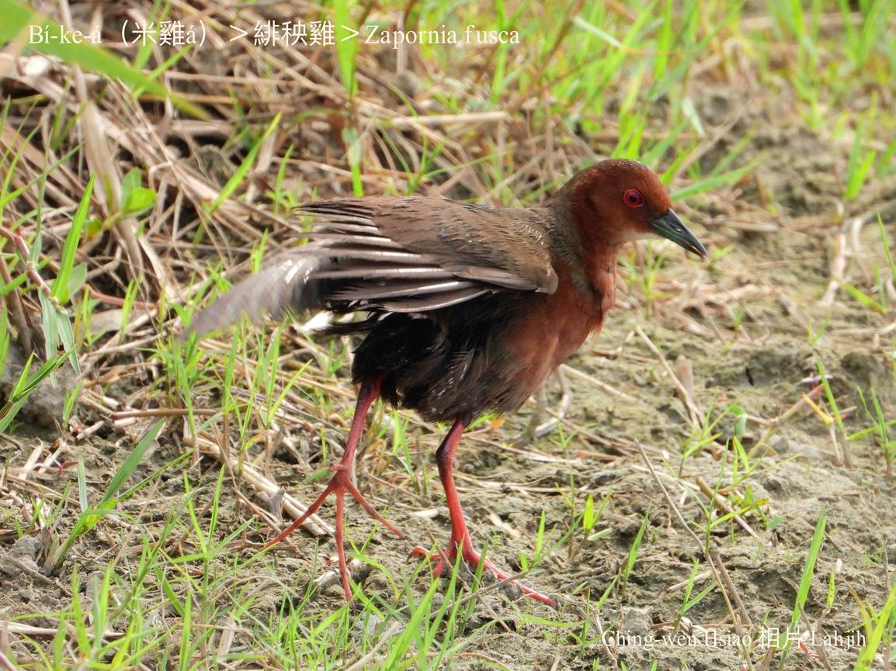
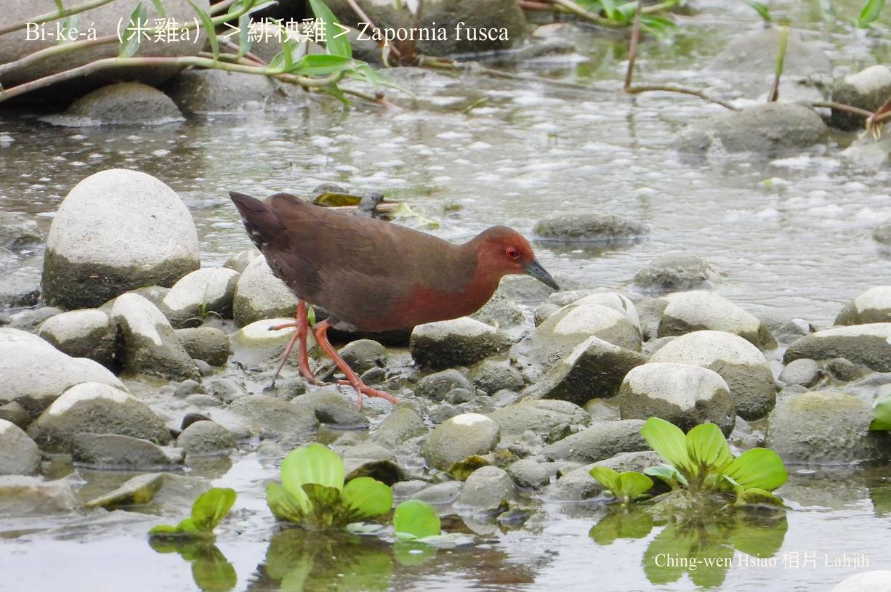
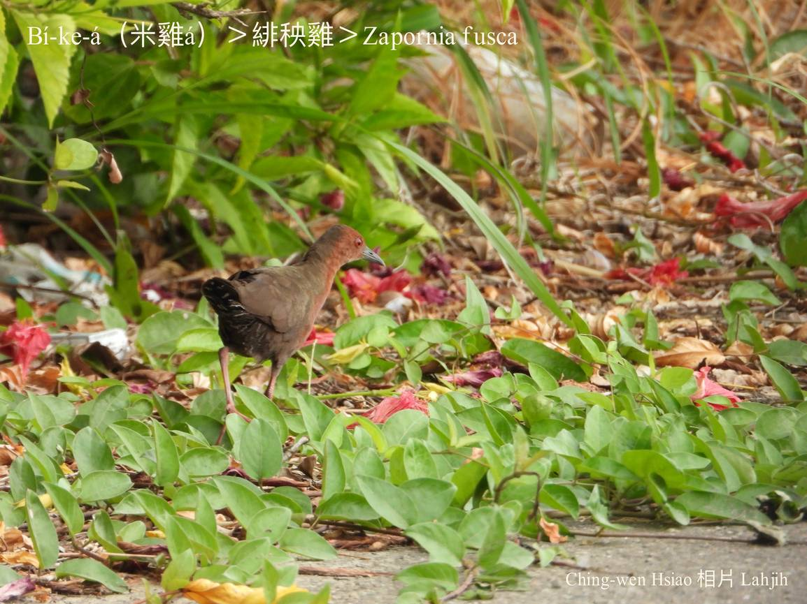
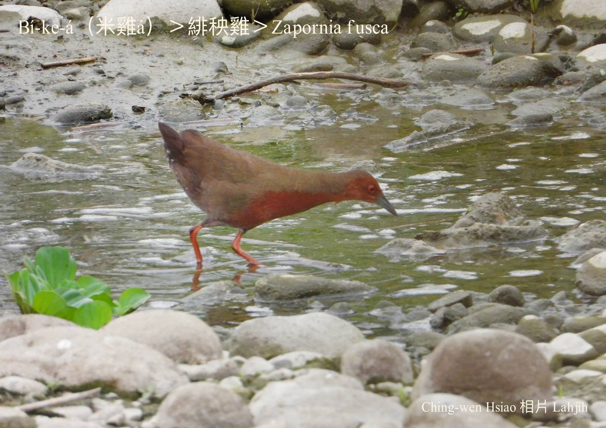
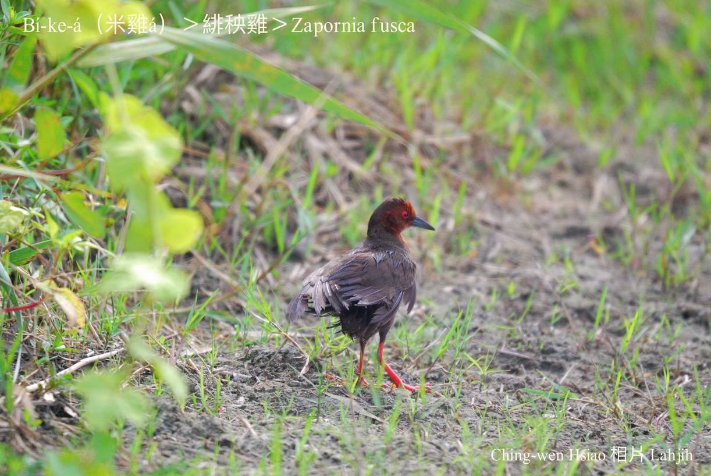

#### 13. Iong-ke Kho『秧雞科』

|台灣名|中譯名|學名|
|Bí-ke-á（米雞á）|緋秧雞|Zapornia fusca|

# 13-1. Bí-ke-á（米雞á）

因為kah意tī田--裡食粟á，所以號做米雞á。 

Bí-ke-á ê頭殼、胸坎âng-hóaⁿ色，翼股、腹肚ka-pi-phú色，活動時，紅kòng-kòng ê雙腳特別影目，庄腳人ka號做âng-kha-á，ē-hiáu泅水chhàng-chúi-bī，緋秧雞是日本名。

Bí-ke-á tī台灣是chiâⁿ普遍ê在地鳥，活動tī水邊廬竹phō、水田、溼地、圳溝邊。Hèng食蟲thōa、水蛙、細粒螺á和種子。

# 【Tâi-oân Chiáu-á Liām Koa-si】

### **Bí-ke-á Chhēng Âng-saⁿ**

Bí-ke-á chhēng âng-saⁿ, chhēng kah súi-tang-tang

Kah-ì chia̍h chhek-á, mā hèng sè-bóe thâng

Pài-thok chhek-á m̄-thang chia̍h siuⁿ-chē

Chiah bē hō͘ goán a-pa pe̍h liáu-kang

Pài-thok chhek-á m̄-thang chia̍h siuⁿ-chē

Chiah bē hō͘ goán a-pa sit-bāng

### 【註解】

|詞|解說|
|緋秧雞|Hui-iong-ke。|
|影目|Iáⁿ-ba̍k。|

