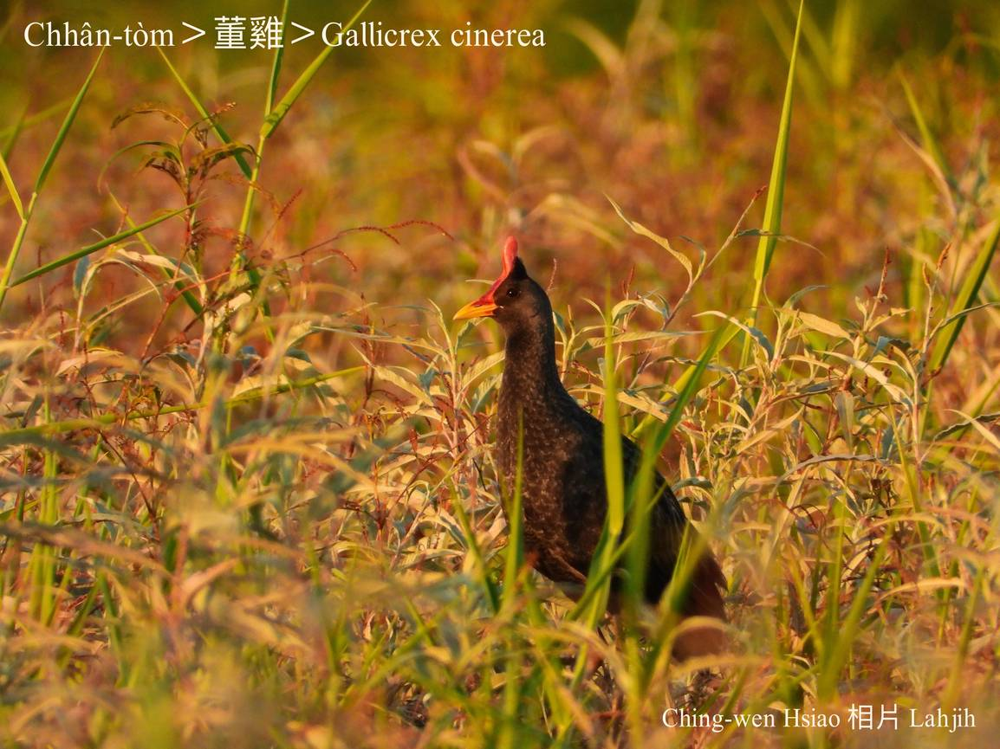

#### 13. Iong-ke Kho『秧雞科』

|台灣名|中譯名|學名|
|Chhân-tòm|董雞|Gallicrex cinerea|

# 13-3. Chhân-tòm

Chhân-tòm，生活tī田野，生湠期間，公鳥ē唱「tòm tòm tòm tòm…」ê低音歌聲，特別tī暗時聽--起-來加真大聲，所以號做chhân-tòm，chiâⁿ有田庄味。

Chhân-tòm tī khah早算是kài普遍chia̍p khoàiⁿ，主要hioh-tī lòm地稻田，因為農藥kah土地過度開發，chit-mái soah pìⁿ-chiâⁿ罕有ê夏hāu-niáu，日--時bih tiàm草埔內，常常有聽見聲無看見影，ài食水內小動物kap種子、幼葉á。

稀有的夏hāu-niáu，chhân-tòm生性無膽，lio̍h-á發現koh-iūⁿ隨bih--起-來。

# 【Tâi-oân Chiáu-á Liām Koa-si】

### **Chhân-tòm Boeh Chhōa-bó͘**

Chhân-tòm leh phah-kó͘

Tòm tòm tòm tòm

Phah kah chiah jīn-chin

Lí sī leh phah hō͘ siâng thiaⁿ

Sī leh phah hō͘ lí ê bī-hun-chhe thiaⁿ

Kóng lí chún-pī boeh chhōa-bó͘

### 【註解】

|詞|解說|
|hāu-niáu|『候鳥』。|
|khoàiⁿ|Khòaⁿ-kìⁿ ê合音。|

