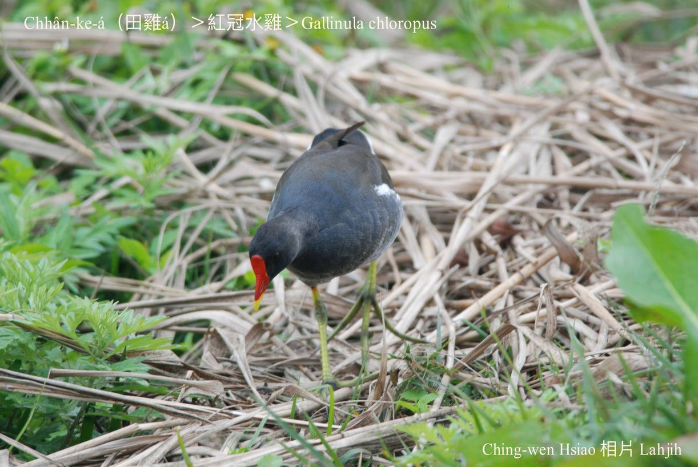

#### 13. Iong-ke Kho『秧雞科』

|台灣名|中譯名|學名|
|Chhân-ke-á（田雞á）|紅冠水雞|Gallinula chloropus|

# 13-4. Chhân-ke-á（田雞á）

Chhân-ke-á to̍h是歇tī水田--裡ê水雞，淺黃綠色ê雙腳chiâⁿ明顯，有「chheⁿ腳á」ê稱號。Mā hō͘人號做水鵁鴒、烏水雞。

Chhân-ke-á額頭連嘴pe鼻頭是紅色，tēng-khok-khok，翼股、尾溜chhap chi̍t-chōa白色，其他羽毛lóng是烏色，chiâⁿ-súi。腳爪無蹼ē泅水，tī台灣是真普遍ê在地鳥，tiàm-tī lòm地、水邊、溪á邊、水田，tī透早a̍h是boeh暗á出來活動，食細隻蟲á，植物幼芽。

Chhân-ke-á用水草做siū tī水田邊、lòm地，雞á-kiáⁿ nā褪殼to̍h ē-hiáu行路，chhân-ke-á母時常chhōa chhân-ke-á-kiáⁿ thit-thô chhōe食物，是盡心盡責ê母親。

# 【Tâi-oân Chiáu-á Liām Koa-si】

### **Chhân-ke-á Gâu Kò͘-chhù**

Kiò lí ke-á, lí koh ē siû-chúi

Kóng lí sī ah, m̄-koh ū ke-jiáu bô ah-kha-tê

Kui-kang bih-tiàm chúi-piⁿ lòm-tē

Ang-á-bó͘-á un-un ài-ài, chhōa-chhut chhōa-ji̍p

Kò͘-ke kò͘-chhù, siau-iâu chū-iû

### 【註解】

|詞|解說|
|水鵁鴒|Chúi-ka-lēng。|
|蹼|Pok。|
|褪殼|Thǹg-khak。Tok-chiù liáu to̍h-sī褪殼，jiân-āu雞á-kiáⁿ to̍h出--來-à。|

