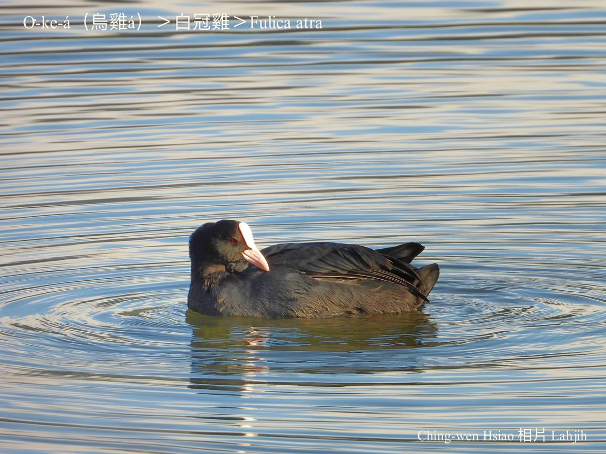
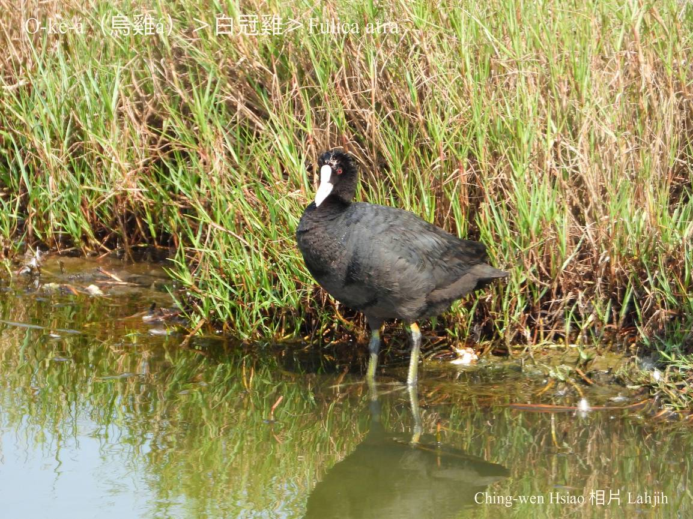
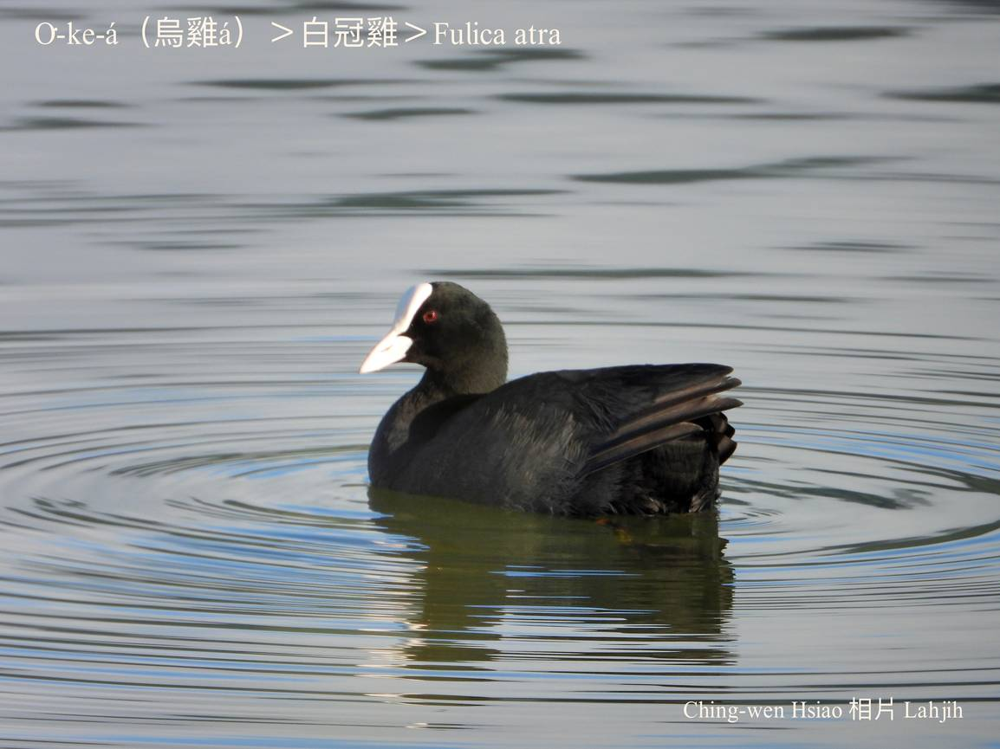
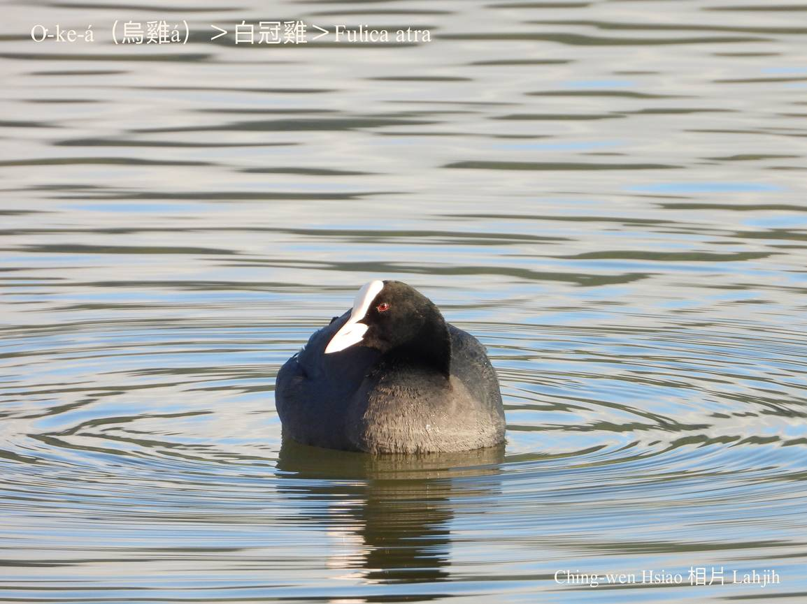
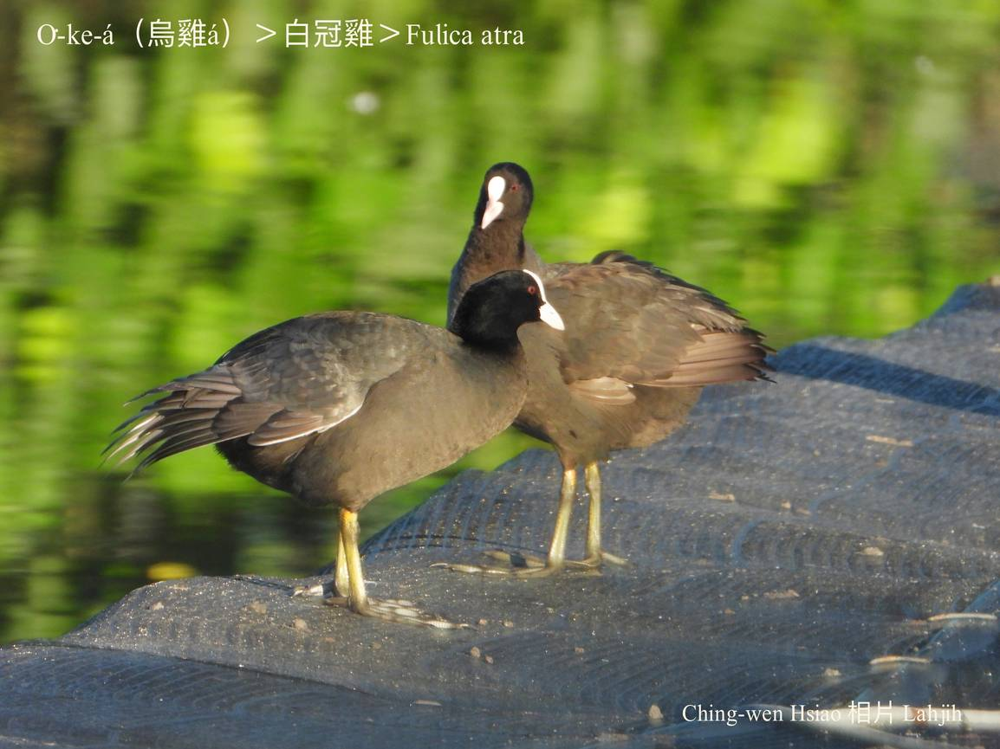
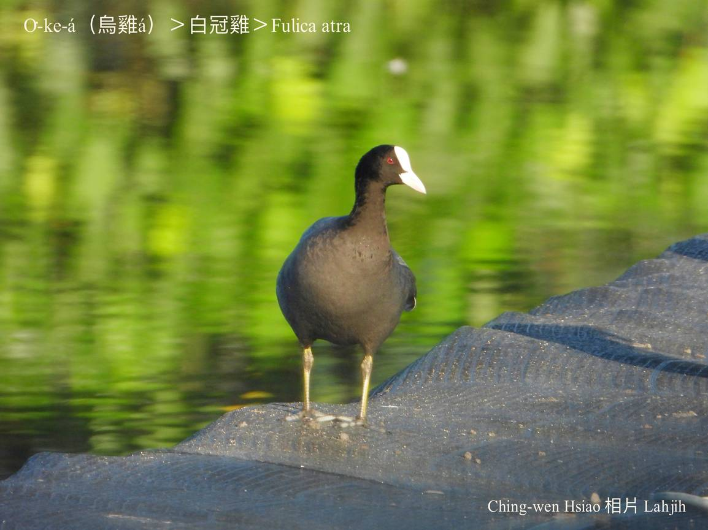
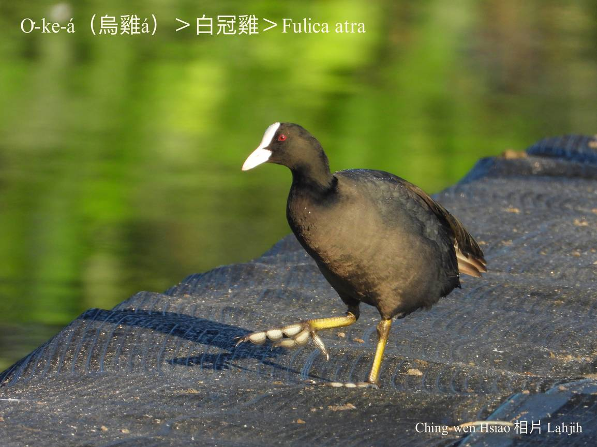

#### 13. Iong-ke Kho『秧雞科』

|台灣名|中譯名|學名|
|O͘-ke-á（烏雞á）|白冠雞|Fulica atra|

# 13-5. O͘-ke-á（烏雞á）

O͘-ke-á，kui隻烏sô-sô ná火塵lo͘，kan-nā頭額連嘴pe是白色，tēng-khok-khok，腳骨白phú白phú，腳爪無蹼gâu泅水。

O͘-ke-á tī台灣是罕有ê冬候鳥，hioh tī曠闊ê水面，a̍h是有水草、廬竹phō ê水池，gâu chhàng-chúi-bī食水底食物。為了適應水內、岸頂ê生活環境，伊ê胸、腹sêng水鴨，嘴pe sêng雞á，腳爪無sêng雞爪，mā無sêng鴨蹄，chiâⁿ特別，主要食物是水生動物植物。

### 【註解】

|詞|解說|
|蹼|Pok。|
|chhàng-chúi-bī|『潛水』。|
|白phú|Pe̍h-phú，『灰色』。|

