#### 14. Chúi-thī／tī Kho『水雉科』

|台灣名|中譯名|學名|
|Lêng-kak-chiáu（菱角鳥）|水雉|Hydrophasianus chirurgus|

# 14-1. Lêng-kak-chiáu（菱角鳥）

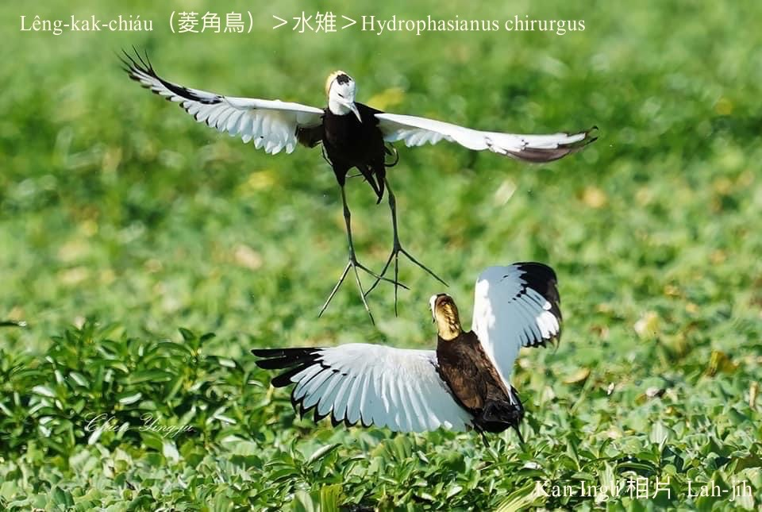

Lêng-kak-chiáu，chhōe食、歇睏、生湠lóng tī菱角田，m̄-chiah hō͘人號做菱角鳥。Tī台灣一寡á是留鳥，多數是夏候鳥。每年4月中旬出現，配對生湠，做siū、生卵、飼kiáⁿ，非常無閒，9月中旬to̍h漸漸消失蹤影。

Lêng-kak-chiáu警覺性真強，做siū tī浮草真旺，視野真闊，pháiⁿ發現ê所在；伊ê腳柱kap腳爪lóng真長，適合tī水蓮、菱角葉頂行來行去。

Lêng-kak-chiáu羽毛白花chhap色非常súi，腳長爪長尾mā長，是珍貴罕有ê二級保育鳥。

Lêng-kak-chiáu tī生湠期間是一妻多夫制，鳥母負責交配生卵，chhun--ê孵卵chhōa-kiáⁿ lóng是鳥公ê tāi-chì。

Lêng-kak-chiáu hèng食水內動物幼蟲，水蛙、ām-oaiⁿ-á、蜘蛛、種子⋯。

# 【Tâi-oân Chiáu-á Liām Koa-si】

### **Lêng-kak-chiáu Chiâⁿ Pún-téng**

Lêng-kak-chiáu-á chiâⁿ pún-téng

Tiàm tī lêng-kak hio̍h téng chhia-poa̍h-péng

Chiáu-bó sì-kè hong-hoa kò͘ seⁿ-nn̄g

Chiáu-kang pū-nn̄g chhōa-kiáⁿ ū chek-jīm

It chhe to hu chū-jiân seⁿ-chiâⁿ bô gī-lūn

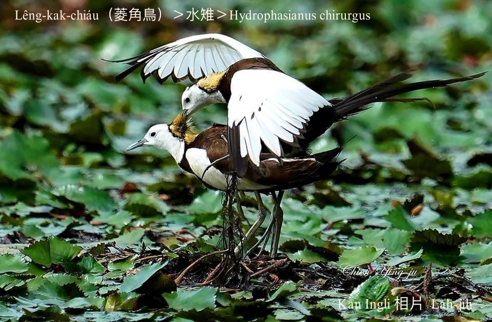
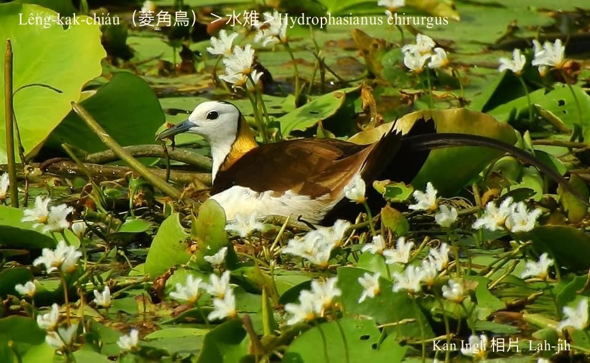
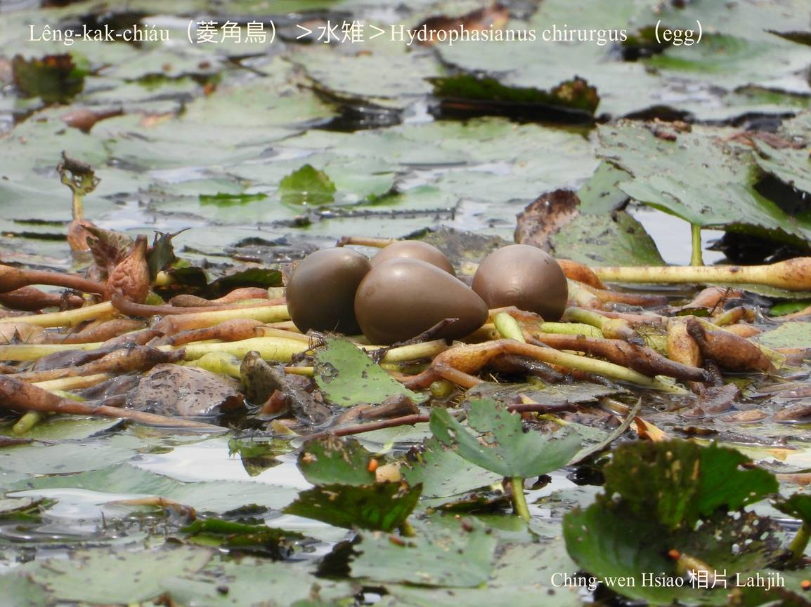
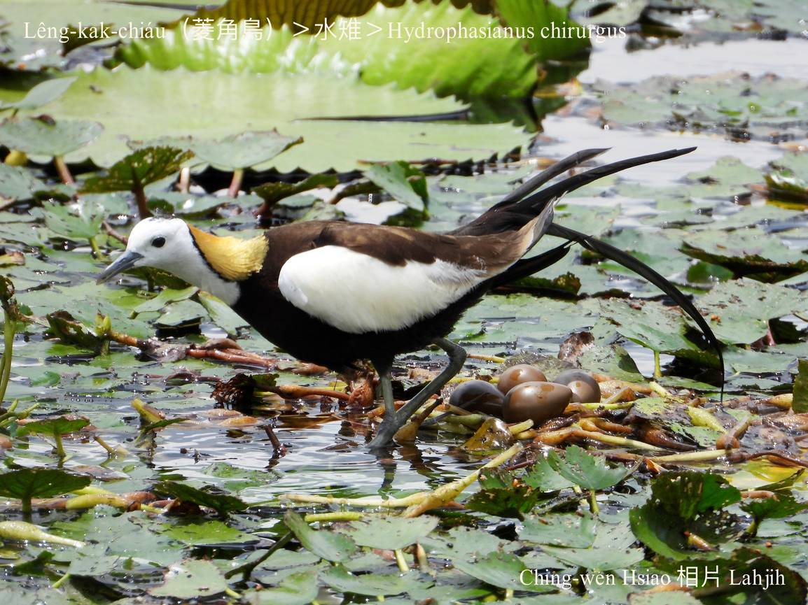
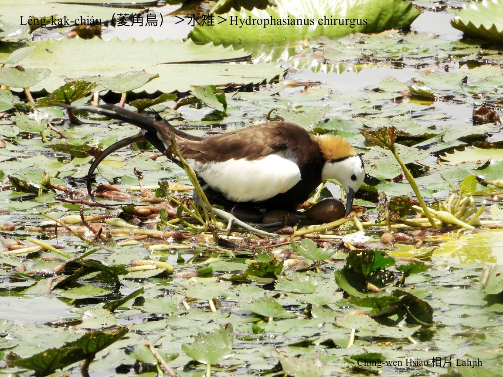
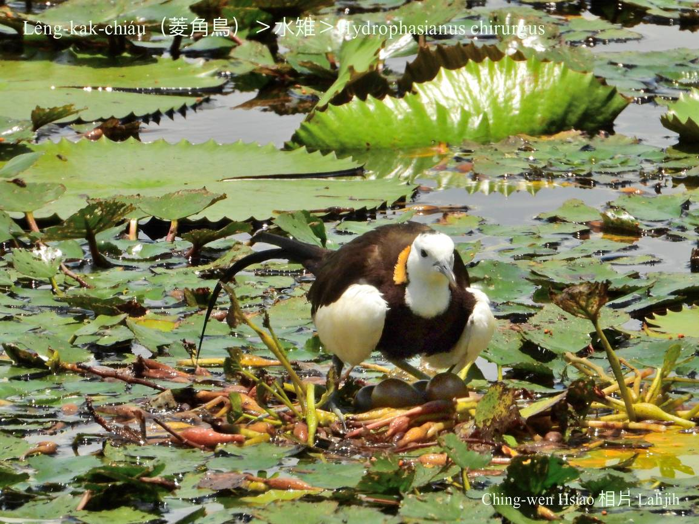
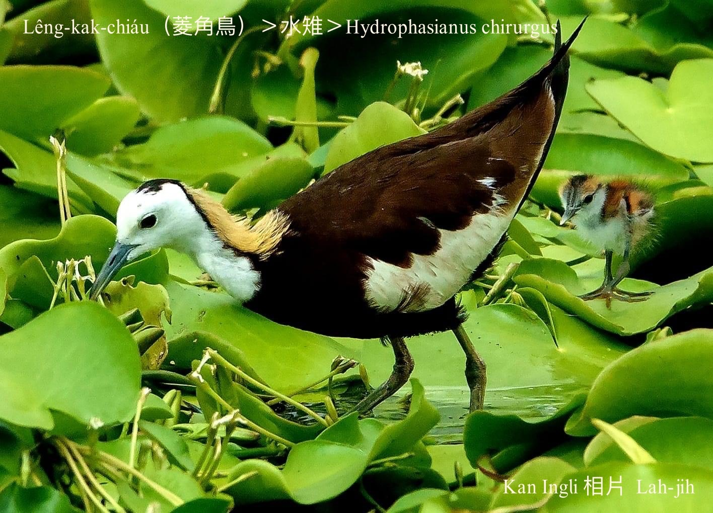
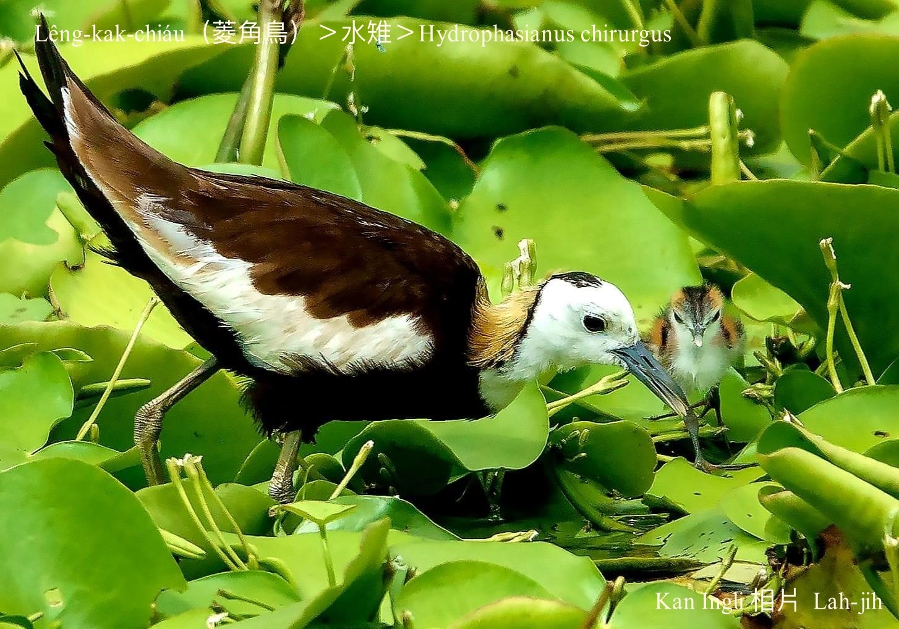
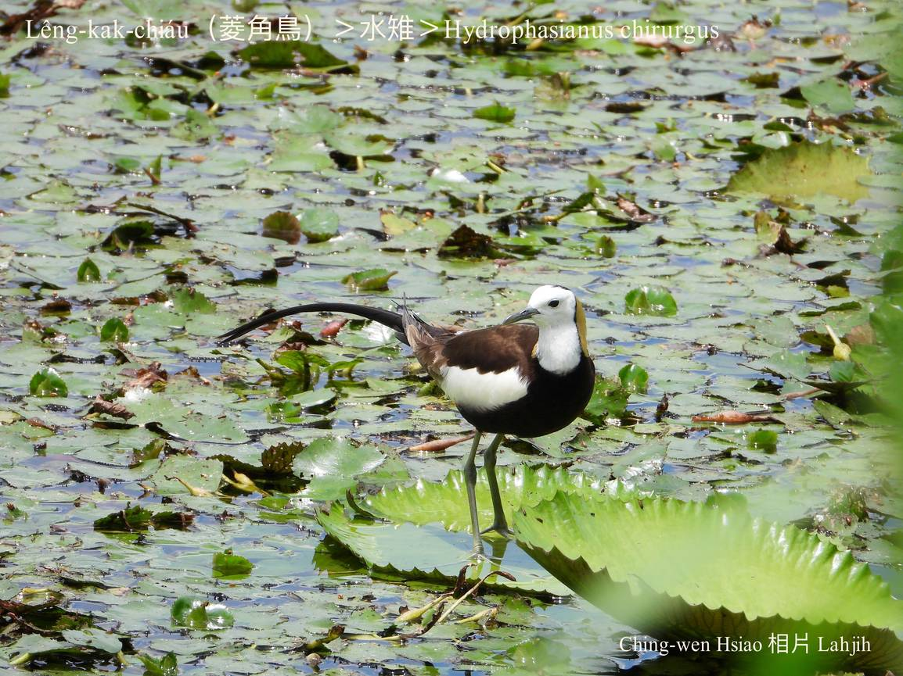
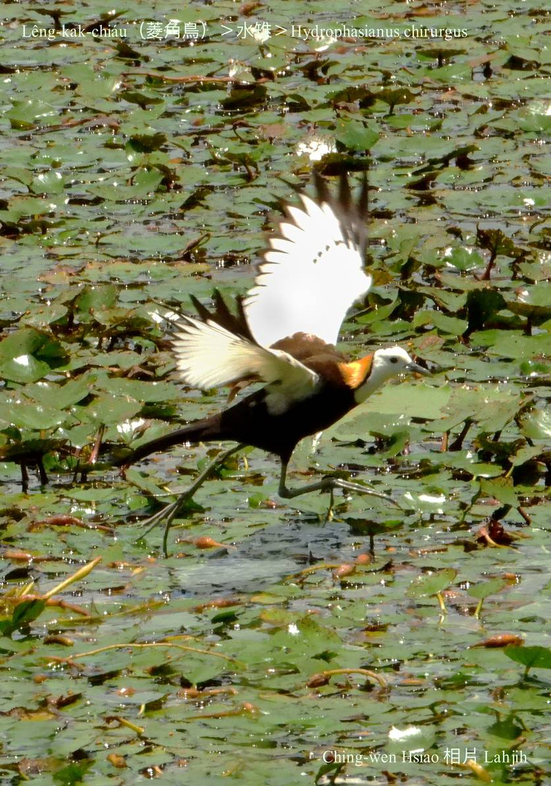
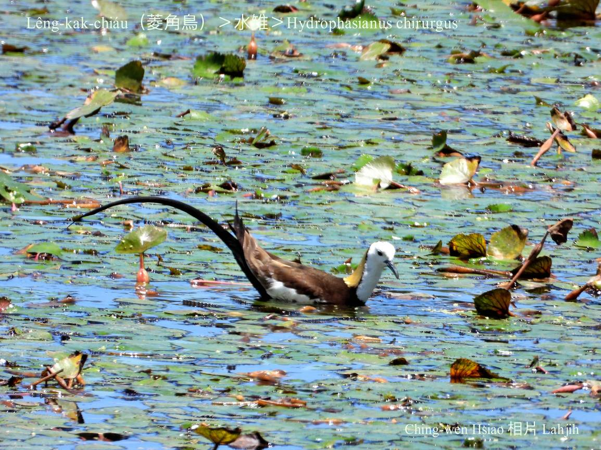
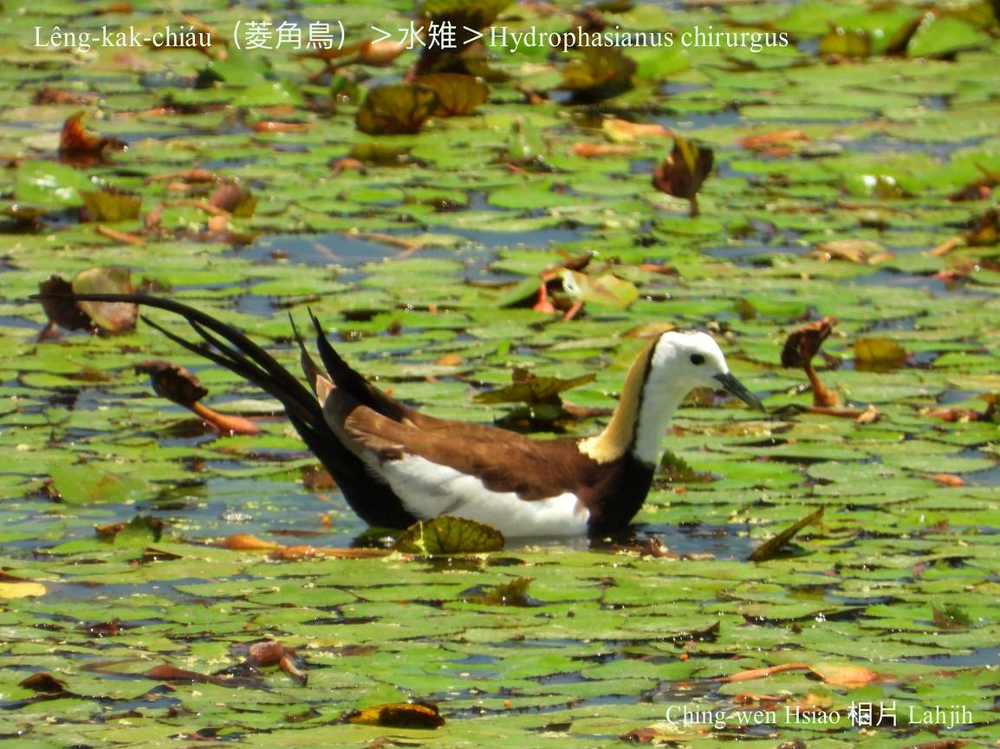

### 【註解】

|詞|解說|
|腳柱|主要指獸類ê腳。|
|ām-oaiⁿ-á|『蝌蚪』。|
