#### 15. U̍t Kho『鷸科』

## 15-0. 『鷸科』Chúi-chiam-á（水尖á）

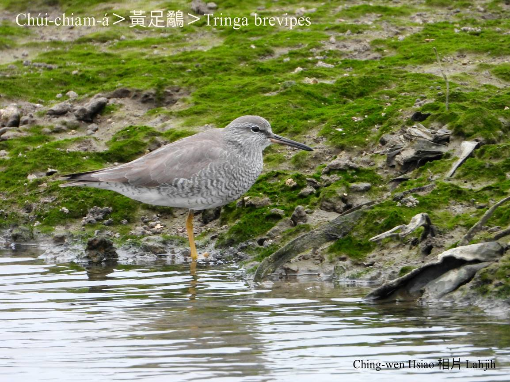

U̍t kho是一種liâu水鳥，in ê嘴pe長koh尖，m̄-chiah號名水尖á，mā叫做海ku̍t-liu-á，可能是根據伊ê動作來號名--ê。

水尖á大部分kui-tīn做夥活動，hioh tī海邊、溪口、lòm地ê水邊，a̍h是曠闊ê草埔，各種水尖á lām做夥生活。伊kap雁、鴨等lóng是典型ê渡鳥，tī台灣有一部份是在地鳥，但是大部分lóng tī 10月ùi北方飛來，過境a̍h是停留到隔轉年三--月chiah飛轉去北方。昆蟲、軟體動物、甲蟲，a̍h是魚蝦是主食。

水尖á嘴細細長長，基部柔軟。有ê尾溜tēng-khok-khok，m̄-koh伊ê內面有chiâⁿ幼ê神經線；田鑽á、骨簪á等、伊ê嘴pe mā有神經，che是kap其他鳥類無kāng ê所在。

# 【Tâi-oân Chiáu-á Liām Koa-si】

### **Chúi-chiam-á Chúi-chiam-á Chhùi Chiam-chiam**

Chúi-chiam-á chúi-chiam-á, chhùi chiam-chiam

Tiàm hái-kháu khe-piⁿ chhōe mi̍h-kiāⁿ

Ū-sî tōa-pō͘ cháu, ū-sî sè-pō͘ kiâⁿ

Chhùi-pe chiok lī-hāi, chúi-lāi hî hê ô-á ham

Piān-nā hō͘ i lā--tio̍h, it-tēng kā i thun pak-lāi

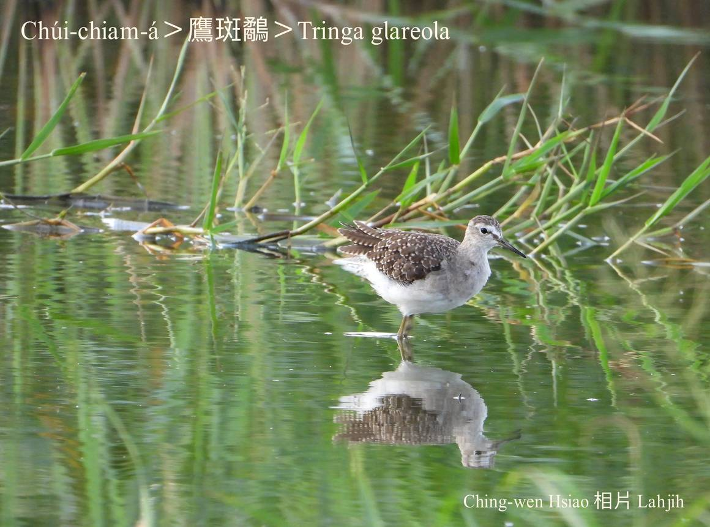
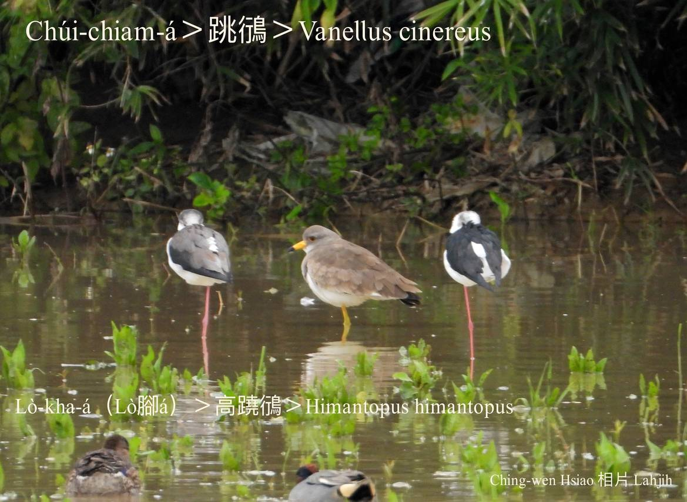
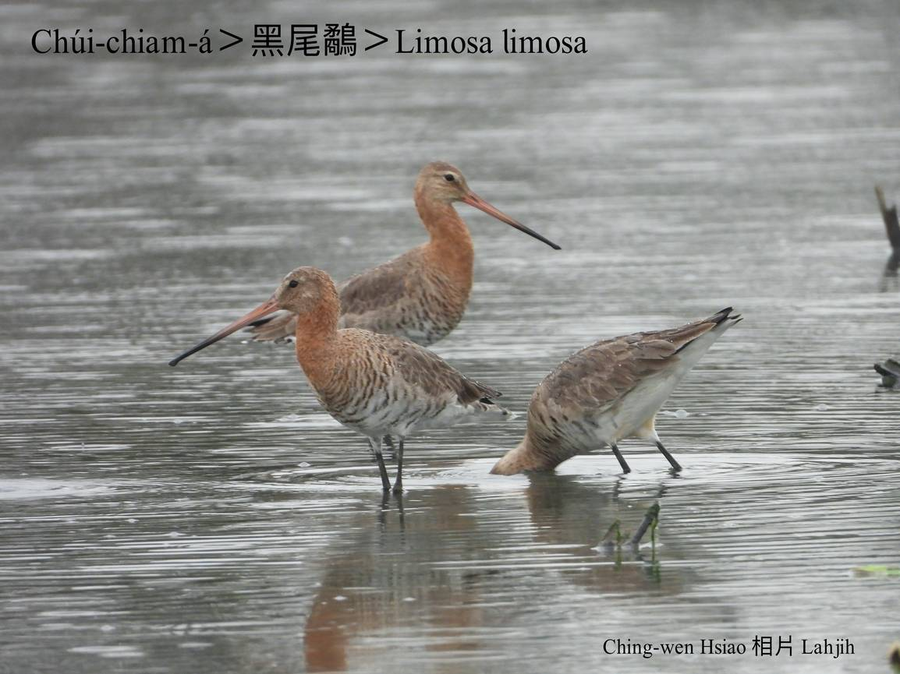
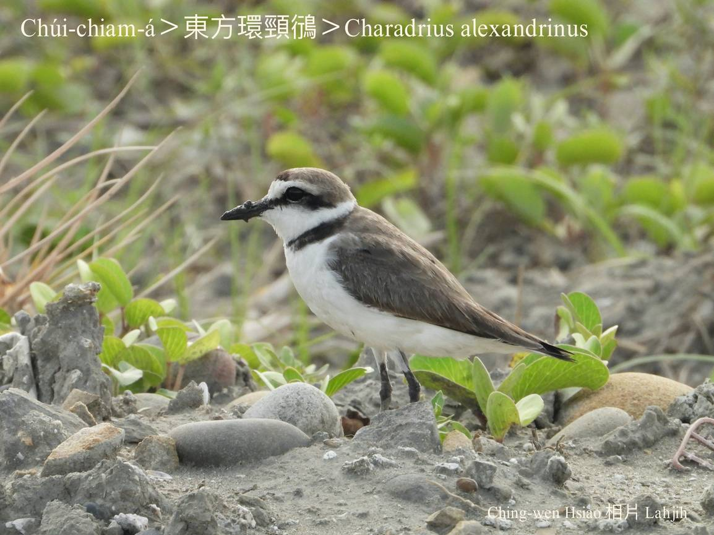
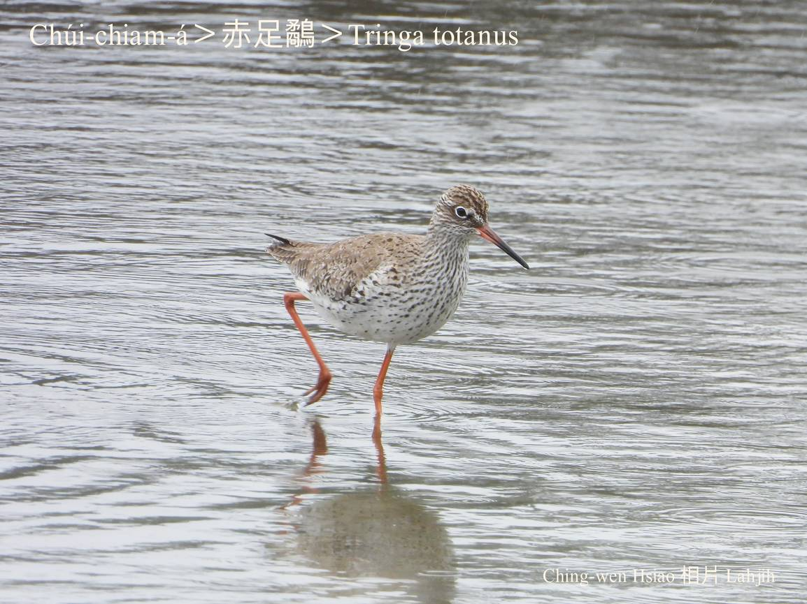
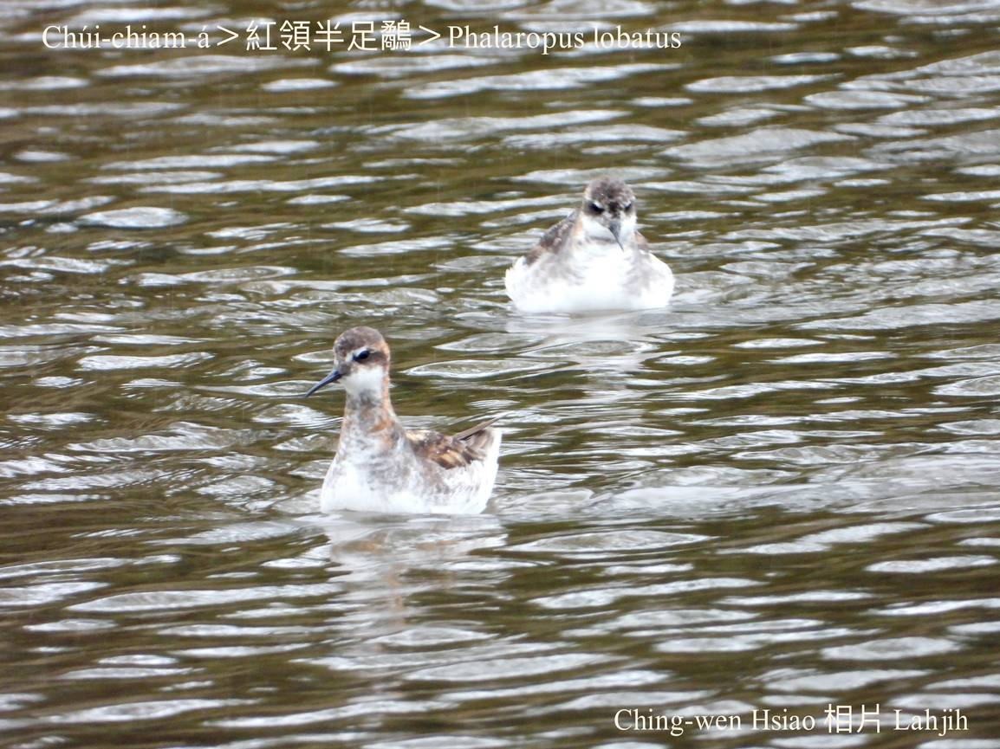
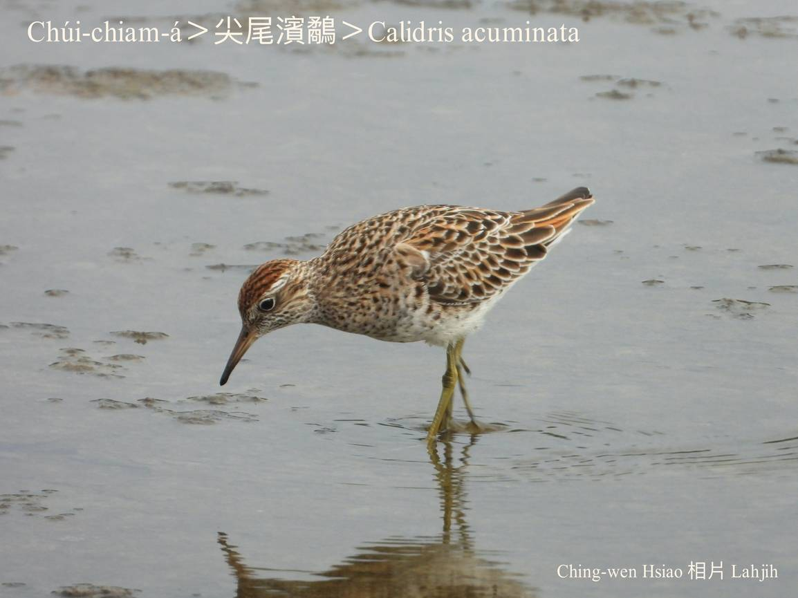
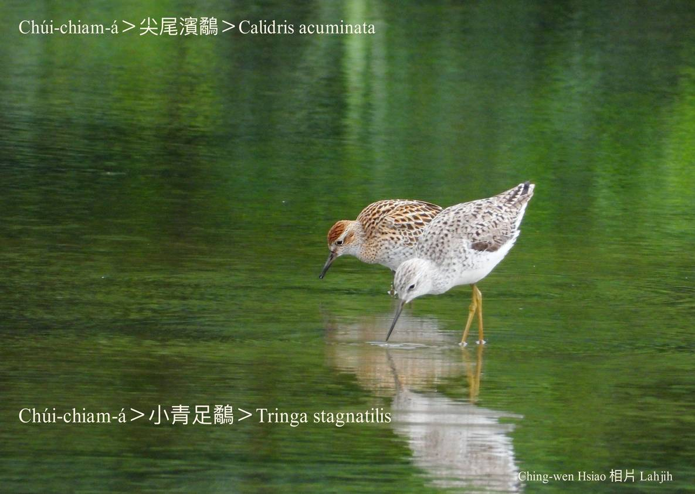
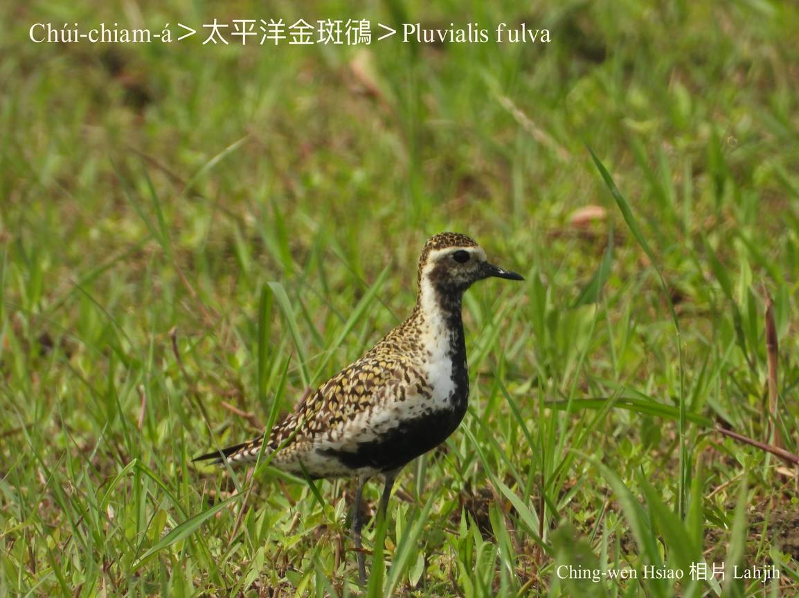
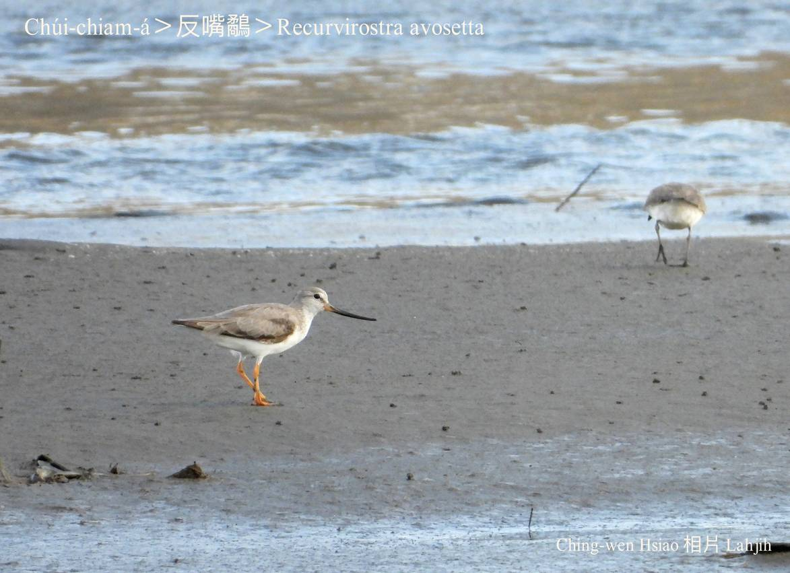

### 【註解】

|詞|解說|
|田鑽á|Chhân-chǹg-á，『田鷸』。|

